위 글은 *토스 SLASH 24 - 미처 알지 못했던 Kernel까지 Observability 향상시키기*[^1]를 기반으로 작성한 내용입니다.

### 1. cpu 사용률 분석

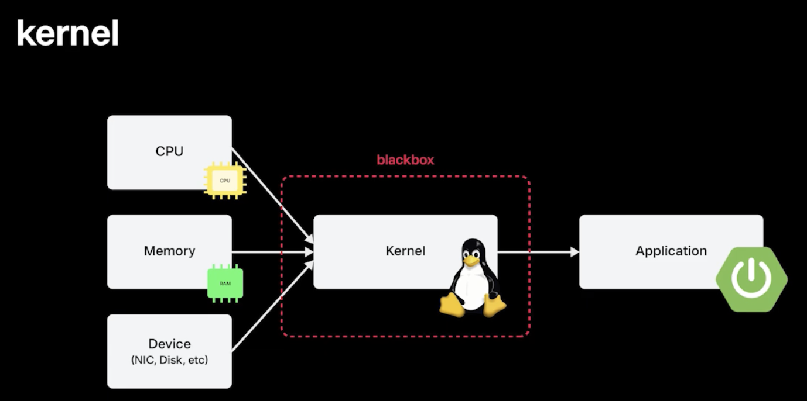

- Application이 CPU, Memory, Device IO를 사용을 할 때, Kernel이 중간에서 분배를 해주다보니깐 분석을 할 때 힘들었던 경험이 있음
- CPU를 누가 더 많이 쓰나, Memory Allocation 문제가 났는데 누가 문제를 일으키나 확인이 필요한데, 커널이 blackbox 형태로 있어서 이러한 분석이 어려웠음
- Kernel에서의 활동을 잘 분석하기 위해서 eBPF라는 도구로 이걸 한꺼풀 벗겨줄 수 있음 → eBPF로 CPU 성능을 분석하고 개선했던 사례 공유

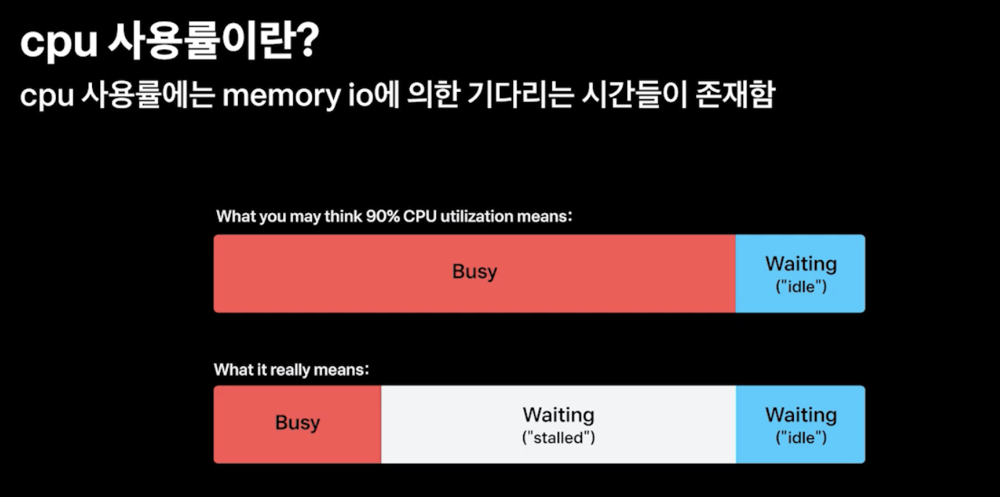

- CPU 사용률이란 전체 백분율에서 Busy State가 차지했던 비율을 의미함
- Busy State가 의미하는 게 연산을 오로지 했다는 것은 아니고, Memory를 읽고 쓰는 데 걸리는 시간인 stalled 이라고 불리는 Memory IO 시간도 포함이 되어 있음
- 따라서 CPU 사용률을 분석할 때, Memory IO도 같이 고려해봐야함 → Memory IO를 Tracing 해보면은 CPU 사용률을 잘 알 수 있을 것이라고 판단했음

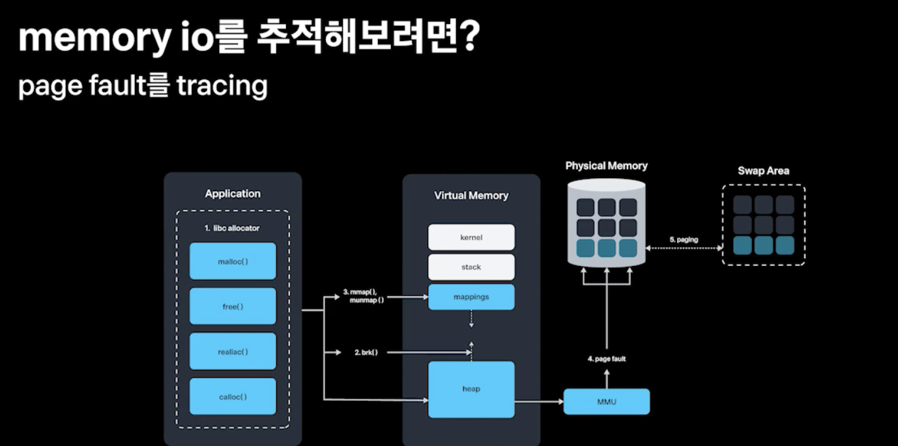

- Memory IO를 추적하려면? → Memory가 Allocation되는 과정을 잘 생각해보면 좋음
- malloc()이라는 allocator를 통해 매핑된 가상 메모리 영역을 받고, 메모리를 액세스할 때 Physical Memory에 pagefault로 실제 메모리가 매핑이 되게 된다
- 여기서 가장 시간이 많이 드는 부분은 page fault다 → 그 이유는 물리적인 부분이 제일 시간이 오래 걸리니깐

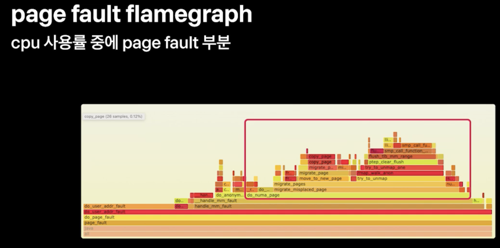

- 그래서 이 page fault를 eBPF로 분석해볼 수 있을 것 같다 
- page fault를 eBPF를 통해서 분석한 뒤 flamegraph를 그려보면은 do_numa_page, migrate_misplaced_page같은 게 있는데, 이 영역들이 절반정도 차지하고 있음 
- 이런 것들을 개선하면 page fault 하는 데 걸리는 시간을 절반으로 줄일 수 있을 것
- 이 부분들이 하드웨어 아키텍처에 numa(Non Uniformed Memory Access)라는 부분과 관련이 있을 것 같다

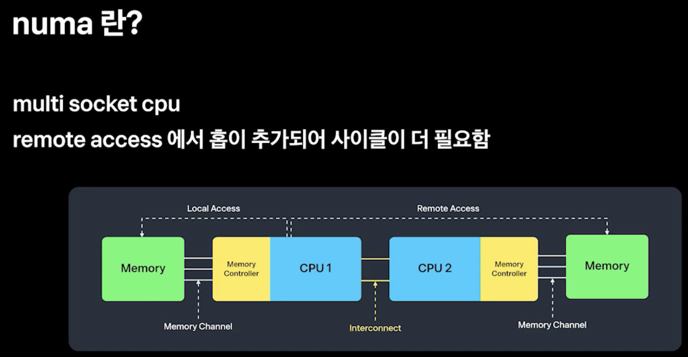

- CPU를 구성하는 반도체 메모리 자체의 성능은 올라갔지만, 그 통로 역할을 하는 채널과 버스들의 성능은 같이 올라가지 못함
- 그래서 채널을 막 쪼개서 로컬 메모리를 붙여서 이 한계를 극복한 게 numa 아키텍처이다
- 자기한테 붙어 있는 메모리를 액세스할 때는 local access, 멀리 있는 걸 access할 때는 remote access 어떤 것을 access 하냐에 따라 성능이 달라짐
- remote access에서는 물리적인 홉이 추가되어서 사이클이 더 필요함 
- remote access가 많이 발생할 수 록 우리 인프라에서는 numa 아키텍처가 비효율적으로 작동하는게 되버림
- remote access가 우리의 인프라 성능에 영향을 주었는 지 파볼 필요가 있겠다

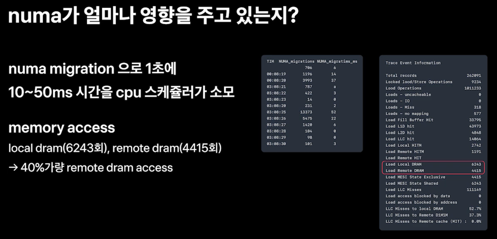

- numa migration이라는 system call이 1초에 10~50ms 시간을 cpu 스케줄러가 소모하는 것을 eBPF로 확인
- memory access 카운트도 확인함, local dram 6243회, remote dram 4415회 → 40% 가량이 remote access
- 거의 절반정도 있다보니깐 numa 아키텍처가 우리에게 있어서 비효율적인 아키텍처였던 것 같다 → 이걸 잘 몰라서 해결을 못하고 있었던 것

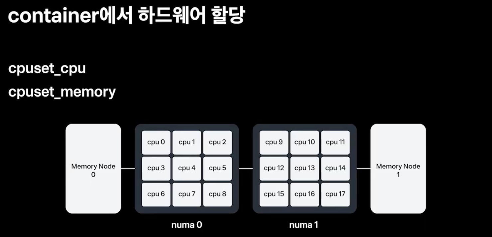

- 이것을 어떻게 container 단에서 해결을 할 수 있냐면
- container 단에서 cpuset_cpu, cpuset_memory 값을 설정하여 하드웨어 할당을 조절할 수 있다
- cpu0, cpu1 / memory node 0번 이런 식으로 지정을 할 수 있음
- 그러나 수천대의 클러스터 만대 가까이 되는 컨테이너에 cpuset_cpu, cpuset_memory를 다 설정하기엔 어려울 것 같음

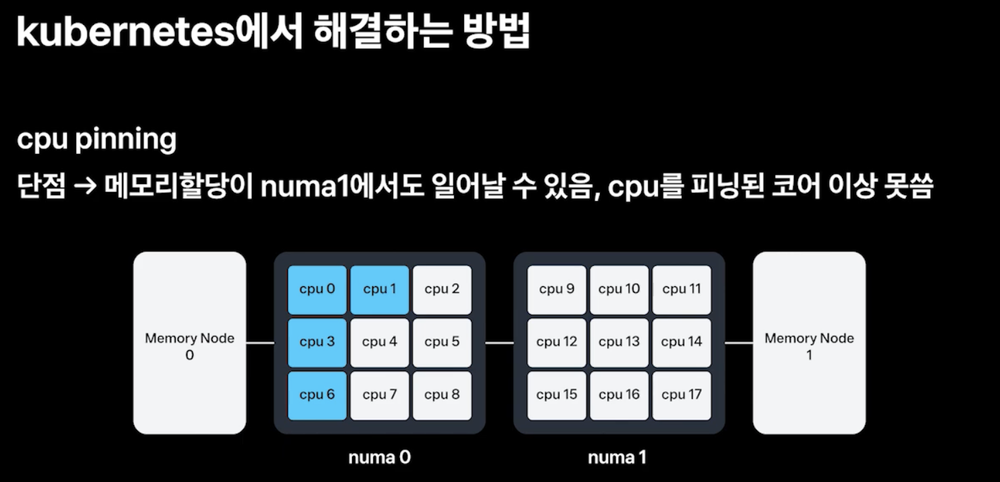

- 이 문제를 쿠버네티스에서 해결하고 있는 방식 → 1. cpu pinning
- 4core를 request한다고 하면 cpu0, cpu1, cpu3, cpu6 이렇게 파란색 표시 된 것처럼 할당을 할 수 있는데,
- 이걸로는 해결이 어려운 게 memory 노드 여유에 따라 memory node 0, memory node 1에 할당될 수 있고 그럼 그 때마다 numa migration remote access가 일어나게 된다
- 그리고 이건 cpu가 pinning 됬다 보니깐 cpu pinning된 한계값 이상 쓸수가 없다 → spike가 일어나면 서비스 안정성이 떨어지게 되는 것

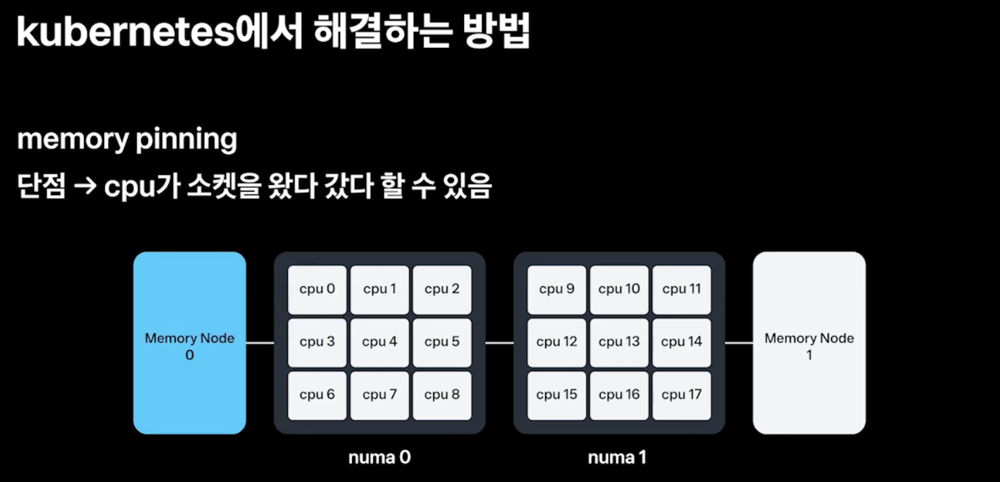

- 두번째로는 memory pinning을 통해 memory node 0번에 memory allocation을 고정할 수 있다
- 이렇게 할 경우, CPU가 Run Queue의 유휴상태에 따라 numa 0번 numa 1번을 왔다갔다 할 수 있음 → 이러면 동일하게 remote access가 또 동일하게 발생을 하니 memory IO로 인한 성능의 영향을 줄일 수 없다

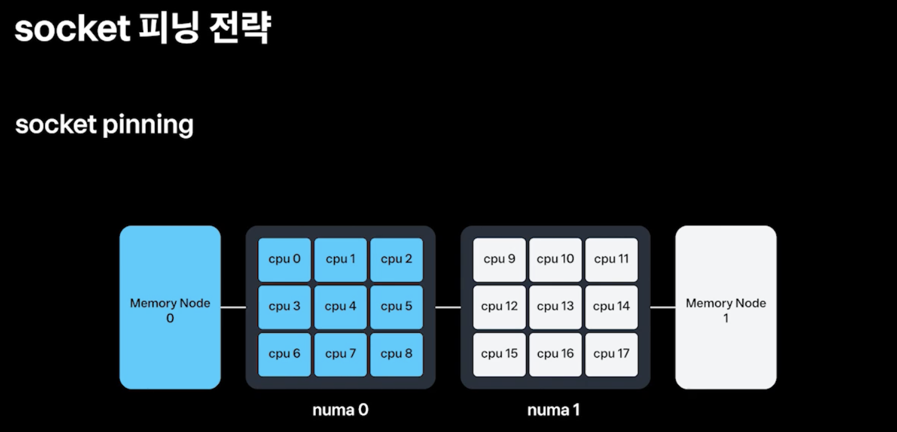
- 우리가 원하는 것은 cpu 안정성도 유지하면서, memory local access를 하게 해야함 → socket pinning
- numa 0번에 해당하는 memory 0에만 할당이 되게 하는 방법 → 이건 쿠버네티스가 제공해주지 않기 때문에 저희가 kubelet에다가 직접 구현을 했다
- numa 0에 cpu0부터 8까지 다 할당을 할 수 있어서 CPU의 socket limit 까지는 할당할 수 있어 서비스 안정성도 보장을 하고
- access의 경우에도 remote access가 안일어나고 local access만 일어나니깐 이제 성능향상도 같이 가능함

### 2. numa 적용 및 ebpf로 메트릭화

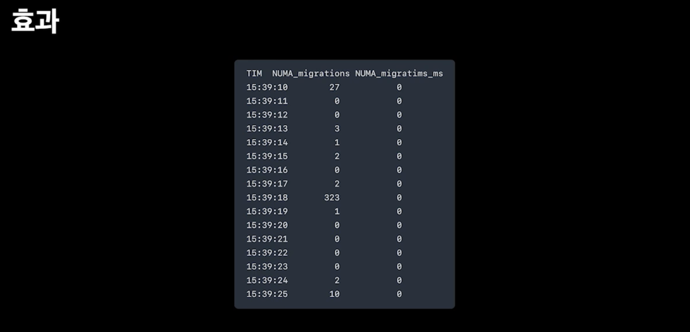

- 적용한 효과를 eBPF로 측정을 해보면 numa migration이 거의 일어나지 않음을 볼 수 있었다

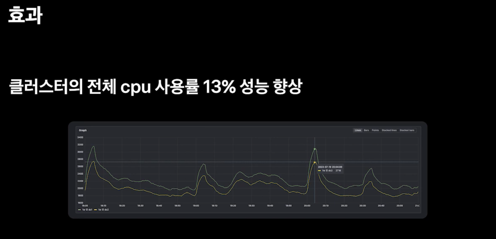

- 클러스터 레벨로 측정을 해본 결과 전체 CPU 사용률이 13% 성능 향상이 됨
- 총 500대, 500대 클러스터 1000개가 있는데 130개를 줄일 수 있었던 효과다 → 매년 수백억씩 IDC 증설을 하다보니깐 고무적인 성과였다
- 하지만, 운영을 해보니깐 생각보다 이 numa가 잘 풀리더라, 그 이유는 Kubelet에 topology hint가 풀린다던가, hint를 막 안준다던가, 리소스 할당도 생각보다 예외 케이스들이 있더라

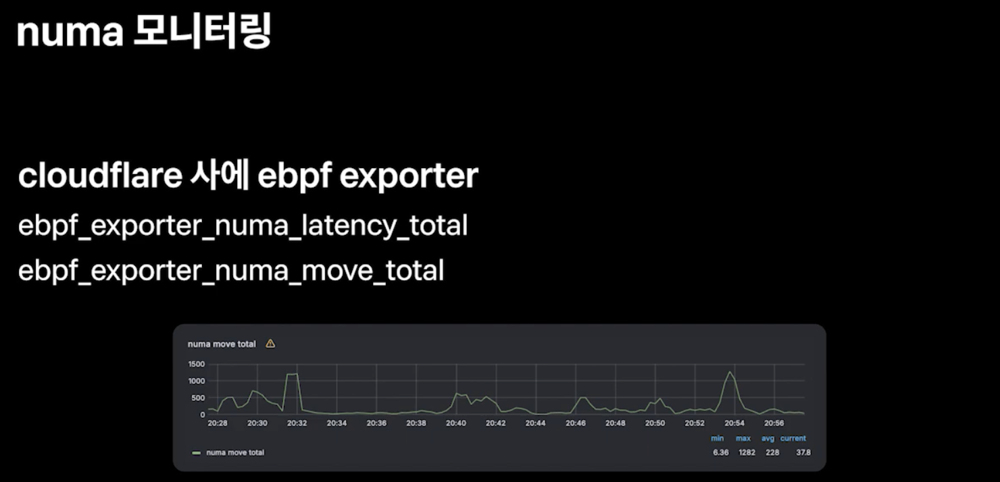

- 그래서 이런 것들을 잘 모니터링하기 위해서 cloudflare사에 ebpf exporter를 제공해주는데 이를 통해 numa의 영향도를 metric화 할 수 있다
    - ebpf_exporter_numa_latency_total
    - ebpf_exporter_numa_move_total
- 이런 metric들을 관찰하면서 numa가 풀리는 지 확인하면서 운영할 수 있게 되었다

[^1]: https://www.youtube.com/watch?v=e8cEDhAPm-E&list=PL1DJtS1Hv1PiGXmgruP1_gM2TSvQiOsFL&index=12