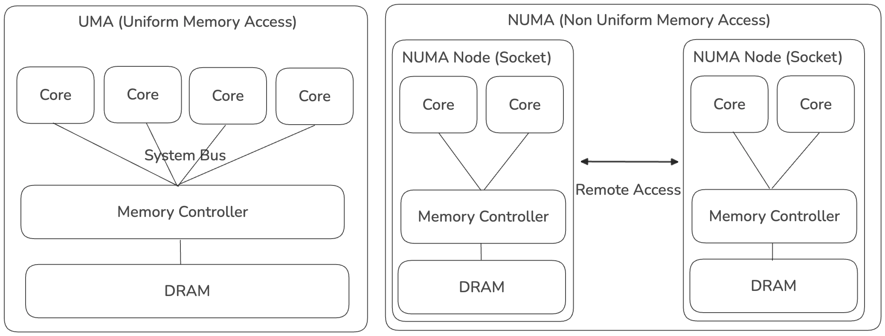
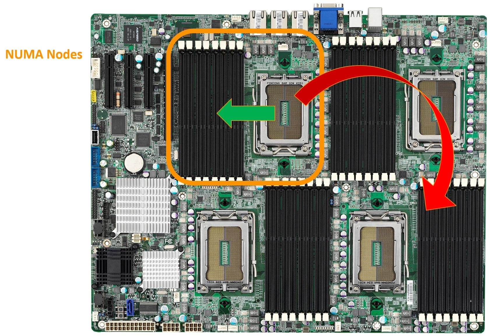
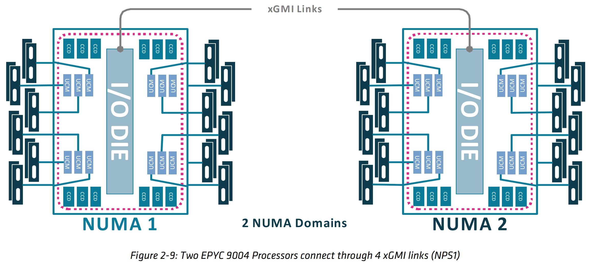
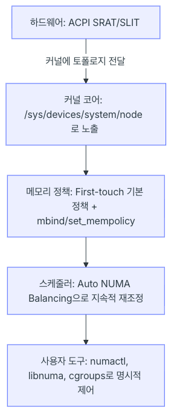

## 왜 토스는 하드웨어 아키텍처(NUMA)까지 건들일 수 밖에 없었나?

일반적으로 클라우드 환경에서 쿠버네티스를 운영하는 조직에서는 Bare Metal 타입 인스턴스를 사용하지않는 한 하드웨어 아키텍처까지 내려가서 최적화 할 일이 많지 않을 것 같습니다.

하지만 토스에서는 자체 데이터 센터를 운영 중이며, 물리 장비를 직접 구성해서 그 위에 쿠버네티스 클러스터를 구성해서 사용중인 환경입니다.

발표 내용에서 데이터 센터의 인프라 증설 비용도 언급하고 있는 만큼 가지고 있는 장비를 "최대한 효율적으로" 활용하는 게 그들의 목표일 수 밖에 없습니다.

아마도 이런 문제가 있었을 것 같습니다.

- 새로운 서비스들은 계속 늘어나서 CPU 사용량이 증가하고 있음
- 인프라 투자 비용은 무한정 늘릴 수 없기 때문에 예산 팀에서 압박이 들어옴

→ 사용량은 계속 느는데, 무턱대고 느는만큼 CPU를 사서 꽂을 수는 없다
→ 일단 최대한 지금 있는 장비로 버틸 수 없을까?
→ CPU 시간 낭비를 줄여보자
→ CPU 시간 분석해보니깐 Page Fault에서 NUMA 관련 시스템 콜(do_numa_page, migrate_misplaced_page) 비중이 높네?
→ 이 시스템 콜로 인한 시간을 줄이면 CPU 효율을 증가시킬 수 있겠다

## NUMA란?

마치 발표내용에서는 NUMA가 문제의 주범인 것처럼 묘사되어 있어서 NUMA를 안쓰면 되는 것 아닌가하는 생각도 들 수 있습니다.

하지만 위 사례의 핵심 문제는 "NUMA 아키텍처를 고려하지 못한 채 배치되는 페이지" 입니다. 왜 페이지들이 배치될 때 NUMA 아키텍처를 고려하지 못했는 지는 잠시 뒤 알아보기로 하고, 우선 NUMA의 기술적 배경부터 알아보겠습니다.



초기 컴퓨터 구조는 UMA(Uniform Memory Access) 구조였습니다.

- 이 구조는 CPU Core가 하나의 메모리 컨트롤러를 통해 메모리에 엑세스하는 구조로 CPU가 아무리 빠르게 명령어를 처리해도 Memory IO는 Memory Controller의 성능에 의존하게 됩니다.
- Core가 수백 수천개로 확장된다고 했을 때 하나의 Memory Controller를 통해 메모리에 접근하는 구조라면 결국 Memory Controller의 성능에 수렴하게 되므로 CPU를 늘리는 의미가 없는 것이지요

이러한 문제를 극복하기 위해 NUMA(Non Uniform Memory Access) 구조가 탄생했습니다.

- NUMA에서는 CPU Socket 별로 Numa Node를 구성하여 소켓별 메모리 컨트롤러를 통해 로컬 DRAM에 액세스하는 구조입니다.
- Core가 수백 수천개로 확장된다고 했을 때 Numa Node도 같이 확장되므로 Local DRAM에 접근하는 경우 CPU 성능을 극대화할 수 있습니다
- 그러나 Local DRAM에 접근하는 경우 외에, Remote Access가 발생하게 되면 지연시간이 추가됩니다 (Remote Access 시에는 QPI/UPI/Infinity Fabric 같은 노드 간 인터커넥트를 거쳐야 하므로 지연시간이 추가됨)
- OS나 애플리케이션이 NUMA를 인지하지 못하면, 스레드는 Node 0에서 실행되는데 메모리는 Node 1에 할당되는 식의 비효율이 발생할 수 있고 이를 막기 위해 NUMA-aware 스케줄링/메모리 할당 필요합니다

정리하면 NUMA는 하드웨어가 알아서 최적화해주는 게 아니라, **OS/애플리케이션이 "이 데이터를 어느 노드에 둘지" 인지하고 있어야 실제 이득을 본다**는 것입니다.

## 실제 하드웨어 구성 예시



실제 메인보드 상에서 NUMA 아키텍처가 구현된 모습[^1]입니다. 그림에서는 4개의 CPU 소켓이 보이고, 소켓 마다 옆에 메모리 슬롯이 보입니다. 간단하게 이해해보면 이렇게 노란 박스 형태로 구성된 메모리와 CPU가 하나의 NUMA 노드가 됩니다.

소켓 가까이에 있는 메모리 슬롯에 접근하면 Local Access가 되고, 소켓과 멀리 떨어진 메모리 슬롯에 접근하면 Remote Access가 됩니다.



좀 더 자세히 실제 서버 예시로 AMD EPYC 9004 서버의 구성[^2]을 확인해보겠습니다. 

1. I/O DIE
      - 다이어그램 중앙의 회색 막대. 메모리 컨트롤러, PCIe/Infinity Fabric 등 입출력 관련 기능을 모아놓은 다이(die)입니다. CCD들과 xGMI 링크가 모두 이 I/O 다이를 거쳐 연결됩니다.
2. CCD (Core Complex Die)
      - 다이어그램 상하단의 진한 청록색 블록들("CCD"라고 표시). 실제 CPU 코어들이 들어있는 다이입니다. EPYC는 여러 개의 CCD 칩렛을 I/O 다이 주위에 배치하는 칩렛(chiplet) 구조를 씁니다. 그림에서 한 소켓에 CCD가 총 12개(상단 6개 + 하단 6개) 있습니다.
3. UCM (Unified Memory Controller)
      - 파란색 작은 블록들("UCM"). 메모리 채널을 제어하는 컨트롤러로, I/O 다이와 실제 메모리 모듈(DIMM) 사이를 연결합니다. 그림에서 한 소켓당 UCM이 12개(양쪽에 6개씩) 있고, 각각 왼쪽/오른쪽의 DIMM(메모리 모듈, 세로 막대 아이콘들)로 이어집니다.
4. DIMM (Dual In-line Memory Module)
      - 좌우 바깥쪽에 세로로 배열된 짙은 색 막대들. 실제 RAM 모듈을 나타내며, UCM을 통해 I/O 다이에 연결됩니다.  
5. xGMI (Global Memory Interconnect)
      - AMD의 소켓 간(그리고 다이 간) 고속 연결 기술입니다. Infinity Fabric의 소켓 간 버전으로, 두 CPU가 서로의 메모리·데이터에 접근할 수 있게 해줍니다. 이 그림에서는 두 소켓의 I/O 다이끼리 xGMI로 연결되어 있습니다.

각 소켓을 감싸는 분홍 점선 테두리는 하나의 NUMA 도메인 경계를 표시합니다. 즉 소켓 1 전체(CCD + I/O 다이 + UCM + 메모리)가 NUMA 노드 1이고, 소켓 2 전체가 NUMA 노드 2라는 것을 알 수 있습니다.


## OS에서는 NUMA를 어떻게 인식할까?

위에서 알아본대로 NUMA는 하드웨어 아키텍처이며, 이를 OS에서 인식하지 않으면 오히려 이득이 아니라 손해가 될 수 있습니다. 그렇다면, OS에서는 어떻게 NUMA를 인식하고 지원할 수 있을까요?

Linux에서 NUMA를 지원하는 방법에 대해 알아보겠습니다.



###  1 계층: (하드웨어) ACPI SRAT/SLIT → 커널에 토폴로지 전달

- 리눅스 커널은 부팅 시점에 CPU가 몇개고, 어떤 CPU가 어떤 메모리와 가까운지 알 수 없음
- 하드웨어 벤더가 BIOS를 통해 이 정보를 표준 형식으로 알려줘야 하는 데, 그 표준이 ACPI (Advanced Configuration and Power Interface)임
- 리눅스 커널에서는 ACPI를 통해 전달받은 정보를 ACPI Tables[^3]라는 이름으로 저장
- ACPI Tables에 NUMA 전용 테이블 SRAT(System Resource Affinity Table)와 SLIT(System Locality Distance Information Table)이 포함됨
- SRAT - 누가 어디 있는 지 (위치정보)
    - 커널은 SRAT을 읽어서 시스템에 프로세서가 몇개 있고, 코어 1~4가 프로세서 1에 속하고 코어 5~8이 프로세서 2에 속한다는 걸 알게 됨
    - 또한 프로세서와 연관된 메모리 범위도 상세히 기술하는데, 물리 메모리 0~64GB가 프로세서 1에, 64GB ~ 128GB가 프로세서 2에 연결되어 있다는 걸 감지함
    - 정리하면 어떤 CPU 및 물리 메모리 주소 범위가 어떤 NUMA 노드에 속하는지를 알 수 있다
- SLIT - 얼마나 먼지 (거리 정보)
    - 커널은 SLIT을 읽어서 모든 NUMA 노드의 상대적 거리에 대한 지도를 만든다
        ```
        Node0  Node1
        Node0  10    21
        Node1  21    10
        ```
    -  SLIT은 이러한 NxN 거리 매트릭스이다. 자기 자신의 거리는 10을 기준값으로 갖고 나머지 노드는 그보다 큰 값으로 표현된다
    - 커널 스케줄러는 이 거리 정보를 이용해서 애플리케이션 스레드를 메모리가 상주한 위치에 가장 가까운 CPU 코어에서 실행시킨다.
    - 단 SLIT 거리가 정확한 실측치가 아니라 펌웨어가 대략 알려주는 힌트에 가깝고 부정확한 경우가 드물지 않다
  
### 2 계층: (커널 코어) /sys/devices/system/node 로 노출

- SRAT/SLIT로 파싱한 정보를 사용자가 볼 수 있게 재포장
- sysfs 파일시스템 형태로 외부에 노출하는 게 이 계층의 역할
  ```
    /sys/devices/system/node/
    ├── node0/
    │   ├── cpu0, cpu1, cpu2, cpu3    ← 이 노드에 속한 CPU (심볼릭 링크)
    │   ├── cpumap                    ← CPU 목록 비트마스크
    │   ├── distance                  ← 다른 노드들까지의 거리
    │   ├── meminfo                   ← 이 노드의 메모리 정보
    │   └── numastat                  ← 로컬/원격 접근 통계
    ├── node1/
    │   └── ...(동일 구조)
  ```
- numactl이 바로 이 sysfs를 읽는 것
    - `numactl --hardware` 명령어는 **바로 이 `/sys/devices/system/node/` 아래 파일들을 파싱해서 보여주는 것**

### 3 계층: (메모리 정책) First-touch 정책 + mbind/set_mempolicy

- 지금까지 지도를 그려서 보관하는 방법에 대해 이야기했음, 이제는 그 지도를 언제 쓰는지에 대해 이야기할 것
- 실제 프로그램이 `malloc()` 으로 메모리를 요청하는 순간 커널은 결정을 내려야 함
    - 이 프로그램한테 줄 메모리는 어떤 NUMA node에서 줄까? 이 결정을 내리는 규칙이 바로 **메모리 정책**
- 메모리 정책이란 NUMA 시스템에서, 프로세스가 메모리를 요청했을 때 커널이 **"몇 번 노드의 메모리를 줄 것인가"**를 정하는 소프트웨어 규칙 [^4]
- 하드웨어가 "어떤 메모리가 어느 CPU에 물리적으로 가까운지"를 정해놓으면, 메모리 정책은 "그럼 실제로 어느 걸 골라 쓸지"를 소프트웨어가 결정하는 규칙

#### 왜 필요한가?
NUMA 시스템에서는:

- 소켓1에 있는 CPU가 **소켓1 옆 메모리**에 접근하면 빠름 (로컬)
- 소켓1에 있는 CPU가 **소켓2 옆 메모리**에 접근하면 느림 (리모트, 인터커넥트를 거쳐야 함)

그런데 프로그램이 `malloc()`으로 메모리를 요청하면, 커널은 **"이 메모리를 어느 노드에서 떼어줄지"**를 결정해야 합니다. 이때 사용하는 규칙이 바로 메모리 정책입니다.

#### 정책이 결정하는 것
메모리 정책 = **모드(mode) + 노드 목록(선택)**

| 구성 요소 | 의미 |
|---|---|
| **모드** | 어떤 방식으로 노드를 고를지 (예: 특정 노드에만 고정, 우선 순위, 여러 노드에 분산 등) |
| **노드 목록** | 그 방식을 적용할 대상 노드들 (예: 노드 0번, 혹은 0,1번) |

#### 대표 예시
```
"MPOL_BIND, 노드 0"  → 무조건 노드 0에서만 메모리를 가져와라
"MPOL_INTERLEAVE, 노드 0,1"  → 노드 0과 1에 번갈아가며 분산해서 가져와라
"MPOL_PREFERRED, 노드 0"  → 가능하면 노드 0에서, 안 되면 다른 데서라도 가져와라
```

#### 기본값 (정책을 아무것도 안 정하면?)
- 시스템이 평상시 켜져 있을 땐, **"로컬 할당(local allocation)"**이 기본값입니다
- 즉, "지금 이 코드를 실행 중인 CPU와 가장 가까운 노드에서 메모리를 줘라"가 기본 동작입니다
- 그래서 대부분의 프로그램은 아무 설정 안 해도 어느 정도 자동으로 NUMA에 최적화되어 동작합니다

```c
char *buf = malloc(1GB);   // ① 이 순간엔 아무 일도 안 일어남 (주소만 예약)
buf[0] = 1;                 // ② 이 순간! 실제로 메모리를 처음 건드림 (= "touch")
```

- malloc 순간에는 예약만 해두고, 실제 접근을 할 때 실행 중인 코어 기준이라 first touch 정책이라고도 합니다

#### 적용 범위 (누구에게 적용되는 규칙인가)
정책은 **범위(scope)** 단위로 걸 수 있습니다:

- 시스템 전체 기본값
- 특정 프로세스 전체
- 프로세스의 특정 메모리 영역(주소 범위)만
- 여러 프로세스가 공유하는 메모리 객체

#### 정책 우선순위 — VMA(Virtual Memory Area) 정책이 프로세스 정책보다 우선

VMA 정책은 페이지 폴트가 발생할 때 프로세스 정책보다 우선순위를 갖는다

```
System Default Policy (최종 폴백, local allocation 사용)
        ↑
Task Policy
        ↑
VMA Policy
```

페이지 폴트 발생 시 정책 확인 순서

1. 해당 VMA(메모리 영역)에 mbind()로 정책이 설정되어 있나? → 있으면 그걸 사용
2. 없으면 프로세스 전체에 set_mempolicy()로 설정된 정책 사용
3. 그것도 없으면 기본값(First-touch, 커널 내부에서는 MPOL_DEFAULT/MPOL_LOCAL) 사용

#### Task와 VMA의 관계

> Task란 리눅스 커널 입장에서 **"실행 중인 하나의 흐름"** — 우리가 흔히 말하는 프로세스(process) 또는 스레드(thread)
> 

일반적으로는 "프로세스"라는 말을 쓰지만, 리눅스 커널 내부에서는 **프로세스와 스레드를 구분하지 않고 둘 다 "task"라는 하나의 개념**으로 관리합니다.

```c
struct task_struct { ... };   // 커널 내부에서 프로세스든 스레드든 전부 이 구조체 하나로 표현
```

- 프로세스 하나 = task 하나
- 스레드가 3개인 프로세스 = task 3개 (단, 이 3개가 같은 주소 공간을 공유)

즉 커널 관점에서는 "프로세스 안에 스레드가 여러 개 있다"가 아니라, **"task가 여러 개인데, 이것들이 같은 메모리 주소 공간을 공유하고 있다"**로 봅니다.

```
[Task] = 실행되고 있는 하나의 흐름 (프로세스 또는 스레드)
   │
   └─ 이 Task가 쓰는 가상 주소 공간 안에
         ├─ [VMA 1] 코드 영역
         ├─ [VMA 2] 힙
         ├─ [VMA 3] 스택
         └─ ...
```

- **Task** = "누가" 실행되고 있는지 (주체)
- **VMA** = 그 Task가 쓰는 메모리 공간을 "어떻게" 쪼갠 조각들 (객체)

```
System Default Policy       ← 시스템 전체 기본 규칙
        ↑
Task Policy                 ← "이 프로세스(또는 이 스레드)는 이 규칙을 써라"
        ↑
VMA Policy                  ← "이 프로세스 안의 이 메모리 조각만은 이 규칙을 써라"
```

```c
// Task 정책: 이 프로세스 전체의 기본 규칙을 노드1로 고정
set_mempolicy(MPOL_BIND, node1_mask, ...);
// VMA 정책: 그 중에서도 이 특정 메모리 영역만 예외적으로 인터리브
mbind(addr, length, MPOL_INTERLEAVE, all_nodes_mask, ...);
```

#### cpuset과의 관계

cpuset은 관리자가 "이 프로세스 그룹은 이 노드들만 써라"라고 강제하는 관리 도구이고, 메모리 정책은 애플리케이션이 스스로 "나는 이렇게 메모리를 할당받고 싶다"고 요청하는 프로그래밍 인터페이스입니다. 둘 다 적용되면 cpuset이 우선합니다.


### 4 계층: (스케줄러) Auto NUMA Balancing

3계층까지 이해한 것을 정리해보면

> 프로그램이 메모리를 처음 쓰는 순간, "지금 실행 중인 코어와 같은 노드"에서 메모리를 떼어준다 (first-touch)

그런데 "지금 실행 중인 코어"는 시간이 지나면 바뀔 수 있습니다.

#### 문제 상황 예시

```
1. 프로그램이 노드0의 코어에서 시작 → 메모리도 노드0에 할당됨 (first-touch)
2. 시간이 흘러, 리눅스 스케줄러가 부하 분산을 위해
   이 프로그램을 노드1의 코어로 옮김
3. 결과: 코어는 노드1인데, 메모리는 여전히 노드0에 있음
   → 매번 메모리 접근할 때마다 원격(remote) 접근 발생 → 느려짐
```

3계층(메모리 정책)은 "처음 할당할 때"만 신경 쓰는 규칙이라서, 이렇게 나중에 코어가 옮겨가서 생기는 불일치는 못 잡아줍니다. 이때 필요한 것이 바로 **Auto NUMA Balancing** 입니다.

#### Auto NUMA Balancing이 하는 일

> 커널이 주기적으로 "지금 코어와 메모리가 잘 붙어있나?"를 확인하고, 안 맞으면 둘 중 하나를 옮겨서 다시 맞춰준다

먼저 어떻게 안 맞다라는 것을 감지할까요?

커널은 의도적인 page fault(NUMA hinting fault)를 만들어서 확인합니다.

```
1. 프로세스가 쓰는 메모리 페이지들을 주기적으로 "접근 금지" 상태로 만들어 놓음
2. 프로그램이 그 페이지를 건드리면 "어? 막혀있네" 하고 커널에 신호(fault)가 감
3. 커널이 그 신호를 받아서 다시 메모리 CPU 위치 관계를 다시 판단 "아, 지금 이 코드는 노드1 코어에서 도는데, 메모리는 노드0에 있었구나" 라고 기록
4. 이런 일이 반복해서 쌓이면 → "이 페이지는 노드1로 옮겨야겠다" 판단 → 옮김
```

즉 일부러 살짝 "함정"을 걸어놓고, 프로그램이 그 함정에 걸릴 때마다 통계를 모아서 재배치를 결정하는 방식입니다.


마지막으로 다시 맞춰주기 위해 아래 두 가지 방법 중 상황에 맞는 걸 선택합니다

- 방법 1. 메모리 마이그레이션: 메모리를 코어 쪽으로 옮긴다

- 방법 2. 태스크 마이그레이션: 태스크(코드 실행)를 메모리 쪽으로 옮긴다

#### Page Fault란

> CPU가 메모리 주소에 접근하려는데, 그 접근이 정상적으로 처리될 수 없을 때 발생하는 하드웨어 예외(exception)입니다. CPU가 "어? 이 주소 처리 못하겠는데, 커널아 네가 처리해" 하고 커널에게 제어권을 넘기는 메커니즘 전체를 page fault라고 부릅니다.

Page Fault의 종류

| 종류 | 발생 원인 | 예시 |
| --- | --- | --- |
| **Major fault** | 페이지가 아예 물리 메모리에 없음 | 처음 malloc한 메모리를 처음 write할 때 (3계층 first-touch가 여기서 발생), 스왑된 페이지를 다시 불러올 때 |
| **Minor fault** | 페이지는 물리 메모리에 있는데, 접근 권한/매핑이 아직 안 걸려있음 | Copy-on-write |
| **Protection fault** | 페이지는 있는데, 커널이 **의도적으로 접근 금지 플래그를 걸어둔 상태** | ← **4계층 Auto NUMA Balancing이 쓰는 방식이 이것** |

사실 위에서 알아본 NUMA hinting fault가 사용하는 방식이 바로 Protection fault입니다.

Protection fault은 아래와 같이 동작합니다.

```
1. 커널이 일부러 특정 페이지의 권한 비트를 "접근 불가"로 바꿔놓음
   (페이지 자체는 이미 물리 메모리에 존재함 — 없어서가 아니라 일부러 막아둔 것)
2. 프로그램이 그 주소를 읽거나 쓰려고 시도
3. CPU가 하드웨어 레벨에서 "권한 없음"을 감지 → page fault 발생
4. 커널의 fault 핸들러가 호출됨
5. 커널은 이때 "누가(어느 코어가), 어느 페이지에 접근했는지" 기록
6. 다시 접근 가능하게 권한을 풀어줌 (동작 자체는 정상적으로 계속 진행됨)
```

즉 핵심은 의도적으로 page fault를 발생시키면서 "누가(어느 코어가), 어느 페이지에 접근했는지" 기록하는 것입니다. 이를 통해 Remote Access가 발생하고 있는 지 통계적으로 확인할 수 있습니다.

이러한 Auto NUMA Balancing 켜져 있는 지는 아래 명령어를 통해 확인 할 수 있습니다.

```bash
cat /proc/sys/kernel/numa_balancing     # 1이면 켜짐, 0이면 꺼짐
```

커널 자체 기본값으로 NUMA 노드가 2개 이상이면 자동으로 켜지게 설정되며, 단일 노드 머신에서는 꺼져있습니다.

### 5 계층: (사용자 도구) numactl, libnuma, cgroups

```
1계층: 하드웨어가 지도를 줌
2계층: 커널이 지도를 파일로 저장
3계층: 커널이 "기본 규칙"대로 메모리를 배치 (first-touch)
4계층: 커널이 알아서 사후 교정 (Auto NUMA Balancing)
```

여기까지는 전부 사람이 개입 안 해도 커널이 자동으로 처리하는 부분이었습니다. 5계층은 다릅니다:

> 커널의 자동 규칙이 마음에 안 들 때, 사용자가 직접 명령을 내려서 강제로 바꾸는 도구들

#### 1. numactl — 커맨드라인에서 바로 강제하기

가장 쉽고 많이 쓰는 방법입니다. 프로그램을 실행할 때 앞에 붙여서 규칙을 지정합니다.

```
# 현재 시스템의 NUMA 구조 확인
numactl --hardware

# 무조건 노드 0의 CPU와 메모리만 써서 실행
numactl --cpunodebind=0 --membind=0 ./myapp

# 여러 노드에 메모리를 골고루 분산 (대역폭 극대화용)
numactl --interleave=all ./myapp
```

내부적으로는 3계층에서 얘기했던 set_mempolicy(), mbind() 시스템콜을 대신 호출해주는 **껍데기(wrapper)**일 뿐입니다.


#### 2. libnuma — 프로그램 코드 안에서 직접 제어하기

numactl은 프로그램 실행할 때 한 번만 설정 가능한데, 프로그램 실행 도중에 동적으로 세밀하게 조정하고 싶을 땐 코드 안에서 직접 API를 씁니다.

```c
#include <numa.h>

// 노드 1에서만 메모리 할당
void *buf = numa_alloc_onnode(size, 1);

// 이 스레드를 노드 1의 CPU에서만 돌리기
numa_run_on_node(1);
```

#### 3. cgroups (cpuset) — 컨테이너/그룹 단위로 통째로 묶기

`numactl`이 "프로그램 하나"를 대상으로 한다면, cgroups는 **여러 프로세스를 묶은 그룹 전체**를 대상으로 합니다. Docker, Kubernetes 같은 컨테이너 환경에서 주로 사용합니다.

```
# cpuset cgroup으로 특정 그룹을 노드 0에만 묶기
echo 0 > /sys/fs/cgroup/cpuset/mygroup/cpuset.mems
```

Kubernetes의 "Topology Manager"가 파드(pod)를 배치할 때 내부적으로 이 cpuset 메커니즘을 활용해서, 파드 하나가 여러 NUMA 노드에 걸쳐 흩어지지 않도록 관리합니다.

| 도구 | 적용 대상 | 언제 씀 |
| --- | --- | --- |
| numactl | 프로그램 실행 1회 | 커맨드라인에서 바로 테스트/실행할 때 |
| libnuma | 코드 내부 | 프로그램 자체가 NUMA를 알아서 최적화하도록 만들 때 |
| cgroups(cpuset) | 프로세스 그룹/컨테이너 전체 | 컨테이너 오케스트레이션(Docker, K8s) 환경에서 |

## 전체 계층 최종 정리

```
1계층: 하드웨어(BIOS) → SRAT/SLIT로 커널에 토폴로지 알려줌
2계층: 커널이 그 정보를 /sys/devices/system/node 파일로 저장
3계층: 커널이 "실행 중인 코어와 같은 노드"에서 메모리 배치 (first-touch, 기본 규칙)
4계층: 커널이 주기적으로 코어-메모리 위치가 맞는지 감시, 안 맞으면 재배치 (Auto NUMA Balancing)
5계층: 사용자가 규칙을 numactl/libnuma/cgroups로 직접 오버라이드
```

[^1]: https://www.dbi-services.com/blog/sql-server-automatic-soft-numa-and-uneven-cpu-load/
[^2]: https://docs.amd.com/api/khub/documents/rFyoKZfMPtrSygqSeku8MA/content
[^3]: https://docs.kernel.org/driver-api/cxl/platform/acpi.html
[^4]: https://docs.kernel.org/admin-guide/mm/numa_memory_policy.html