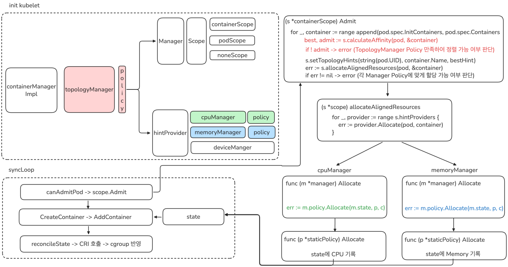
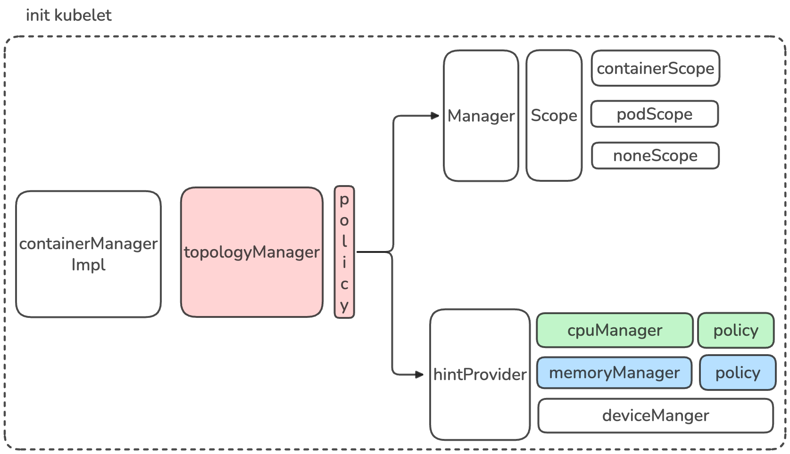
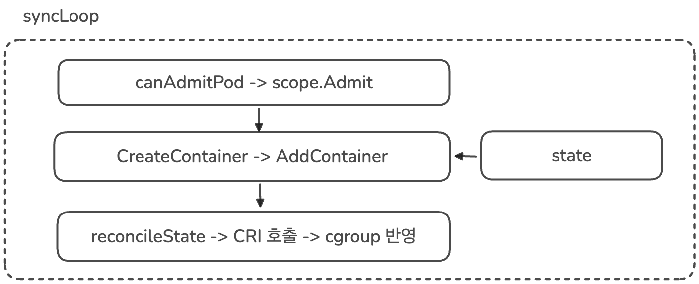
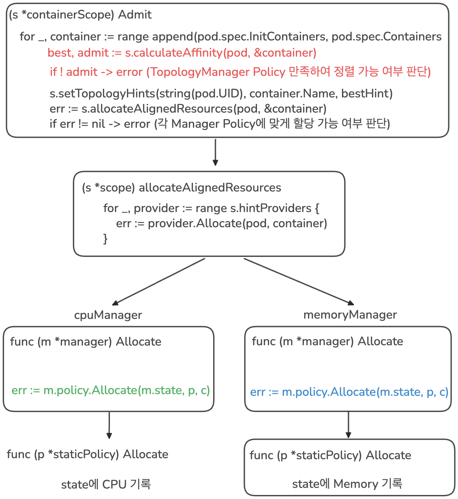
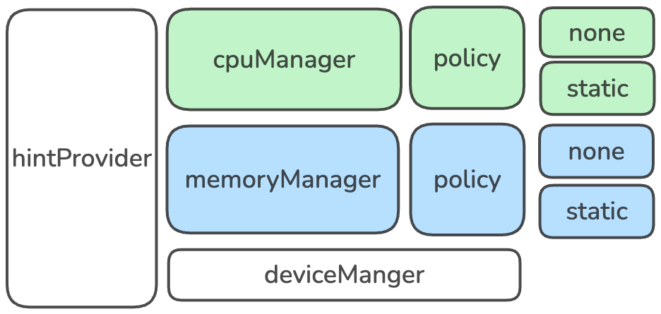

### 분석

이제 [0.발표내용](0.발표내용.md)을 [1.개념정리](1.개념정리.md)를 통해서 정리한 내용을 바탕으로 분석해보겠습니다.

### 목표 정의

이번 사례의 목표는 CPU 사용률을 Kernel 레벨에서 eBPF를 통해 자세히 분석하여 최적화함에 있다

### 문제 정의


이번 사례의 문제를 한줄로 정리하면 다음과 같이 작성할 수 있을 것 같습니다.

> CPU 사용률 중 가장 많은 부분을 차지하는 page fault에서 `do_numa_page` 동작 중 `migrate_misplaced_page` 수행 시간이 전체의 50% 이상을 차지한다

- CPU 사용률이란 전체 백분율에서 Busy State가 차지했던 비율을 의미함
- Busy State가 의미하는 게 연산을 오로지 했다는 것은 아니고, Memory를 읽고 쓰는 데 걸리는 시간인 stalled 이라고 불리는 Memory IO 시간도 포함이 되어 있음
- Memory IO 중 가장 오래 걸리는 부분이 바로 page fault이고 이는 물리적으로 하드웨어 접근까지 필요하기 때문임
- page fault에서 migrate_misplaced_page 시간을 단축시키면 전체적인 page fault 시간을 단축시킬 수 있고 이를 통해 CPU 사용률을 최적화할 수 있음

### do_numa_page란?

이전 글에서 알아본대로 커널은 지속적으로 Auto NUMA Balancing을 맞추려고 노력하고 있습니다.

이러한 동작을 구현하기 위해 NUMA hinting fault가 발생한다고 알아보았고, 이러한 fault가 발생하면 커널에서 호출하는 함수가 바로 `do_numa_page`입니다.

해당 함수의 코드는[^1] 아래와 같습니다.

```c
/* mm/memory.c — NUMA hinting fault 처리 (folio 기반, 간략화) */
static vm_fault_t do_numa_page(struct vm_fault *vmf)
{
    struct vm_area_struct *vma = vmf->vma;
    struct folio *folio;
    int nid = NUMA_NO_NODE, last_cpupid = -1;
    int target_nid, nr_pages;
    bool writable;
    pte_t pte, old_pte;
    int flags = 0;
    /* PROT_NONE으로 바꿔둔 PTE를 원래 권한으로 복원 */
    old_pte = ptep_get(vmf->pte);
    pte = pte_modify(old_pte, vma->vm_page_prot);
    writable = pte_write(pte);
    /* struct page 대신 folio 단위로 처리 (large folio 지원) */
    folio = vm_normal_folio(vma, vmf->address, pte);
    if (!folio || folio_is_zone_device(folio))
        goto out_map;
    nid = folio_nid(folio);          /* folio의 현재 노드 */
    nr_pages = folio_nr_pages(folio);
    /* 접근 태스크와 folio 노드 비교 → 마이그레이션 대상
     * 노드 결정 + cpupid 디코딩 */
    target_nid = numa_migrate_check(folio, vmf, vmf->address,
                                    &flags, writable, &last_cpupid);
    if (target_nid == NUMA_NO_NODE)
        goto out_map;                /* 이미 최적 위치 */
    /* 격리 사전 검사: 공유 실행/더티 파일 folio 제외,
     * 대상 노드 워터마크 확인 후 LRU 격리까지 수행 */
    if (migrate_misplaced_folio_prepare(folio, vma, target_nid)) {
        flags |= TNF_MIGRATE_FAIL;
        goto out;
    }
    /* 실제 마이그레이션 수행 (MIGRATE_ASYNC) */
    if (migrate_misplaced_folio(folio, target_nid))
        flags |= TNF_MIGRATE_FAIL;
out:
    /* NUMA 폴트 통계 업데이트 (folio 크기 반영) */
    if (nid != NUMA_NO_NODE)
        task_numa_fault(last_cpupid, nid, nr_pages, flags);
    return 0;
out_map:
    /* 매핑만 복원하고 종료 (PTE 권한 재설정) */
    ...
}
```

동작을 살펴보면,

- CPU(태스크)가 있는 노드와  데이터(folio)가 있는 노드를 비교합니다
- 같은 노드에 있지 않은 경우 마이그레이션 (migrate_misplaced_folio)을 수행합니다

즉 정리하면, `do_numa_page`는 지속적으로 호출될 수 밖에 없습니다. 이는 Auto NUMA Balancing이 켜져있기 때문입니다. 이 동작에서 가장 많은 시간을 할애하는 것이 바로 마이그레이션 `migrate_misplaced_page` 입니다.

**따라서 `migrate_misplaced_page`이 발생하지 않게 하면 전체적인 `do_numa_page` 시간을 줄일 수 있습니다.**

### migrate_misplaced_page이 발생하는 이유

이전 글에서 알아본대로 `migrate_misplaced_page`가 발생하는 이유는 Auto NUMA Balancing 때문이며, Auto NUMA Balancing이 필요한 이유는 아래와 같은 상황들 때문입니다.

```
1. 프로그램이 노드0의 코어에서 시작 → 메모리도 노드0에 할당됨 (first-touch)
2. 시간이 흘러, 리눅스 스케줄러가 부하 분산을 위해
   이 프로그램을 노드1의 코어로 옮김
3. 결과: 코어는 노드1인데, 메모리는 여전히 노드0에 있음
   → 매번 메모리 접근할 때마다 원격(remote) 접근 발생 → 느려짐
```

즉 정리하면 리눅스 스케줄러에 의해 task가 실행되는 CPU 코어의 위치가 변경될 수 있고 이로 인해 NUMA 정렬이 깨지면 Auto NUMA Balancing에 의해 실행 중인 CPU 코어 혹은 저장된 메모리의 위치를 변경합니다.

따라서 이를 해결하는 가장 간단한 방법은 task가 실행되는 CPU, 메모리를 동일한 NUMA 노드로 고정하는 것입니다.

### Kubernetes에서 프로세스를 자원에 배치하는 방법 - kubelet

Kubernetes에서 프로세스를 실제 노드에서 실행하는 역할은 kubelet이 수행합니다. kube-scheduler에 의해서 각 노드의 자원 할당 상태를 확인하여 새로운 Pod가 호스팅될 노드가 결정되고, 해당 노드의 kubelet은 자신의 이름이 적인 Pendig 상태의 Pod의 정보를 읽어 실행하게 됩니다. 이제 Pod의 정보를 읽은 뒤 어떻게 실제 자원까지 할당하는 지 알아보겠습니다.

#### 1. syncLoop

kubelet이 노드에서 실행되면 `syncLoop`가 무한 반복됩니다. `syncLoop`는 세가지 채널(file, apiserver, http)을 통해 변경 사항을 감지하고 이를 반영합니다.

여기서 한번 파드가 새로 생성되었다는 흐름으로 코드를 따라가 보겠습니다.

```go
// syncLoop is the main loop for processing changes. It watches for changes from
// three channels (file, apiserver, and http) and creates a union of them. For
// any new change seen, will run a sync against desired state and running state. If
// no changes are seen to the configuration, will synchronize the last known desired
// state every sync-frequency seconds. Never returns.
func (kl *Kubelet) syncLoop(ctx context.Context, updates <-chan kubetypes.PodUpdate, handler SyncHandler) {
	klog.InfoS("Starting kubelet main sync loop")
    ...

	for {
		if err := kl.runtimeState.runtimeErrors(); err != nil {
			klog.ErrorS(err, "Skipping pod synchronization")
			// exponential backoff
			time.Sleep(duration)
			duration = time.Duration(math.Min(float64(max), factor*float64(duration)))
			continue
		}
		// reset backoff if we have a success
		duration = base

		kl.syncLoopMonitor.Store(kl.clock.Now())
		if !kl.syncLoopIteration(ctx, updates, handler, syncTicker.C, housekeepingTicker.C, plegCh) {
			break
		}
		kl.syncLoopMonitor.Store(kl.clock.Now())
	}
}
```

각 루프마다 `kl.syncLoopIteration`을 호출하게 되고 Pod가 추가된 경우 이 함수 안에서 `handler.HandlePodAdditions`를 호출하게 됩니다.

```go
func (kl *Kubelet) syncLoopIteration(ctx context.Context, configCh <-chan kubetypes.PodUpdate, handler SyncHandler,
	syncCh <-chan time.Time, housekeepingCh <-chan time.Time, plegCh <-chan *pleg.PodLifecycleEvent) bool {
	select {
	case u, open := <-configCh:
		// Update from a config source; dispatch it to the right handler
		// callback.
		if !open {
			klog.ErrorS(nil, "Update channel is closed, exiting the sync loop")
			return false
		}

		switch u.Op {
		case kubetypes.ADD:
			klog.V(2).InfoS("SyncLoop ADD", "source", u.Source, "pods", klog.KObjSlice(u.Pods))
			// After restarting, kubelet will get all existing pods through
			// ADD as if they are new pods. These pods will then go through the
			// admission process and *may* be rejected. This can be resolved
			// once we have checkpointing.
			handler.HandlePodAdditions(u.Pods)
		...
	return true
}
```

`handler.HandlePodAdditions`에서는 이 Pod를 노드 안으로 들여도 되는 지 확인하는 `kl.canAdmitPod`을 호출하게되고

```go
func (kl *Kubelet) HandlePodAdditions(pods []*v1.Pod) {
	...
	for _, pod := range pods {
		existingPods := kl.podManager.GetPods()
		// Always add the pod to the pod manager. Kubelet relies on the pod
		// manager as the source of truth for the desired state. If a pod does
		// not exist in the pod manager, it means that it has been deleted in
		// the apiserver and no action (other than cleanup) is required.
		kl.podManager.AddPod(pod)

		pod, mirrorPod, wasMirror := kl.podManager.GetPodAndMirrorPod(pod)
		if wasMirror {
			if pod == nil {
				klog.V(2).InfoS("Unable to find pod for mirror pod, skipping", "mirrorPod", klog.KObj(mirrorPod), "mirrorPodUID", mirrorPod.UID)
				continue
			}
			kl.podWorkers.UpdatePod(UpdatePodOptions{
				Pod:        pod,
				MirrorPod:  mirrorPod,
				UpdateType: kubetypes.SyncPodUpdate,
				StartTime:  start,
			})
			continue
		}

		// Only go through the admission process if the pod is not requested
		// for termination by another part of the kubelet. If the pod is already
		// using resources (previously admitted), the pod worker is going to be
		// shutting it down. If the pod hasn't started yet, we know that when
		// the pod worker is invoked it will also avoid setting up the pod, so
		// we simply avoid doing any work.
		// We also do not try to admit the pod that is already in terminated state.
		if !kl.podWorkers.IsPodTerminationRequested(pod.UID) && !podutil.IsPodPhaseTerminal(pod.Status.Phase) {
			// We failed pods that we rejected, so activePods include all admitted
			// pods that are alive.
			activePods := kl.filterOutInactivePods(existingPods)

			if utilfeature.DefaultFeatureGate.Enabled(features.InPlacePodVerticalScaling) {
				// To handle kubelet restarts, test pod admissibility using AllocatedResources values
				// (for cpu & memory) from checkpoint store. If found, that is the source of truth.
				podCopy := pod.DeepCopy()
				kl.updateContainerResourceAllocation(podCopy)

				// Check if we can admit the pod; if not, reject it.
				if ok, reason, message := kl.canAdmitPod(activePods, podCopy); !ok {
					kl.rejectPod(pod, reason, message)
					continue
				}
				// For new pod, checkpoint the resource values at which the Pod has been admitted
				if err := kl.statusManager.SetPodAllocation(podCopy); err != nil {
					//TODO(vinaykul,InPlacePodVerticalScaling): Can we recover from this in some way? Investigate
					klog.ErrorS(err, "SetPodAllocation failed", "pod", klog.KObj(pod))
				}
			} else {
				// Check if we can admit the pod; if not, reject it.
				if ok, reason, message := kl.canAdmitPod(activePods, pod); !ok {
					kl.rejectPod(pod, reason, message)
					continue
				}
			}
		}
		kl.podWorkers.UpdatePod(UpdatePodOptions{
			Pod:        pod,
			MirrorPod:  mirrorPod,
			UpdateType: kubetypes.SyncPodCreate,
			StartTime:  start,
		})
	}
}
```

`kl.canAdmitPod`안에서는 등록된 모든 `kl.admitHandlers`를 돌면서 실제로 들여도 되는 지 하나씩 점검하기 위해 각 핸들러마다 `podAdmitHandler.Admit`를 호출합니다.
이때 하나의 핸들러라도 Pod Admit을 거절하게 되면 해당 Pod는 노드에서 호스팅 되지 못하고 거절됩니다.

```go
func (kl *Kubelet) canAdmitPod(pods []*v1.Pod, pod *v1.Pod) (bool, string, string) {
	// the kubelet will invoke each pod admit handler in sequence
	// if any handler rejects, the pod is rejected.
	// TODO: move out of disk check into a pod admitter
	// TODO: out of resource eviction should have a pod admitter call-out
	attrs := &lifecycle.PodAdmitAttributes{Pod: pod, OtherPods: pods}
	if utilfeature.DefaultFeatureGate.Enabled(features.InPlacePodVerticalScaling) {
		// Use allocated resources values from checkpoint store (source of truth) to determine fit
		otherPods := make([]*v1.Pod, 0, len(pods))
		for _, p := range pods {
			op := p.DeepCopy()
			kl.updateContainerResourceAllocation(op)

			otherPods = append(otherPods, op)
		}
		attrs.OtherPods = otherPods
	}
	for _, podAdmitHandler := range kl.admitHandlers {
		if result := podAdmitHandler.Admit(attrs); !result.Admit {
			return false, result.Reason, result.Message
		}
	}

	return true, "", ""
}
```

그렇다면 각 핸들러가 수행하는 `podAdmitHandler.Admit`은 정확히 어떤 것일까요? 이것을 알기 위해 어떤 핸들러들이 등록되는 지 확인해보겠습니다.

#### 2. admitHandlers

admitHandler들은 스케줄러가 이미 이 노드로 보내기로 결정한 파드를, kubelet이 로컬에서 마지막으로 한 번 더 체크해서 실제로 실행 가능한지 최종 승인/거부하는 문지기(gatekeeper)입니다.

스케줄러는 etcd에 저장된 "예상" 상태를 보고 결정하지만, 실제 노드는:

- 그 사이 다른 static pod가 리소스를 이미 써버렸을 수 있고
- 메모리/디스크 압박(pressure) 상태로 바뀌었을 수 있고
- 노드가 shutdown 절차를 시작했을 수 있고
- CPU/메모리/디바이스를 NUMA 정렬해서 배타적으로 줘야 하는데 실제로는 그럴 여유가 없을 수도 있습니다

그래서 kubelet은 "스케줄러가 시켰다고 무조건 실행"하지 않고, 자기 노드의 실시간 상태를 기준으로 한 번 더 검증합니다. 이 검증 로직들의 집합이 Admit Handler들입니다.

```go
// NewMainKubelet instantiates a new Kubelet object along with all the required internal modules.
// No initialization of Kubelet and its modules should happen here.
func NewMainKubelet(kubeCfg *kubeletconfiginternal.KubeletConfiguration,
	kubeDeps *Dependencies,
	crOptions *config.ContainerRuntimeOptions,
	hostname string,
	hostnameOverridden bool,
	nodeName types.NodeName,
	nodeIPs []net.IP,
	providerID string,
	cloudProvider string,
	certDirectory string,
	rootDirectory string,
	podLogsDirectory string,
	imageCredentialProviderConfigFile string,
	imageCredentialProviderBinDir string,
	registerNode bool,
	registerWithTaints []v1.Taint,
	allowedUnsafeSysctls []string,
	experimentalMounterPath string,
	kernelMemcgNotification bool,
	experimentalNodeAllocatableIgnoreEvictionThreshold bool,
	minimumGCAge metav1.Duration,
	maxPerPodContainerCount int32,
	maxContainerCount int32,
	registerSchedulable bool,
	keepTerminatedPodVolumes bool,
	nodeLabels map[string]string,
	nodeStatusMaxImages int32,
	seccompDefault bool,
) (*Kubelet, error) {
	ctx := context.Background()
	logger := klog.TODO()

	...

	// setup eviction manager
	evictionManager, evictionAdmitHandler := eviction.NewManager(klet.resourceAnalyzer, evictionConfig,
		killPodNow(klet.podWorkers, kubeDeps.Recorder), klet.imageManager, klet.containerGC, kubeDeps.Recorder, nodeRef, klet.clock, kubeCfg.LocalStorageCapacityIsolation)

	klet.evictionManager = evictionManager
	klet.admitHandlers.AddPodAdmitHandler(evictionAdmitHandler)

	// Safe, allowed sysctls can always be used as unsafe sysctls in the spec.
	// Hence, we concatenate those two lists.
	safeAndUnsafeSysctls := append(sysctl.SafeSysctlAllowlist(), allowedUnsafeSysctls...)
	sysctlsAllowlist, err := sysctl.NewAllowlist(safeAndUnsafeSysctls)
	if err != nil {
		return nil, err
	}
	klet.admitHandlers.AddPodAdmitHandler(sysctlsAllowlist)

	// enable active deadline handler
	activeDeadlineHandler, err := newActiveDeadlineHandler(klet.statusManager, kubeDeps.Recorder, klet.clock)
	if err != nil {
		return nil, err
	}
	klet.AddPodSyncLoopHandler(activeDeadlineHandler)
	klet.AddPodSyncHandler(activeDeadlineHandler)

	klet.admitHandlers.AddPodAdmitHandler(klet.containerManager.GetAllocateResourcesPodAdmitHandler())

	criticalPodAdmissionHandler := preemption.NewCriticalPodAdmissionHandler(klet.GetActivePods, killPodNow(klet.podWorkers, kubeDeps.Recorder), kubeDeps.Recorder)
	klet.admitHandlers.AddPodAdmitHandler(lifecycle.NewPredicateAdmitHandler(klet.getNodeAnyWay, criticalPodAdmissionHandler, klet.containerManager.UpdatePluginResources))
	// apply functional Option's
	for _, opt := range kubeDeps.Options {
		opt(klet)
	}

	if sysruntime.GOOS == "linux" {
		// AppArmor is a Linux kernel security module and it does not support other operating systems.
		klet.appArmorValidator = apparmor.NewValidator()
		klet.softAdmitHandlers.AddPodAdmitHandler(lifecycle.NewAppArmorAdmitHandler(klet.appArmorValidator))
	}

	leaseDuration := time.Duration(kubeCfg.NodeLeaseDurationSeconds) * time.Second
	renewInterval := time.Duration(float64(leaseDuration) * nodeLeaseRenewIntervalFraction)
	klet.nodeLeaseController = lease.NewController(
		klet.clock,
		klet.heartbeatClient,
		string(klet.nodeName),
		kubeCfg.NodeLeaseDurationSeconds,
		klet.onRepeatedHeartbeatFailure,
		renewInterval,
		string(klet.nodeName),
		v1.NamespaceNodeLease,
		util.SetNodeOwnerFunc(klet.heartbeatClient, string(klet.nodeName)))

	// setup node shutdown manager
	shutdownManager, shutdownAdmitHandler := nodeshutdown.NewManager(&nodeshutdown.Config{
		Logger:                           logger,
		ProbeManager:                     klet.probeManager,
		Recorder:                         kubeDeps.Recorder,
		NodeRef:                          nodeRef,
		GetPodsFunc:                      klet.GetActivePods,
		KillPodFunc:                      killPodNow(klet.podWorkers, kubeDeps.Recorder),
		SyncNodeStatusFunc:               klet.syncNodeStatus,
		ShutdownGracePeriodRequested:     kubeCfg.ShutdownGracePeriod.Duration,
		ShutdownGracePeriodCriticalPods:  kubeCfg.ShutdownGracePeriodCriticalPods.Duration,
		ShutdownGracePeriodByPodPriority: kubeCfg.ShutdownGracePeriodByPodPriority,
		StateDirectory:                   rootDirectory,
	})
	klet.shutdownManager = shutdownManager
	klet.usernsManager, err = userns.MakeUserNsManager(klet)
	if err != nil {
		return nil, fmt.Errorf("create user namespace manager: %w", err)
	}
	klet.admitHandlers.AddPodAdmitHandler(shutdownAdmitHandler)

	// Finally, put the most recent version of the config on the Kubelet, so
	// people can see how it was configured.
	klet.kubeletConfiguration = *kubeCfg

	// Generating the status funcs should be the last thing we do,
	// since this relies on the rest of the Kubelet having been constructed.
	klet.setNodeStatusFuncs = klet.defaultNodeStatusFuncs()

	return klet, nil
}
```

각 Handler에 대한 설명은 아래와 같습니다.

| 순서 | 등록 코드 | Admit Handler | 실제 구현체 | 역할 |
|---|---|---|---|---|
| 1 | `admitHandlers.AddPodAdmitHandler(evictionAdmitHandler)` | Eviction Manager | `eviction.NewManager()`가 반환하는 admit handler | 노드가 메모리/디스크 등 자원 압박(pressure) 상태일 때 신규 파드 거부 |
| 2 | `admitHandlers.AddPodAdmitHandler(sysctlsAllowlist)` | Sysctl Allowlist | `sysctl.NewAllowlist()` | 파드가 지정한 sysctl이 허용 목록(safe+unsafe) 안에 있는지 검사, 아니면 거부 |
| 3 | `admitHandlers.AddPodAdmitHandler(klet.containerManager.GetAllocateResourcesPodAdmitHandler())` | **Topology Manager** | `containerManagerImpl.GetAllocateResourcesPodAdmitHandler()` → `return cm.topologyManager` | Topology Manager가 CPU/Memory/Device Manager로부터 각각 NUMA 힌트를 모아 정렬 가능 여부 판단 + 가능하면 각 매니저의 `Allocate()` 호출해 실제 리소스 예약까지 확정 |
| 4 | `admitHandlers.AddPodAdmitHandler(lifecycle.NewPredicateAdmitHandler(klet.getNodeAnyWay, criticalPodAdmissionHandler, klet.containerManager.UpdatePluginResources))` | Predicate Admit Handler<br>(내부에 Critical Pod Admission/Preemption 포함) | `lifecycle.NewPredicateAdmitHandler()` | 노드 조건(NodeSelector, 포트 충돌, 리소스 fit 등) 재검증. 부족하면 `criticalPodAdmissionHandler`가 우선순위 낮은 파드를 선점(evict) 시도 |
| 5 | `admitHandlers.AddPodAdmitHandler(shutdownAdmitHandler)` | Node Shutdown Manager | `nodeshutdown.NewManager()`가 반환하는 admit handler | 노드가 종료 절차 중일 때 신규 파드 거부 |
| (조건부, Linux 전용) | `softAdmitHandlers.AddPodAdmitHandler(lifecycle.NewAppArmorAdmitHandler(...))` | AppArmor Admit Handler | `lifecycle.NewAppArmorAdmitHandler()` | AppArmor 프로파일 검증. **별도 리스트(`softAdmitHandlers`)**에 등록 |
| (별도 그룹, Admit 아님) | `AddPodSyncLoopHandler` / `AddPodSyncHandler` | Active Deadline Handler | `newActiveDeadlineHandler()` | 실행 시간 초과된 **기존** 파드를 감시 후 강제 종료 — 진입(admission)이 아니라 지속 감시라서 Admit Handler 목록에 없음 |

이렇게 모든 Handler의 승인을 받게 되면 그 다음은 `kl.podWorkers.UpdatePod`를 호출해서 Pod의 상태를 업데이트해주게 됩니다.

여기서 우리가 집중해야하는 부분은 `klet.containerManager.GetAllocateResourcesPodAdmitHandler())`을 통해 등록되는 **Topology Manager** 입니다. 이 Topology Manager에서는 CPU/Memory/Device Manager로부터 각각 NUMA 힌트를 모아 정렬 가능 여부 판단한 뒤 가능하면 각 매니저의 `Allocate()` 호출해 실제 리소스 예약까지 확정합니다.

### Kubernetes에서 NUMA 노드 고정하기

앞서 발표 내용을 정리하면서 Kubernetes에서 CPU Pinning을 지원한다고 했습니다. 이러한 기능을 구현하고 있는 것이 위에서 언급한 containerManager 통합 핸들러의 CPU Manager입니다.


CPU Manager의 기본 정책은 `none`이지만, `static`으로 설정하면 QoS가 Guaranteed(즉, request == limit)이면서 정수 코어를 요청한 Pod에 대해서 CPU 코어가 요청한 만큼 배타적 할당(dedicated) 됩니다.[^2]

kubelet을 설정하는 config에 아래와 같이 `cpuManagerPolicy`을 `static`으로 설정하면 적용됩니다. 

```yaml
apiVersion: kubelet.config.k8s.io/v1beta1
kind: KubeletConfiguration
cpuManagerPolicy: static
cpuManagerReconcilePeriod: 10s
systemReserved:
  cpu: "1"
kubeReserved:
  cpu: "1"
```

마찬가지로 Memory Pinnig 역시 Memory Manager에 의해 구현되어 있습니다.


Memory Manager의 기본 정책도 `none`이고, `static`으로 설정하면 QoS가 Guaranteed(즉, request == limit)인 Pod에 대해 요청한 만큼 메모리가 예약 됩니다.

kubelet을 설정하는 config에 아래와 같이 `memoryManagerPolicy`를 `static`으로 설정하면 적용됩니다.[^3]

```yaml
apiVersion: kubelet.config.k8s.io/v1beta1
kind: KubeletConfiguration
memoryManagerPolicy: Static
systemReserved:
  memory: "2Gi"
kubeReserved:
  memory: "1Gi"
reservedMemory:
  - numaNode: 0
    limits:
      memory: "1586Mi"
  - numaNode: 1
    limits:
      memory: "1586Mi"
```

발표 내용에서도 언급하고 있듯이,

- CPU pinning만 하게 되면  메모리 노드 여유에 따라 프로세스의 메모리가 이동하므로 remote access가 일어납니다
- Memory pinning만 하게 되면 CPU 여유에 따라 프로세스를 실행하는 CPU가 이동하므로 remote access가 일어납니다

따라서 NUMA 아키텍처를 고려해서 최적화하기 위해선 CPU, Memory를 같은 NUMA 노드 단위로 배치해야하고 이를 구현한 정책이 Topology Manager의 `single-numa-node` 정책입니다.[^4]

`single-numa-node` 정책을 적용하기 위해선 cpuManager 정책을 `static`으로 memoryManager 정책을 `Static`으로 설정해주어야 합니다.

```yaml
apiVersion: kubelet.config.k8s.io/v1beta1
kind: KubeletConfiguration
memoryManagerPolicy: Static
cpuManagerPolicy: static
topologyManagerPolicy: single-numa-node
systemReserved:
  memory: "2Gi"
kubeReserved:
  memory: "1Gi"
reservedMemory:
  - numaNode: 0
    limits:
      memory: "1586Mi"
  - numaNode: 1
    limits:
      memory: "1586Mi"
```

때문에 `single-numa-node` 정책을 적용하기 위해서 Pod는

- QoS가 Guaranteed(즉, request == limit)이면서
- 정수 코어를 요청해야합니다

위 정책을 통해 프로세스의 CPU를 특정 NUMA 노드 코어에 전용 할당하고 메모리를 그 같은 노드에서 할당합니다.
이때 위 둘이 같은 NUMA 노드가 안 되면 파드 자체를 거부(Admission 실패)하게 됩니다.

여기까지 보면 앞에서 정리한 [문제 정의](#_3)를 해결할 수 있을 것 같습니다. task가 실행되는 CPU, 메모리를 동일한 NUMA 노드로 고정할 수 있기 때문입니다.

하지만 남은 문제가 있습니다. 그건 바로 제약이 심하다는 것입니다. 일반적으로 Kubernetes 위에서 동작하는 Pod의 CPU Request가 항상 정수로 떨어지지 않습니다.
또한 QoS가 항상 Guaranteed 일 수 없습니다. 어떤 것은 Burstable 일 수 도 있기 때문입니다.

발표 내용에서도 이러한 점을 언급합니다. CPU 가 Spike 칠 수 도 있는데, 이렇게 고정된 값으로 제한하면 서비스가 불안정해질 수 있다고요.
그래서 토스에서 제시한 해결책은 **"kubelet을 커스텀하는 것"**입니다.

### Kubelet 커스텀 목표 설정


kubelet을 커스텀을 통해 구현해야 하는 동작은 아래와 같습니다.

- task가 실행되는 CPU, 메모리를 동일한 NUMA 노드로 고정한다
- 특정 코어 수나 메모리로 제한하지 않고, 소켓 전체 범위로 할당한다
- Pod의 QoS는 Guaranteed 뿐만아니라 Burstable도 수용 가능해야한다
- 코어 수를 요청할 때 정수가 아니여도 동작해야한다

이제 위 동작을 구현하기 위해 kubelet에서 어떤 코드를 추가하고 수정하면 되는 지 분석해보겠습니다.

#### Topology Manager

우리는 [syncLoop](#1-syncloop)에서 각 핸들러마다 podAdmitHandler.Admit를 호출한다는 것을 알아봤습니다. 그리고 podAdmitHandler 중 우리가 집중에서 볼 핸들러는 Topology Manager는
`klet.containerManager.GetAllocateResourcesPodAdmitHandler())`을 통해 등록됩니다.

`klet.containerManager.GetAllocateResourcesPodAdmitHandler())`은 `pkg/kubelet/cm/container_manager_linux.go` 파일에서 구현되어 있고 `cm.topologyManager`를 반환합니다.

```go
func (cm *containerManagerImpl) GetAllocateResourcesPodAdmitHandler() lifecycle.PodAdmitHandler {
	return cm.topologyManager
}
```

`cm.topologyManager`가 반환하는 것은 `topologymanager.Manager` (=topologymanger 패키지의 Manager 인터페이스)입니다.

```go
type containerManagerImpl struct {
	sync.RWMutex
	cadvisorInterface cadvisor.Interface
	mountUtil         mount.Interface
	NodeConfig
	status Status
	// External containers being managed.
	systemContainers []*systemContainer
	// Tasks that are run periodically
	periodicTasks []func()
	// Holds all the mounted cgroup subsystems
	subsystems *CgroupSubsystems
	nodeInfo   *v1.Node
	// Interface for cgroup management
	cgroupManager CgroupManager
	// Capacity of this node.
	capacity v1.ResourceList
	// Capacity of this node, including internal resources.
	internalCapacity v1.ResourceList
	// Absolute cgroupfs path to a cgroup that Kubelet needs to place all pods under.
	// This path include a top level container for enforcing Node Allocatable.
	cgroupRoot CgroupName
	// Event recorder interface.
	recorder record.EventRecorder
	// Interface for QoS cgroup management
	qosContainerManager QOSContainerManager
	// Interface for exporting and allocating devices reported by device plugins.
	deviceManager devicemanager.Manager
	// Interface for CPU affinity management.
	cpuManager cpumanager.Manager
	// Interface for memory affinity management.
	memoryManager memorymanager.Manager
	// Interface for Topology resource co-ordination
	topologyManager topologymanager.Manager
	// Interface for Dynamic Resource Allocation management.
	draManager dra.Manager
}
```

위에서 `GetAllocateResourcesPodAdmitHandler()` 함수의 반환 값은 `lifecycle.PodAdmitHandler`이었습니다. 아래 Manager 인터페이스는 `lifecycle.PodAdmitHandler` 인터페이스를 임베딩하고 있기 때문에 Manager의 메서드 집합은 PodAdmitHandler의 메서드 집합을 포함합니다. 따라서 Manager가 `lifecycle.PodAdmitHandler` 인터페이스 형태로 반환될 수 있었 던 것입니다.

```go
// Manager interface provides methods for Kubelet to manage pod topology hints
type Manager interface {
	// PodAdmitHandler is implemented by Manager
	lifecycle.PodAdmitHandler
	// AddHintProvider adds a hint provider to manager to indicate the hint provider
	// wants to be consulted with when making topology hints
	AddHintProvider(HintProvider)
	// AddContainer adds pod to Manager for tracking
	AddContainer(pod *v1.Pod, container *v1.Container, containerID string)
	// RemoveContainer removes pod from Manager tracking
	RemoveContainer(containerID string) error
	// Store is the interface for storing pod topology hints
	Store
}

type manager struct {
	//Topology Manager Scope
	scope Scope
}

...

func (m *manager) GetAffinity(podUID string, containerName string) TopologyHint {
	return m.scope.GetAffinity(podUID, containerName)
}

func (m *manager) GetPolicy() Policy {
	return m.scope.GetPolicy()
}

func (m *manager) AddHintProvider(h HintProvider) {
	m.scope.AddHintProvider(h)
}

func (m *manager) AddContainer(pod *v1.Pod, container *v1.Container, containerID string) {
	m.scope.AddContainer(pod, container, containerID)
}

func (m *manager) RemoveContainer(containerID string) error {
	return m.scope.RemoveContainer(containerID)
}

func (m *manager) Admit(attrs *lifecycle.PodAdmitAttributes) lifecycle.PodAdmitResult {
	klog.InfoS("Topology Admit Handler", "podUID", attrs.Pod.UID, "podNamespace", attrs.Pod.Namespace, "podName", attrs.Pod.Name)
	metrics.TopologyManagerAdmissionRequestsTotal.Inc()

	startTime := time.Now()
	podAdmitResult := m.scope.Admit(attrs.Pod)
	metrics.TopologyManagerAdmissionDuration.Observe(float64(time.Since(startTime).Milliseconds()))

	return podAdmitResult
}

```

Manager 인터페이스는 *manager를 리시버로 각 메서드가 구현되는 것을 확인할 수 있고 `Scope`의 Wrapper에 불과하다는 것을 확인할 수 있습니다.

 `pkg/kubelet/lifecycle/interfaces.go`에서 정의된 PodAdmitHandler 인터페이스를 보면
Admit을 구현해야함을 알 수 있습니다. manager에서는 Admit을 포함한 GetAffinity, GetPolicy, AddHintProvider, AddContainer, RemoveContainer 총 6개의 메서드를 구현하고 있습니다.

```go
// PodAdmitHandler is notified during pod admission.
type PodAdmitHandler interface {
	// Admit evaluates if a pod can be admitted.
	Admit(attrs *PodAdmitAttributes) PodAdmitResult
}
```

이제 Admit 구현이 어떻게 되어 있는 지 확인해보면 `pkg/kubelet/cm/topologymanager/topology_manager.go`에서 아래와 같이 구현되어 있습니다.

```go
func (m *manager) Admit(attrs *lifecycle.PodAdmitAttributes) lifecycle.PodAdmitResult {
	klog.InfoS("Topology Admit Handler", "podUID", attrs.Pod.UID, "podNamespace", attrs.Pod.Namespace, "podName", attrs.Pod.Name)
	metrics.TopologyManagerAdmissionRequestsTotal.Inc()

	startTime := time.Now()
	podAdmitResult := m.scope.Admit(attrs.Pod)
	metrics.TopologyManagerAdmissionDuration.Observe(float64(time.Since(startTime).Milliseconds()))

	return podAdmitResult
}
```

결국 내부적으로 `m.scope.Admit(attrs.Pod)`를 호출해서 실제 Admit을 수행하는 것으로 확인되었습니다. 
scope.Admit은 어떤 동작을 수행하는 지 알아보기 위해 `pkg/kubelet/cm/topologymanager/scope.go`에 정의된 Scope 인터페이스를 확인해보겠습니다.

```go
// Scope interface for Topology Manager
type Scope interface {
	Name() string
	GetPolicy() Policy
	Admit(pod *v1.Pod) lifecycle.PodAdmitResult
	// AddHintProvider adds a hint provider to manager to indicate the hint provider
	// wants to be consoluted with when making topology hints
	AddHintProvider(h HintProvider)
	// AddContainer adds pod to Manager for tracking
	AddContainer(pod *v1.Pod, container *v1.Container, containerID string)
	// RemoveContainer removes pod from Manager tracking
	RemoveContainer(containerID string) error
	// Store is the interface for storing pod topology hints
	Store
}

type scope struct {
	mutex sync.Mutex
	name  string
	// Mapping of a Pods mapping of Containers and their TopologyHints
	// Indexed by PodUID to ContainerName
	podTopologyHints podTopologyHints
	// The list of components registered with the Manager
	hintProviders []HintProvider
	// Topology Manager Policy
	policy Policy
	// Mapping of (PodUid, ContainerName) to ContainerID for Adding/Removing Pods from PodTopologyHints mapping
	podMap containermap.ContainerMap
}

func (s *scope) Name() string {
	return s.name
}

func (s *scope) getTopologyHints(podUID string, containerName string) TopologyHint {
	s.mutex.Lock()
	defer s.mutex.Unlock()
	return s.podTopologyHints[podUID][containerName]
}

func (s *scope) setTopologyHints(podUID string, containerName string, th TopologyHint) {
	s.mutex.Lock()
	defer s.mutex.Unlock()

	if s.podTopologyHints[podUID] == nil {
		s.podTopologyHints[podUID] = make(map[string]TopologyHint)
	}
	s.podTopologyHints[podUID][containerName] = th
}

func (s *scope) GetAffinity(podUID string, containerName string) TopologyHint {
	return s.getTopologyHints(podUID, containerName)
}

func (s *scope) GetPolicy() Policy {
	return s.policy
}

func (s *scope) AddHintProvider(h HintProvider) {
	s.hintProviders = append(s.hintProviders, h)
}

// It would be better to implement this function in topologymanager instead of scope
// but topologymanager do not track mapping anymore
func (s *scope) AddContainer(pod *v1.Pod, container *v1.Container, containerID string) {
	s.mutex.Lock()
	defer s.mutex.Unlock()

	s.podMap.Add(string(pod.UID), container.Name, containerID)
}

// It would be better to implement this function in topologymanager instead of scope
// but topologymanager do not track mapping anymore
func (s *scope) RemoveContainer(containerID string) error {
	s.mutex.Lock()
	defer s.mutex.Unlock()

	klog.InfoS("RemoveContainer", "containerID", containerID)
	// Get the podUID and containerName associated with the containerID to be removed and remove it
	podUIDString, containerName, err := s.podMap.GetContainerRef(containerID)
	if err != nil {
		return nil
	}
	s.podMap.RemoveByContainerID(containerID)

	// In cases where a container has been restarted, it's possible that the same podUID and
	// containerName are already associated with a *different* containerID now. Only remove
	// the TopologyHints associated with that podUID and containerName if this is not true
	if _, err := s.podMap.GetContainerID(podUIDString, containerName); err != nil {
		delete(s.podTopologyHints[podUIDString], containerName)
		if len(s.podTopologyHints[podUIDString]) == 0 {
			delete(s.podTopologyHints, podUIDString)
		}
	}

	return nil
}
```

Scope 인터페이스는 Topology Manager를 위한 인터페이스이며 마찬가지로 Admit을 구현해야합니다. 그리고 Scope 인터페이스는 마찬가지로 *scope를 통해 메서드로 구현됩니다.

그런데 이상한 점이 하나 있습니다. 그건 바로 Admit이 정의되어 있지 않다는 점입니다. 그 이유는 scope는 공통 메서드만 정의하고 실제 Admit이나 GetAffinity는 `containerScope`이나 `podScope`에서 정의되기 때문입니다. 이를 위해 각 구현체에서는 `scope`를 임베딩합니다.


| 메서드 | 정의 위치 |
|---|---|
| `Name` | `scope` |
| `GetPolicy` | `scope` |
| `AddHintProvider` | `scope` |
| `AddContainer` | `scope` |
| `RemoveContainer` | `scope` |
| `GetAffinity` | `scope`에서 정의되지만 각 구현체에서 재정의됨 |
| `Admit` | 각 구현체 |

```go
type containerScope struct {
	scope
}

// Ensure containerScope implements Scope interface
var _ Scope = &containerScope{}

// NewContainerScope returns a container scope.
func NewContainerScope(policy Policy) Scope {
	return &containerScope{
		scope{
			name:             containerTopologyScope,
			podTopologyHints: podTopologyHints{},
			policy:           policy,
			podMap:           containermap.NewContainerMap(),
		},
	}
}

func (s *containerScope) Admit(pod *v1.Pod) lifecycle.PodAdmitResult {
	for _, container := range append(pod.Spec.InitContainers, pod.Spec.Containers...) {
		bestHint, admit := s.calculateAffinity(pod, &container)
		klog.InfoS("Best TopologyHint", "bestHint", bestHint, "pod", klog.KObj(pod), "containerName", container.Name)

		if !admit {
			metrics.TopologyManagerAdmissionErrorsTotal.Inc()
			return admission.GetPodAdmitResult(&TopologyAffinityError{})
		}
		klog.InfoS("Topology Affinity", "bestHint", bestHint, "pod", klog.KObj(pod), "containerName", container.Name)
		s.setTopologyHints(string(pod.UID), container.Name, bestHint)

		err := s.allocateAlignedResources(pod, &container)
		if err != nil {
			metrics.TopologyManagerAdmissionErrorsTotal.Inc()
			return admission.GetPodAdmitResult(err)
		}
	}
	return admission.GetPodAdmitResult(nil)
}

func (s *containerScope) accumulateProvidersHints(pod *v1.Pod, container *v1.Container) []map[string][]TopologyHint {
	var providersHints []map[string][]TopologyHint

	for _, provider := range s.hintProviders {
		// Get the TopologyHints for a Container from a provider.
		hints := provider.GetTopologyHints(pod, container)
		providersHints = append(providersHints, hints)
		klog.InfoS("TopologyHints", "hints", hints, "pod", klog.KObj(pod), "containerName", container.Name)
	}
	return providersHints
}

func (s *containerScope) calculateAffinity(pod *v1.Pod, container *v1.Container) (TopologyHint, bool) {
	providersHints := s.accumulateProvidersHints(pod, container)
	bestHint, admit := s.policy.Merge(providersHints)
	klog.InfoS("ContainerTopologyHint", "bestHint", bestHint)
	return bestHint, admit
}
```

```go
type podScope struct {
	scope
}

// Ensure podScope implements Scope interface
var _ Scope = &podScope{}

// NewPodScope returns a pod scope.
func NewPodScope(policy Policy) Scope {
	return &podScope{
		scope{
			name:             podTopologyScope,
			podTopologyHints: podTopologyHints{},
			policy:           policy,
			podMap:           containermap.NewContainerMap(),
		},
	}
}

func (s *podScope) Admit(pod *v1.Pod) lifecycle.PodAdmitResult {
	bestHint, admit := s.calculateAffinity(pod)
	klog.InfoS("Best TopologyHint", "bestHint", bestHint, "pod", klog.KObj(pod))
	if !admit {
		metrics.TopologyManagerAdmissionErrorsTotal.Inc()
		return admission.GetPodAdmitResult(&TopologyAffinityError{})
	}

	for _, container := range append(pod.Spec.InitContainers, pod.Spec.Containers...) {
		klog.InfoS("Topology Affinity", "bestHint", bestHint, "pod", klog.KObj(pod), "containerName", container.Name)
		s.setTopologyHints(string(pod.UID), container.Name, bestHint)

		err := s.allocateAlignedResources(pod, &container)
		if err != nil {
			metrics.TopologyManagerAdmissionErrorsTotal.Inc()
			return admission.GetPodAdmitResult(err)
		}
	}
	return admission.GetPodAdmitResult(nil)
}

func (s *podScope) accumulateProvidersHints(pod *v1.Pod) []map[string][]TopologyHint {
	var providersHints []map[string][]TopologyHint

	for _, provider := range s.hintProviders {
		// Get the TopologyHints for a Pod from a provider.
		hints := provider.GetPodTopologyHints(pod)
		providersHints = append(providersHints, hints)
		klog.InfoS("TopologyHints", "hints", hints, "pod", klog.KObj(pod))
	}
	return providersHints
}

func (s *podScope) calculateAffinity(pod *v1.Pod) (TopologyHint, bool) {
	providersHints := s.accumulateProvidersHints(pod)
	bestHint, admit := s.policy.Merge(providersHints)
	klog.InfoS("PodTopologyHint", "bestHint", bestHint)
	return bestHint, admit
}
```

정리하면, Topology Manager는 scope와 policy 두 가지 축으로 구성되고, scope는 containerScope/podScope로 나뉩니다. 그리고 각 scope에는 policy가 설정됩니다. scope의 기본 값은 containerScope입니다.

Admit 과정에서 `calculateAffinity`을 호출하여 hintProviders에 등록된 CPU/Memory/Device Manager로부터 각각 NUMA 힌트를 취합합니다. 이후 `s.policy.Merge(providersHints)`를 호출하여 설정한 정책에 맞게 정렬 가능 여부 판단한 뒤 가능하면 `allocateAlignedResources`를 통해 각 매니저의 `Allocate()` 호출해 실제 리소스 예약까지 확정합니다.

```
kubelet
  │
  ├─ Manager (interface)              ← kubelet이 보는 계약, PodAdmitHandler로 등록
  │
  └─ manager (struct)                 ← 얇은 래퍼. 메트릭/로깅만 하고 전부 위임
        │
        └─ scope Scope                ← ① 인터페이스 필드 (has-a)
             │
             ├─ *containerScope ┐
             └─ *podScope       ┘     ← 이 중 하나가 런타임에 주입됨
                    │
                    └─ scope          ← ② struct 임베딩 (is-a 흉내)
                         │
                         └─ policy Policy   ← ③ 또 인터페이스 필드 (has-a)
                              ├─ nonePolicy
                              ├─ bestEffortPolicy
                              ├─ restrictedPolicy
                              └─ singleNumaNodePolicy
```

#### HintProvider

hintProviders에 등록된 것들은 어떤 것들이 있을까요? 그리고 이것들은 언제 등록될까요? 이것은 kubelet이 시작될 때 `pkg/kubelet/cm/container_manager_linux.go`에 정의된 `NewContainerManager`을 호출할 때 등록됩니다.

아래 코드를 보면 `cm.deviceManager`, `cm.cpuManager`, `cm.memoryManager`가 등록되는 것을 알 수 있습니다. 

```go
func NewContainerManager(mountUtil mount.Interface, cadvisorInterface cadvisor.Interface, nodeConfig NodeConfig, failSwapOn bool, recorder record.EventRecorder, kubeClient clientset.Interface) (ContainerManager, error) {
	subsystems, err := GetCgroupSubsystems()
	...

	cm := &containerManagerImpl{
		cadvisorInterface:   cadvisorInterface,
		mountUtil:           mountUtil,
		NodeConfig:          nodeConfig,
		subsystems:          subsystems,
		cgroupManager:       cgroupManager,
		capacity:            capacity,
		internalCapacity:    internalCapacity,
		cgroupRoot:          cgroupRoot,
		recorder:            recorder,
		qosContainerManager: qosContainerManager,
	}

	cm.topologyManager, err = topologymanager.NewManager(
		machineInfo.Topology,
		nodeConfig.TopologyManagerPolicy,
		nodeConfig.TopologyManagerScope,
		nodeConfig.TopologyManagerPolicyOptions,
	)

	if err != nil {
		return nil, err
	}

	klog.InfoS("Creating device plugin manager")
	cm.deviceManager, err = devicemanager.NewManagerImpl(machineInfo.Topology, cm.topologyManager)
	if err != nil {
		return nil, err
	}
	cm.topologyManager.AddHintProvider(cm.deviceManager)

	// initialize DRA manager
	if utilfeature.DefaultFeatureGate.Enabled(kubefeatures.DynamicResourceAllocation) {
		klog.InfoS("Creating Dynamic Resource Allocation (DRA) manager")
		cm.draManager, err = dra.NewManagerImpl(kubeClient, nodeConfig.KubeletRootDir, nodeConfig.NodeName)
		if err != nil {
			return nil, err
		}
	}

	// Initialize CPU manager
	cm.cpuManager, err = cpumanager.NewManager(
		nodeConfig.CPUManagerPolicy,
		nodeConfig.CPUManagerPolicyOptions,
		nodeConfig.CPUManagerReconcilePeriod,
		machineInfo,
		nodeConfig.NodeAllocatableConfig.ReservedSystemCPUs,
		cm.GetNodeAllocatableReservation(),
		nodeConfig.KubeletRootDir,
		cm.topologyManager,
	)
	if err != nil {
		klog.ErrorS(err, "Failed to initialize cpu manager")
		return nil, err
	}
	cm.topologyManager.AddHintProvider(cm.cpuManager)

	if utilfeature.DefaultFeatureGate.Enabled(kubefeatures.MemoryManager) {
		cm.memoryManager, err = memorymanager.NewManager(
			nodeConfig.ExperimentalMemoryManagerPolicy,
			machineInfo,
			cm.GetNodeAllocatableReservation(),
			nodeConfig.ExperimentalMemoryManagerReservedMemory,
			nodeConfig.KubeletRootDir,
			cm.topologyManager,
		)
		if err != nil {
			klog.ErrorS(err, "Failed to initialize memory manager")
			return nil, err
		}
		cm.topologyManager.AddHintProvider(cm.memoryManager)
	}

	return cm, nil
}

```

### Overview



두 가지 단계로 정리해서 코드를 살펴보겠습니다.



먼저, init kubelet입니다. 

- 이 단계에서는 kubelet 관련 객체를 생성하고 초기화하면서 kubelet 구성 요소를 설정합니다.
- 이 때 `containerManagerImpl`이 생성되고 `topologyManager`가 `TopologyManagerPolicy`와 함께 생성됩니다. 
- 그 이후 `cpuManager`가 `CPUManagerPolicy`와 함께 생성되고, `memoryManager`가 `MemoryManagerPolicy`와 함께 생성되어 `topologyManager`의 hintProvider로서 추가됩니다.

이 단계에서 기억해야 하는 것은 `topologyManager`, `cpuManager`,  `memoryManager` 모두가 각자의 정책(policy)를 갖는다는 점입니다.

```go title="pkg/kubelet/cm/container_manager_linux.go"
func NewContainerManager(mountUtil mount.Interface, cadvisorInterface cadvisor.Interface, nodeConfig NodeConfig, failSwapOn bool, recorder record.EventRecorder, kubeClient clientset.Interface) (ContainerManager, error) {
	...

	cm := &containerManagerImpl{
		cadvisorInterface:   cadvisorInterface,
		mountUtil:           mountUtil,
		NodeConfig:          nodeConfig,
		subsystems:          subsystems,
		cgroupManager:       cgroupManager,
		capacity:            capacity,
		internalCapacity:    internalCapacity,
		cgroupRoot:          cgroupRoot,
		recorder:            recorder,
		qosContainerManager: qosContainerManager,
	}

	cm.topologyManager, err = topologymanager.NewManager(
		machineInfo.Topology,
		nodeConfig.TopologyManagerPolicy,
		nodeConfig.TopologyManagerScope,
		nodeConfig.TopologyManagerPolicyOptions,
	)

	if err != nil {
		return nil, err
	}

	klog.InfoS("Creating device plugin manager")
	cm.deviceManager, err = devicemanager.NewManagerImpl(machineInfo.Topology, cm.topologyManager)
	if err != nil {
		return nil, err
	}
	cm.topologyManager.AddHintProvider(cm.deviceManager)

	// Initialize CPU manager
	cm.cpuManager, err = cpumanager.NewManager(
		nodeConfig.CPUManagerPolicy,
		nodeConfig.CPUManagerPolicyOptions,
		nodeConfig.CPUManagerReconcilePeriod,
		machineInfo,
		nodeConfig.NodeAllocatableConfig.ReservedSystemCPUs,
		cm.GetNodeAllocatableReservation(),
		nodeConfig.KubeletRootDir,
		cm.topologyManager,
	)
	if err != nil {
		klog.ErrorS(err, "Failed to initialize cpu manager")
		return nil, err
	}
	cm.topologyManager.AddHintProvider(cm.cpuManager)

	if utilfeature.DefaultFeatureGate.Enabled(kubefeatures.MemoryManager) {
		cm.memoryManager, err = memorymanager.NewManager(
			nodeConfig.ExperimentalMemoryManagerPolicy,
			machineInfo,
			cm.GetNodeAllocatableReservation(),
			nodeConfig.ExperimentalMemoryManagerReservedMemory,
			nodeConfig.KubeletRootDir,
			cm.topologyManager,
		)
		if err != nil {
			klog.ErrorS(err, "Failed to initialize memory manager")
			return nil, err
		}
		cm.topologyManager.AddHintProvider(cm.memoryManager)
	}

	return cm, nil
}
```

추가로 `Scope`라는 것에 대해 알아볼 필요가 있습니다.

- `Scope`는 `Manager` 인터페이스를 구현하는 구조체 `manager`가 보유한 필드의 타입이며, 
- 그 필드에는 kubelet 기동 시 설정된 scope(containerScope / podScope / noneScope 중 하나)의 구현체 포인터가 담깁니다.
- topologyManagerScope 설정에 따라 선택된 containerScope, podScope, noneScope 중 하나가 담기며 기본 값은 containerScope입니다

```go title="pkg/kubelet/cm/topologymanager/topology_manager.go"

// Manager interface provides methods for Kubelet to manage pod topology hints
type Manager interface {
	// PodAdmitHandler is implemented by Manager
	lifecycle.PodAdmitHandler
	// AddHintProvider adds a hint provider to manager to indicate the hint provider
	// wants to be consulted with when making topology hints
	AddHintProvider(HintProvider)
	// AddContainer adds pod to Manager for tracking
	AddContainer(pod *v1.Pod, container *v1.Container, containerID string)
	// RemoveContainer removes pod from Manager tracking
	RemoveContainer(containerID string) error
	// Store is the interface for storing pod topology hints
	Store
}

type manager struct {
	//Topology Manager Scope
	scope Scope
}

...

// NewManager creates a new TopologyManager based on provided policy and scope
func NewManager(topology []cadvisorapi.Node, topologyPolicyName string, topologyScopeName string, topologyPolicyOptions map[string]string) (Manager, error) {
	// When policy is none, the scope is not relevant, so we can short circuit here.
	if topologyPolicyName == PolicyNone {
		klog.InfoS("Creating topology manager with none policy")
		return &manager{scope: NewNoneScope()}, nil
	}

	opts, err := NewPolicyOptions(topologyPolicyOptions)
	if err != nil {
		return nil, err
	}

	klog.InfoS("Creating topology manager with policy per scope", "topologyPolicyName", topologyPolicyName, "topologyScopeName", topologyScopeName, "topologyPolicyOptions", opts)

	numaInfo, err := NewNUMAInfo(topology, opts)
	if err != nil {
		return nil, fmt.Errorf("cannot discover NUMA topology: %w", err)
	}

	if topologyPolicyName != PolicyNone && len(numaInfo.Nodes) > maxAllowableNUMANodes {
		return nil, fmt.Errorf("unsupported on machines with more than %v NUMA Nodes", maxAllowableNUMANodes)
	}

	var policy Policy
	switch topologyPolicyName {

	case PolicyBestEffort:
		policy = NewBestEffortPolicy(numaInfo, opts)

	case PolicyRestricted:
		policy = NewRestrictedPolicy(numaInfo, opts)

	case PolicySingleNumaNode:
		policy = NewSingleNumaNodePolicy(numaInfo, opts)

	default:
		return nil, fmt.Errorf("unknown policy: \"%s\"", topologyPolicyName)
	}

	var scope Scope
	switch topologyScopeName {

	case containerTopologyScope:
		scope = NewContainerScope(policy)

	case podTopologyScope:
		scope = NewPodScope(policy)

	default:
		return nil, fmt.Errorf("unknown scope: \"%s\"", topologyScopeName)
	}

	manager := &manager{
		scope: scope,
	}

	return manager, nil
}
```

두번째는, syncLoop 단계입니다.

- 먼저 syncLoopIteration을 수행하면서, 추가할 Pod가 생기면 canAdmitPod를 호출해 이 Pod를 노드에 띄워도 되는 지 판단
- canAdmitPod는 내부적으로 scope.Admit을 호출하여 설정된 TopologyManager Scope 및 Policy에 맞게 배치 판단 (state에 저장)
- 배치 결과가 저장된 state 내용을 읽어서 container 생성 -> CRI 호출하여 cgroup 작성 마무리



이제 scope.Admit 단계를 더 자세히 알아보겠습니다. scope.Admit은 크게 두 가지 기능을 수행하는 데요

1. `calculateAffinity`를 통해 topologyManager policy에 맞게 topologyHint 계산
2. `allocateAlignedResources`를 호출해 cpuManager, memoryManager의 각 policy에 맞게 리소스 할당



정리하면 Pod가 배치될 때 TopologManager에서 미리 hintProvider에 등록된 cpuManager, memoryManager, deviceManager를 통해 NUMA 관련된 topologyHint를 수집합니다.

그리고 수집된 힌트를 종합하여 bestHint를 찾고 등록해둡니다. 그리고 이제 실제 자원을 할당하는데, 이때도 hintProvider에 등록된 cpuManager, memoryManager, deviceManager를 통해 자원을 할당합니다.

```go title="pkg/kubelet/cm/topologymanager/scope_container.go"
func (s *containerScope) Admit(pod *v1.Pod) lifecycle.PodAdmitResult {
	for _, container := range append(pod.Spec.InitContainers, pod.Spec.Containers...) {
		bestHint, admit := s.calculateAffinity(pod, &container)
		klog.InfoS("Best TopologyHint", "bestHint", bestHint, "pod", klog.KObj(pod), "containerName", container.Name)

		if !admit {
			metrics.TopologyManagerAdmissionErrorsTotal.Inc()
			return admission.GetPodAdmitResult(&TopologyAffinityError{})
		}
		klog.InfoS("Topology Affinity", "bestHint", bestHint, "pod", klog.KObj(pod), "containerName", container.Name)
		s.setTopologyHints(string(pod.UID), container.Name, bestHint)

		err := s.allocateAlignedResources(pod, &container)
		if err != nil {
			metrics.TopologyManagerAdmissionErrorsTotal.Inc()
			return admission.GetPodAdmitResult(err)
		}
	}
	return admission.GetPodAdmitResult(nil)
}
```

```go title="pkg/kubelet/cm/topologymanager/scope.go"
func (s *scope) allocateAlignedResources(pod *v1.Pod, container *v1.Container) error {
	for _, provider := range s.hintProviders {
		err := provider.Allocate(pod, container)
		if err != nil {
			return err
		}
	}
	return nil
}
```

```go title="pkg/kubelet/cm/cpumanager/cpu_manager.go"
func (m *manager) Allocate(p *v1.Pod, c *v1.Container) error {
	// The pod is during the admission phase. We need to save the pod to avoid it
	// being cleaned before the admission ended
	m.setPodPendingAdmission(p)

	// Garbage collect any stranded resources before allocating CPUs.
	m.removeStaleState()

	m.Lock()
	defer m.Unlock()

	// Call down into the policy to assign this container CPUs if required.
	err := m.policy.Allocate(m.state, p, c)
	if err != nil {
		klog.ErrorS(err, "Allocate error")
		return err
	}

	return nil
}
```

```go title="pkg/kubelet/cm/memorymanager/memory_manager.go"
// Allocate is called to pre-allocate memory resources during Pod admission.
func (m *manager) Allocate(pod *v1.Pod, container *v1.Container) error {
	// The pod is during the admission phase. We need to save the pod to avoid it
	// being cleaned before the admission ended
	m.setPodPendingAdmission(pod)

	// Garbage collect any stranded resources before allocation
	m.removeStaleState()

	m.Lock()
	defer m.Unlock()

	// Call down into the policy to assign this container memory if required.
	if err := m.policy.Allocate(m.state, pod, container); err != nil {
		klog.ErrorS(err, "Allocate error")
		return err
	}
	return nil
}
```

그럼 실제 각 cpuManager, memoryManager의 policy에서는 어떻게 `m.policy.Allocate`가 구현되어 있는 지 확인해보겠습니다.



- cpuManager, memoryManager 모두 `none policy`와 `static policy`를 갖습니다.


기본값은 none policy로 해당 정책일 때 Allocate는 어떤 자원 예약도 없이 끝납니다.

```go title="pkg/kubelet/cm/cpumanager/policy_none.go"
func (p *nonePolicy) Allocate(s state.State, pod *v1.Pod, container *v1.Container) error {
	return nil
}
```
```go title="pkg/kubelet/cm/memorymanager/policy_none.go"
func (p *none) Allocate(s state.State, pod *v1.Pod, container *v1.Container) error {
	return nil
}
```

static policy일 때는 아래와 같이 배타적 자원 할당이 발생합니다.

```go title="pkg/kubelet/cm/cpumanager/policy_static.go"
func (p *staticPolicy) Allocate(s state.State, pod *v1.Pod, container *v1.Container) (rerr error) {
	numCPUs := p.guaranteedCPUs(pod, container)
	if numCPUs == 0 {
		// container belongs in the shared pool (nothing to do; use default cpuset)
		return nil
	}

	...
	}
	if cpuset, ok := s.GetCPUSet(string(pod.UID), container.Name); ok {
		p.updateCPUsToReuse(pod, container, cpuset)
		klog.InfoS("Static policy: container already present in state, skipping", "pod", klog.KObj(pod), "containerName", container.Name)
		return nil
	}

	// Call Topology Manager to get the aligned socket affinity across all hint providers.
	hint := p.affinity.GetAffinity(string(pod.UID), container.Name)
	klog.InfoS("Topology Affinity", "pod", klog.KObj(pod), "containerName", container.Name, "affinity", hint)

	// Allocate CPUs according to the NUMA affinity contained in the hint.
	cpuset, err := p.allocateCPUs(s, numCPUs, hint.NUMANodeAffinity, p.cpusToReuse[string(pod.UID)])
	if err != nil {
		klog.ErrorS(err, "Unable to allocate CPUs", "pod", klog.KObj(pod), "containerName", container.Name, "numCPUs", numCPUs)
		return err
	}
	s.SetCPUSet(string(pod.UID), container.Name, cpuset)
	p.updateCPUsToReuse(pod, container, cpuset)

	return nil
}

```

```go title="pkg/kubelet/cm/memorymanager/policy_static.go"
func (p *staticPolicy) Allocate(s state.State, pod *v1.Pod, container *v1.Container) (rerr error) {
	// allocate the memory only for guaranteed pods
	if v1qos.GetPodQOS(pod) != v1.PodQOSGuaranteed {
		return nil
	}

	podUID := string(pod.UID)
	klog.InfoS("Allocate", "pod", klog.KObj(pod), "containerName", container.Name)
	// container belongs in an exclusively allocated pool
	metrics.MemoryManagerPinningRequestTotal.Inc()
	defer func() {
		if rerr != nil {
			metrics.MemoryManagerPinningErrorsTotal.Inc()
		}
	}()
	if blocks := s.GetMemoryBlocks(podUID, container.Name); blocks != nil {
		p.updatePodReusableMemory(pod, container, blocks)

		klog.InfoS("Container already present in state, skipping", "pod", klog.KObj(pod), "containerName", container.Name)
		return nil
	}

	// Call Topology Manager to get the aligned affinity across all hint providers.
	hint := p.affinity.GetAffinity(podUID, container.Name)
	klog.InfoS("Got topology affinity", "pod", klog.KObj(pod), "podUID", pod.UID, "containerName", container.Name, "hint", hint)

	requestedResources, err := getRequestedResources(pod, container)
	if err != nil {
		return err
	}

	machineState := s.GetMachineState()
	bestHint := &hint
	// topology manager returned the hint with NUMA affinity nil
	// we should use the default NUMA affinity calculated the same way as for the topology manager
	if hint.NUMANodeAffinity == nil {
		defaultHint, err := p.getDefaultHint(machineState, pod, requestedResources)
		if err != nil {
			return err
		}

		if !defaultHint.Preferred && bestHint.Preferred {
			return fmt.Errorf("[memorymanager] failed to find the default preferred hint")
		}
		bestHint = defaultHint
	}

	// topology manager returns the hint that does not satisfy completely the container request
	// we should extend this hint to the one who will satisfy the request and include the current hint
	if !isAffinitySatisfyRequest(machineState, bestHint.NUMANodeAffinity, requestedResources) {
		extendedHint, err := p.extendTopologyManagerHint(machineState, pod, requestedResources, bestHint.NUMANodeAffinity)
		if err != nil {
			return err
		}

		if !extendedHint.Preferred && bestHint.Preferred {
			return fmt.Errorf("[memorymanager] failed to find the extended preferred hint")
		}
		bestHint = extendedHint
	}

	var containerBlocks []state.Block
	maskBits := bestHint.NUMANodeAffinity.GetBits()
	for resourceName, requestedSize := range requestedResources {
		// update memory blocks
		containerBlocks = append(containerBlocks, state.Block{
			NUMAAffinity: maskBits,
			Size:         requestedSize,
			Type:         resourceName,
		})

		podReusableMemory := p.getPodReusableMemory(pod, bestHint.NUMANodeAffinity, resourceName)
		if podReusableMemory >= requestedSize {
			requestedSize = 0
		} else {
			requestedSize -= podReusableMemory
		}

		// Update nodes memory state
		p.updateMachineState(machineState, maskBits, resourceName, requestedSize)
	}

	p.updatePodReusableMemory(pod, container, containerBlocks)

	s.SetMachineState(machineState)
	s.SetMemoryBlocks(podUID, container.Name, containerBlocks)

	// update init containers memory blocks to reflect the fact that we re-used init containers memory
	// it is possible that the size of the init container memory block will have 0 value, when all memory
	// allocated for it was re-used
	// we only do this so that the sum(memory_for_all_containers) == total amount of allocated memory to the pod, even
	// though the final state here doesn't accurately reflect what was (in reality) allocated to each container
	// TODO: we should refactor our state structs to reflect the amount of the re-used memory
	p.updateInitContainersMemoryBlocks(s, pod, container, containerBlocks)

	return nil
}

```

[^1]: https://www.minzkn.com/linuxkernel/pages/numa.html#numa-fault

[^2]: https://kubernetes.io/docs/tasks/administer-cluster/cpu-management-policies/#static-policy-configuration

[^3]: https://kubernetes.io/docs/tasks/administer-cluster/memory-manager/#policy-static

[^4]: https://kubernetes.io/docs/tasks/administer-cluster/topology-manager/#policy-single-numa-node