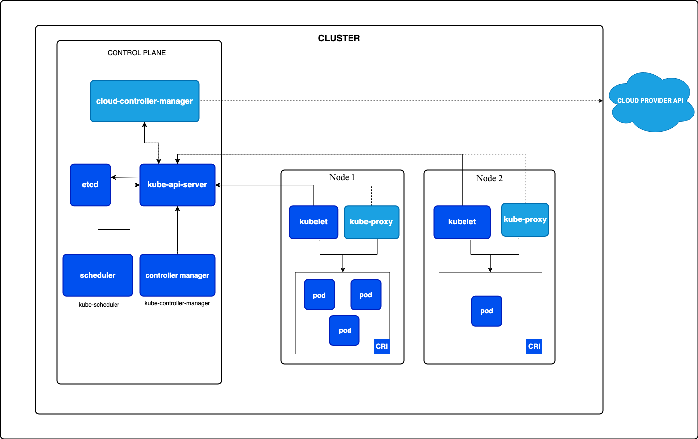
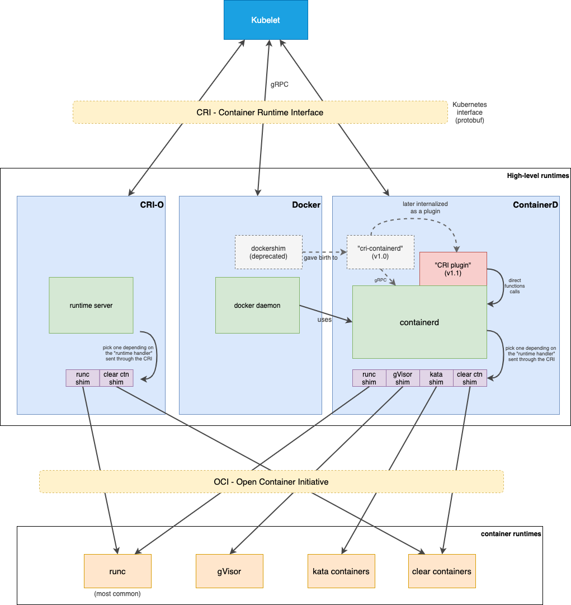
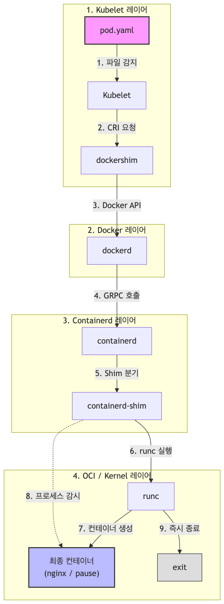

# 1. kubelet

## k8s hardway?

이번 실습은 Kubernetes의 각 핵심 컴포넌트 (kubelet, kube-apiserver, etcd, kube-scheduler, kube-controller-manager)를 하나의 머신 안에서 바이너리 형태로 직접 띄우며 내부 동작 원리를 이해하는 과정입니다.

쿠버네티스 클러스터는 크게 두 가지(컨트롤 플레인, 워커 노드) 영역으로 구성됩니다. 컨트롤 플레인은 클러스터 내의 워커 노드와 파드를 관리하고, 워커 노드들은 컨테이너화된 애플리케이션을 실행합니다.

[^1]

## kubelet

`kubelet`은 클러스터의 각 노드에서 실행되는 에이전트로, 파드 스펙 정보를 받아서 컨테이너가 해당 스펙에 따라 동작하도록 책임지는 역할을 수행합니다.

### 파드 스펙 정보를 받는 과정

`kubelet`이 파드 스펙 정보를 받는 경로는 크게 두 가지가 있습니다.

첫번째는, `kube-apiserver`를 통해 전달받는 방법입니다.

`kube-apiserver`가 해당 노드에서 생성해야하는 파드 스펙 정보를 `kubelet`에 전달하면, 이 정보를 가지고 `kubelet`이 파드를 생성합니다. `kubelet`은 자신의 노드에 할당된 파드를 확인하기 위해 아래와 같은 API로 `kube-apiserver`와 연결을 유지한 채 변경 사항이 생길 때마다 데이터를 전달받습니다.

```bash
https://<kube-apiserver-IP>:<PORT>/api/v1/pods?watch=true&fieldSelector=spec.nodeName=mynode
```

kubelet이 위 주소로 연결을 맺고 있으면, 스케줄러가 파드에 노드 이름을 적는 순간 다음과 같은 구조의 JSON 데이터 스트림이 네트워크 파이프라인을 타고 `kubelet`에게 툭 떨어집니다.

```bash
// 첫 번째 이벤트 (파드가 내 노드에 처음 할당됨)
{
  "type": "ADDED",
  "object": { "kind": "Pod", "metadata": { "name": "nginx" },
  "spec": { "nodeName": "node-a", "containers": [...] } }
}
```

두번째는, `kubelet` 내부의 로컬 파일시스템을 통해 전달받는 방법입니다.

일반적으로 대부분의 파드들은 `kube-apiserver`를 통해 전달받는 첫번째 방법으로 생성됩니다. 하지만 쿠버네티스 클러스터 자체를 띄우기 위해 마스터 노드에서 작동하는 `kube-apiserver`, `kube-scheduler` 같은 핵심 컴포넌트들은, 아이러니하게도 쿠버네티스가 완전히 준비되기 전에 먼저 실행되어야 합니다.

이때는 API 서버가 없으므로 관리자가 특정 폴더(`/etc/kubernetes/manifests/`)에 파드 명세서 YAML 파일을 직접 저장해둡니다. `kubelet`은 이 폴더를 주기적으로 감시하다가 파일이 생기면 파드를 스스로 띄웁니다. 이렇게 생성된 파드를 [정적 파드(Static Pod)](https://kubernetes.io/docs/tasks/configure-pod-container/static-pod/)라고 합니다.


### 컨테이너가 시작되는 과정

쿠버네티스의 컨테이너 실행은 계층형 아키텍처를 따릅니다. 

- Kubelet은 CRI(Container Runtime Interface)를 기반으로 고수준 런타임(containerd 등)과 상호작용하며,
- 고수준 런타임은 다시 OCI(Open Container Initiative) 규격에 따라 저수준 런타임(runc 등)을 실행함으로써 리눅스 커널 상에 독립된 컨테이너를 기동합니다.

[^2]

CRI는 컨테이너를 관리하는 모든 고수준 런타임이 반드시 구현해야하는 인터페이스입니다. 이러한 고수준 런타임에는 Docker, Containerd, CRI-O 등이 있습니다. `kubelet`은 CRI를 통해 고수준 런타임과 통신합니다.

CRI로 주고 받는 데이터는 protobuf 규격으로 정의되어 있으며, `kubelet`과 컨테이너 런타임 간의 통신은 gRPC를 통해 이루어집니다.

그리고 이러한 고수준 런타임은 shim이라고 불리는 작은 프로그램들을 통해 저수준 런타임과 통신합니다.

만약 shim이 없다면, 하이레벨 런타임(containerd)이 로우레벨 런타임(runc)을 직접 실행해 컨테이너를 만들고, 그 컨테이너 프로세스를 직접 붙잡고 관리해야 합니다.

이렇게 되면 치명적인 문제가 있는데요, 만약 고수준 런타임(containerd, docker) 데몬이 죽게되면 데몬이 붙잡고 있던 모든 하위 컨테이너 프로세스도 같이 죽어버리는 대참사가 발생합니다.

따라서 고수준 런타임(containerd)은 컨테이너를 만들 때 직접 실행하지 않고, 중간에 shim이라는 아주 가벼운 경량 프로세스를 하나 띄웁니다. 이 shim이 저수준 런타임(runc)를 호출해 컨테이너를 생성한 뒤, 컨테이너 제어권을 넘겨 받습니다. 저수준 런타임(runc)은 자기 할 일을 다하고 즉시 종료되지만, shim은 컨테이너 옆에 상주하며 컨테이너의 '부모 프로세스'역할을 대신 해줍니다.

덕분에 고수준 런타임(containerd) 데몬이 죽거나 재시작되어도, 컨테이너들은 아무런 중단 없이 계속 실행될 수 있습니다.

이와 같은 구조로 컨테이너를 생성하기 때문에 쿠버네티스 노드에서 `ps -ef | grep shim` 명령어를 쳐보면, 실행 중인 컨테이너 개수만큼 shim 프로세스가 떠 있는 것을 볼 수 있습니다.

## 실습

이제 `kubelet`을 VM 위에서 바이너리로 실행해보겠습니다.
사전에 [0.개요 및 환경설정](0.개요%20및%20환경설정.md)에서 만들어둔 실습 용 VM안으로 접속해보겠습니다.

```bash
cd vagrant-k8s-hardway/
vagrant up --provider=libvirt
vagrant ssh ubuntu1804
```

### kubelet 설치 및 기동

현재 환경에 맞게 `kubelet`을 설치해줍니다.

```bash
wget https://storage.googleapis.com/kubernetes-release/release/v1.19.6/bin/linux/amd64/kubelet 
chmod +x kubelet
sudo ./kubelet --version
```

노드 안에서 `kubelet`을 실행하기 위한 환경을 구성하기 위해 스왑 메모리 기능을 꺼두고, mainfests 폴더를 생성해줍니다.

참고로 스왑 메모리를 끄지 않으면 kubelet이 실행되지 않는데요, 이는 예측 가능성과 안정성을 지키기 위해서입니다.

`kube-scheduler`는 노드의 물리적인 RAM 용량만을 기준으로 파드를 어디에 배치할 지 결정합니다. 만약 노드에 스왑 메모리가 켜져 있으면, 리눅스 커널은 RAM이 부족할 때 디스크 공간을 RAM처럼 쓰기 시작합니다. 스케줄러는 이 사실을 모른채 파드를 계속 추가로 배치하게 되어 전체적인 스케줄링 계산이 꼬이게 됩니다.


```bash
sudo swapoff -a
mkdir manifests
```

마지막으로 Docker 설정을 systemd로 변경하기 위해 아래와 같이 설정합니다.

```bash
# Docker 설정 파일 생성 및 수정
sudo mkdir -p /etc/docker
sudo vim /etc/docker/daemon.json

# 파일 내용에 아래 설정을 붙여넣고 저장합니다
{
  "exec-opts": ["native.cgroupdriver=systemd"]
}

# Docker 서비스를 재시작합니다
sudo systemctl daemon-reload
sudo systemctl restart docker
```

이제 우리가 설치한 `kubelet`을 mainfest 경로에 맞게 실행해줍니다.

```bash
vagrant@ubuntu1804:~$ sudo nohup \
>  ./kubelet --pod-manifest-path=$PWD/manifests \
>   --runtime-cgroups=/systemd/system.slice --kubelet-cgroups=/systemd/system.slice \
>   --cgroup-driver systemd > kubelet.log 2>&1 &
[1] 23562

vagrant@ubuntu1804:~$ curl -k https://localhost:10250/healthz
ok
```

### 파드 기동

이제 `kubelet`이 정상적으로 시작되었으니, maifests 폴더에 정적 파드를 생성해보겠습니다.

```bash
cat > manifests/pod.yaml <<EOF
apiVersion: v1
kind: Pod
metadata:
  name: nginx
spec:
  hostNetwork: true
  containers:
  - image: nginx
    name: nginx
EOF
```

`kubelet`에 의해 생성된 파드를 조회해보겠습니다.

```bash
vagrant@ubuntu1804:~/manifests$ curl --stderr /dev/null http://localhost:10255/pods | jq .
{
  "kind": "PodList",
  "apiVersion": "v1",
  "metadata": {},
  "items": [
    {
      "metadata": {
        "name": "nginx-ubuntu1804",
        "namespace": "default",
        "selfLink": "/api/v1/namespaces/default/pods/nginx-ubuntu1804",
        "uid": "f20ef8708f8a4d9c61808a4745b79d9f",
        "creationTimestamp": null,
        "annotations": {
          "kubernetes.io/config.hash": "f20ef8708f8a4d9c61808a4745b79d9f",
          "kubernetes.io/config.seen": "2026-06-28T12:32:02.426539947Z",
          "kubernetes.io/config.source": "file"
        }
      },
      "spec": {
        "containers": [
          {
            "name": "nginx",
            "image": "nginx",
            "resources": {},
            "terminationMessagePath": "/dev/termination-log",
            "terminationMessagePolicy": "File",
            "imagePullPolicy": "Always"
          }
        ],
        "restartPolicy": "Always",
        "terminationGracePeriodSeconds": 30,
        "dnsPolicy": "ClusterFirst",
        "nodeName": "ubuntu1804",
        "hostNetwork": true,
        "securityContext": {},
        "schedulerName": "default-scheduler",
        "tolerations": [
          {
            "operator": "Exists",
            "effect": "NoExecute"
          }
        ],
        "enableServiceLinks": true
      },
      "status": {
        "phase": "Pending",
        "conditions": [
          {
            "type": "Initialized",
            "status": "True",
            "lastProbeTime": null,
            "lastTransitionTime": "2026-06-28T12:32:02Z"
          },
          {
            "type": "Ready",
            "status": "False",
            "lastProbeTime": null,
            "lastTransitionTime": "2026-06-28T12:32:02Z",
            "reason": "ContainersNotReady",
            "message": "containers with unready status: [nginx]"
          },
          {
            "type": "ContainersReady",
            "status": "False",
            "lastProbeTime": null,
            "lastTransitionTime": "2026-06-28T12:32:02Z",
            "reason": "ContainersNotReady",
            "message": "containers with unready status: [nginx]"
          },
          {
            "type": "PodScheduled",
            "status": "True",
            "lastProbeTime": null,
            "lastTransitionTime": "2026-06-28T12:32:02Z"
          }
        ],
        "startTime": "2026-06-28T12:32:02Z",
        "containerStatuses": [
          {
            "name": "nginx",
            "state": {
              "waiting": {
                "reason": "ContainerCreating"
              }
            },
            "lastState": {},
            "ready": false,
            "restartCount": 0,
            "image": "nginx",
            "imageID": "",
            "started": false
          }
        ],
        "qosClass": "BestEffort"
      }
    }
  ]
}
```

고수준 런타임 도구인 docker로 생성된 컨테이너를 조회해보겠습니다.

```bash
vagrant@ubuntu1804:~/manifests$ sudo docker ps
CONTAINER ID   IMAGE                  COMMAND                  CREATED          STATUS          PORTS     NAMES
95f74756de66   nginx                  "/docker-entrypoint.…"   40 seconds ago   Up 39 seconds             k8s_nginx_nginx-ubuntu1804_default_f20ef8708f8a4d9c61808a4745b79d9f_0
8f32646a5dcc   k8s.gcr.io/pause:3.2   "/pause"                 55 seconds ago   Up 54 seconds             k8s_POD_nginx-ubuntu1804_default_f20ef8708f8a4d9c61808a4745b79d9f_0
```

프로세스 트리를 통해 현재 어떻게 프로세스가 실행중 인지 확인해보겠습니다.

```bash
vagrant@ubuntu1804:~/manifests$ pstree
systemd─┬─accounts-daemon───2*[{accounts-daemon}]
        ├─agetty
        ├─atd
        ├─containerd───8*[{containerd}]
        ├─containerd-shim─┬─pause
        │                 └─10*[{containerd-shim}]
        ├─containerd-shim─┬─nginx───2*[nginx]
        │                 └─11*[{containerd-shim}]
        ├─cron
        ├─dbus-daemon
        ├─dockerd───8*[{dockerd}]
```

확인 해보면 `containerd-shim─┬─pause`, `containerd-shim─┬─nginx`를 통해 현재 실행중이었던 nginx, pause 컨테이너마다 `containerd-shim` 프로세스가 부모 프로세스로 동작하고 있음을 확인할 수 있습니다. 특히 이러한 `containerd-shim` 프로세스의 부모는 `systemd`로 고수준 런타임에 종속되어 있지 않음을 확인할 수 있습니다.

이제 정적 파드를 삭제하기 위해 manifests 폴더에서 파일을 삭제해주겠습니다.

```bash
vagrant@ubuntu1804:~$ rm manifests/pod.yaml
vagrant@ubuntu1804:~$
vagrant@ubuntu1804:~$ sudo docker ps
CONTAINER ID   IMAGE     COMMAND   CREATED   STATUS    PORTS     NAMES
vagrant@ubuntu1804:~$ curl --stderr /dev/null http://localhost:10255/pods | jq .{
  "kind": "PodList",
  "apiVersion": "v1",
  "metadata": {},
  "items": null
}
```

### 런타임 로그 분석

VM 내부(`vagrant ssh ubuntu1804`)에서 아래 작업을 진행합니다.

#### 1) Docker 데몬 디버그 활성화
`/etc/docker/daemon.json`에 디버그 옵션을 추가합니다.
```bash
# 파일 수정 (기존 파일이 있으면 중괄호 안에 "debug": true 추가)
sudo tee /etc/docker/daemon.json <<EOF
{
  "exec-opts": ["native.cgroupdriver=systemd"],
  "debug": true
}
EOF

# Docker 서비스 재시작
sudo systemctl daemon-reload
sudo systemctl restart docker
```

#### 2) containerd 디버그 활성화
`/etc/containerd/config.toml` 파일 맨 아래의 `[debug]` 섹션 주석을 풀고 로그 레벨을 수정합니다.
```bash
# 파일의 주석(#)을 풀고 level = "debug"로 수정
[debug]
  address = "/run/containerd/debug.sock"
  uid = 0
  gid = 0
  level = "debug"

# containerd 서비스 재시작
sudo systemctl restart containerd
```

---

#### 3) 실시간 로그 모니터링 창 띄우기

터미널 창을 여러 개 실행하여 각 레이어의 로그를 실시간(`-f`)으로 관찰할 준비를 합니다.

* **터미널 1 (Docker REST API 로그):**
  ```bash
  sudo journalctl -u docker -f | grep -E "handler|POST|CreateContainer"
  ```
* **터미널 2 (containerd & shim 로그):**
  ```bash
  sudo journalctl -u containerd -f | grep -E "shim|task|create"
  ```

---

#### 4) 정적 파드 생성 유도

이제 새로운 터미널에서 정적 파드 YAML 파일을 manifests 폴더에 집어넣어 컨테이너 생성을 트리거합니다.

```bash
# manifests 폴더 아래에 pod.yaml 파일 생성 (kubelet이 즉시 감지)
cat > ~/manifests/pod.yaml <<EOF
apiVersion: v1
kind: Pod
metadata:
  name: nginx
spec:
  hostNetwork: true
  containers:
  - image: nginx
    name: nginx
EOF
```

---

#### 5) 로그 분석

```bash
vagrant@ubuntu1804:~$   sudo journalctl -u docker -f | grep -E "handler|POST|CreateContainer"
Jul 11 13:18:13 ubuntu1804 dockerd[2427]: time="2026-07-11T13:18:13.800198592Z" level=debug msg="Calling POST /v1.40/containers/create?name=k8s_POD_nginx-ubuntu1804_default_f20ef8708f8a4d9c61808a4745b79d9f_0"
Jul 11 13:18:13 ubuntu1804 dockerd[2427]: time="2026-07-11T13:18:13.890237375Z" level=debug msg="Calling POST /v1.40/containers/ba60ff2b3402a7ed956de40313a24d738e199710330512d2f8955ec10cb4e73b/start"
Jul 11 13:18:14 ubuntu1804 dockerd[2427]: time="2026-07-11T13:18:14.094963326Z" level=debug msg="Calling POST /v1.40/images/create?fromImage=nginx&tag=latest"
Jul 11 13:18:16 ubuntu1804 dockerd[2427]: time="2026-07-11T13:18:16.584006565Z" level=debug msg="Calling POST /v1.40/containers/create?name=k8s_nginx_nginx-ubuntu1804_default_f20ef8708f8a4d9c61808a4745b79d9f_0"
Jul 11 13:18:16 ubuntu1804 dockerd[2427]: time="2026-07-11T13:18:16.656030367Z" level=debug msg="Calling POST /v1.40/containers/82c82c131602502230be97432d9e8d42d32d2d81627648909ca8b122b1c48db3/start"
```

```bash
vagrant@ubuntu1804:~$   sudo journalctl -u containerd -f | grep -E "shim|task|create"
Jul 11 13:18:13 ubuntu1804 containerd[2903]: time="2026-07-11T13:18:13.951013743Z" level=debug msg="event published" ns=moby topic=/containers/create type=containerd.events.ContainerCreate
Jul 11 13:18:13 ubuntu1804 containerd[2903]: time="2026-07-11T13:18:13.964078266Z" level=info msg="loading plugin \"io.containerd.ttrpc.v1.task\"..." runtime=io.containerd.runc.v2 type=io.containerd.ttrpc.v1
Jul 11 13:18:13 ubuntu1804 containerd[2903]: time="2026-07-11T13:18:13.964140212Z" level=debug msg="registering ttrpc service" id=io.containerd.ttrpc.v1.task
Jul 11 13:18:13 ubuntu1804 containerd[2903]: time="2026-07-11T13:18:13.964299697Z" level=info msg="starting signal loop" namespace=moby path=/run/containerd/io.containerd.runtime.v2.task/moby/ba60ff2b3402a7ed956de40313a24d738e199710330512d2f8955ec10cb4e73b pid=3817 runtime=io.containerd.runc.v2
Jul 11 13:18:14 ubuntu1804 containerd[2903]: time="2026-07-11T13:18:14.070045839Z" level=debug msg="event forwarded" ns=moby topic=/tasks/create type=containerd.events.TaskCreate
Jul 11 13:18:14 ubuntu1804 containerd[2903]: time="2026-07-11T13:18:14.075403260Z" level=debug msg="event forwarded" ns=moby topic=/tasks/start type=containerd.events.TaskStart
Jul 11 13:18:16 ubuntu1804 containerd[2903]: time="2026-07-11T13:18:16.666547351Z" level=debug msg="event published" ns=moby topic=/containers/create type=containerd.events.ContainerCreate
Jul 11 13:18:16 ubuntu1804 containerd[2903]: time="2026-07-11T13:18:16.675646270Z" level=info msg="loading plugin \"io.containerd.ttrpc.v1.task\"..." runtime=io.containerd.runc.v2 type=io.containerd.ttrpc.v1
Jul 11 13:18:16 ubuntu1804 containerd[2903]: time="2026-07-11T13:18:16.675768161Z" level=debug msg="registering ttrpc service" id=io.containerd.ttrpc.v1.task
Jul 11 13:18:16 ubuntu1804 containerd[2903]: time="2026-07-11T13:18:16.675946981Z" level=info msg="starting signal loop" namespace=moby path=/run/containerd/io.containerd.runtime.v2.task/moby/82c82c131602502230be97432d9e8d42d32d2d81627648909ca8b122b1c48db3 pid=3896 runtime=io.containerd.runc.v2
Jul 11 13:18:16 ubuntu1804 containerd[2903]: time="2026-07-11T13:18:16.762882482Z" level=debug msg="event forwarded" ns=moby topic=/tasks/create type=containerd.events.TaskCreate
Jul 11 13:18:16 ubuntu1804 containerd[2903]: time="2026-07-11T13:18:16.768704121Z" level=debug msg="event forwarded" ns=moby topic=/tasks/start type=containerd.events.TaskStart
```


1단계: 샌드박스(Pause) 컨테이너 기동 단계 (13:18:13)

쿠버네티스는 컨테이너 간의 네트워크 및 볼륨 공유를 위해 가장 먼저 뼈대가 되는 **`pause` 컨테이너(POD)**를 띄웁니다.

```text
[Docker] Calling POST /v1.40/containers/create?name=k8s_POD_nginx-ubuntu1804...
```
* **Kubelet ➔ Docker:** Kubelet의 `dockershim`이 도커 데몬에게 이름이 `k8s_POD_nginx...`로 시작하는 샌드박스 컨테이너 생성을 요청합니다.

```text
[containerd] event published ... ns=moby topic=/containers/create
[containerd] starting signal loop ... moby/ba60ff2b3402... pid=3817
```
* **Docker ➔ containerd:** 도커 데몬이 containerd에게 컨테이너 생성을 위임합니다.
* containerd는 도커 네임스페이스(`ns=moby`) 영역 안에 컨테이너 메타데이터를 등록하고, 실제 구동을 담당할 대리인 프로세스인 **`containerd-shim-runc-v2`**를 포크하여 띄웁니다.
  * 이때 실행된 **`containerd-shim` 프로세스의 호스트 PID는 `3817`**입니다.

```text
[Docker] Calling POST /v1.40/containers/ba60ff2b3402.../start
[containerd] event forwarded ... topic=/tasks/create
[containerd] event forwarded ... topic=/tasks/start
```
* **Docker ➔ containerd ➔ runc:** Docker가 컨테이너 시작(`start`) API를 호출합니다.
* containerd의 위임을 받은 `containerd-shim (PID 3817)`이 백엔드에서 **`runc create`와 `runc start`를 실행**합니다.
* 작업이 정상 처리되어 containerd에 `TaskCreate` 및 `TaskStart` 이벤트가 등록됩니다. (이 시점에 pause 컨테이너가 정상 구동됩니다.)

---

2단계: 이미지 확인 및 준비 단계 (13:18:14 ~ 13:18:16)

```text
[Docker] Calling POST /v1.40/images/create?fromImage=nginx&tag=latest
```
* 샌드박스가 마련되었으니, Kubelet은 실제 기동할 애플리케이션 이미지인 `nginx:latest`가 호스트에 존재하는지 검사하고 필요한 경우 다운로드(Pull)를 진행합니다. 이 검사/다운로드 과정이 완료될 때까지 다음 단계로 넘어가지 않고 대기합니다. (약 2.4초 소요)

---

3단계: 실제 Nginx 애플리케이션 컨테이너 기동 단계 (13:18:16)

이미지가 확보된 후, 드디어 본체 컨테이너가 구동되는 최종 장입니다.

```text
[Docker] Calling POST /v1.40/containers/create?name=k8s_nginx_nginx-ubuntu1804...
[containerd] event published ... ns=moby topic=/containers/create
```
**Kubelet ➔ Docker ➔ containerd:** Kubelet이 본체 컨테이너(`k8s_nginx_nginx...`) 생성을 요청하고, `containerd`가 이를 전달받아 수신 이벤트를 발행합니다.

```text
[containerd] starting signal loop ... moby/82c82c131602... pid=3896
```
**containerd-shim 기동:** containerd가 nginx 컨테이너를 독자적으로 감시할 **두 번째 `containerd-shim` 프로세스를 실행**합니다.

**nginx 컨테이너 전용 shim의 PID는 `3896`**으로 잡혔습니다.

```text
[Docker] Calling POST /v1.40/containers/82c82c131602.../start
[containerd] event forwarded ... topic=/tasks/create
[containerd] event forwarded ... topic=/tasks/start
```
* **최종 runc 호출 및 기동:** Docker가 nginx 컨테이너의 `start` API를 호출하자, `containerd-shim (PID 3896)`이 저수준 런타임인 **`runc`를 통해 실제 nginx 프로세스를 네임스페이스와 cgroup에 가둬 기동(TaskStart)**시킵니다. 

* 이것으로 파드 내부의 nginx 기동 작업이 성공적으로 종료됩니다.

#### 6) runc 실행 과정 직접 추적

##### runc 로그 분석

파일 로그로는 한계가 있어서, containerd 프로세스에 `strace`를 붙여 `execve` 시스템콜만 추적하는 방식으로 전환했습니다. 이 방법은 containerd/shim의 debug 설정과 무관하게 항상 동작합니다.

```bash
# containerd 메인 프로세스(PID는 systemctl status containerd로 확인)에 attach
sudo strace -f -tt -e trace=execve -p 777 2>&1 | tee ~/runc-trace.log &

# 기존 파드 삭제 후 재생성해서 컨테이너 생성 과정을 트리거
rm -f ~/manifests/pod.yaml
sleep 3
cat > ~/manifests/pod.yaml <<EOF
apiVersion: v1
kind: Pod
metadata:
  name: nginx
spec:
  hostNetwork: true
  containers:
  - image: nginx
    name: nginx
EOF
```

트리거 직후 아래와 같이 `execve` 호출들이 순서대로 잡힙니다. (컨테이너 ID는 편의상 앞 8자리만 표기)

**① 샌드박스(pause) 컨테이너 생성**

```text
[3259] execve("/usr/bin/containerd-shim-runc-v2", [..., "-id", "06d9d9b8...", "-debug", "start"])
[3278] execve("/usr/bin/runc", ["runc", "--root", "/var/run/docker/runtime-runc/moby",
                "--log", ".../log.json", "--log-format", "json",
                "--systemd-cgroup", "create", "--bundle", "...", "06d9d9b8..."])
[3286] execve("/proc/self/exe", ["runc", "init"])
```

여기서 눈여겨볼 부분이 `runc init`입니다. `runc create`가 실행되면 runc는 **자기 자신을 `/proc/self/exe`로 재실행**해서 `runc init`이라는 자식 프로세스를 만듭니다. 이 프로세스가 새로 만든 namespace/cgroup 안으로 먼저 들어가서 대기하다가, 이후 `runc start`가 호출되는 시점에 실제 컨테이너 엔트리포인트로 자신을 exec합니다. 문서 앞부분에서 설명한 "저수준 런타임이 커널 상에 독립된 컨테이너를 기동한다"는 문장의 실제 구현이 바로 이 2단계(`create` → `init` 대기 → `start` → exec) 구조입니다.

```text
[3310] execve("/usr/bin/runc", ["runc", "--root", "...", "--systemd-cgroup", "start", "06d9d9b8..."])
[3297] execve("/pause", ["/pause"])
```

`runc start`가 호출되자 대기 중이던 `runc init` 프로세스가 `/pause` 바이너리를 exec하면서 샌드박스 컨테이너가 완성됩니다.

**② nginx 컨테이너 생성 (동일 패턴 반복)**

```text
[3346] execve("/usr/bin/containerd-shim-runc-v2", [..., "-id", "6e4c9f20...", "-debug", "start"])
[3365] execve("/usr/bin/runc", [..., "create", "--bundle", "...", "6e4c9f20..."])
[3373] execve("/proc/self/exe", ["runc", "init"])
...
[3397] execve("/usr/bin/runc", [..., "start", "6e4c9f20..."])
[3383] execve("/docker-entrypoint.sh", ["/docker-entrypoint.sh", "nginx", "-g", "daemon off;"])
```

nginx 컨테이너에서는 `runc start` 이후 nginx 공식 이미지의 엔트리포인트 스크립트가 실행되면서, 그 안에서 다시 여러 하위 프로세스가 순차적으로 exec되는 것까지 확인할 수 있습니다.

```text
find /docker-entrypoint.d/ ...
10-listen-on-ipv6-by-default.sh 실행 → sed로 default.conf 수정
dpkg-query, md5sum -c → 설정 파일 무결성 체크
20-envsubst-on-templates.sh
30-tune-worker-processes.sh
```

그리고 마지막으로 nginx 바이너리를 세 경로(`/usr/local/sbin`, `/usr/local/bin`, `/usr/sbin`) 순서로 탐색하다가 `/usr/sbin/nginx`에서 찾아 최종 exec하면서 컨테이너 안의 진짜 nginx 프로세스가 살아납니다.

```text
execve("/usr/local/sbin/nginx", ...) = -1 ENOENT
execve("/usr/local/bin/nginx", ...)  = -1 ENOENT
execve("/usr/sbin/nginx", ["nginx", "-g", "daemon off;"]) = 0
```

정리

- runc는 컨테이너 하나당 두 번 호출된다: **`create`**(namespace/cgroup 준비 + `runc init` 대기 프로세스 생성) → **`start`**(대기 중이던 프로세스가 실제 엔트리포인트로 exec).

##### runc init 내부 syscall 분석

containerd 메인 프로세스(PID는 `systemctl status containerd`로 확인, 여기서는 777)에 `-f`(자식 프로세스까지 추적)로 붙어서, namespace/mount/capability 관련 syscall만 필터링해 파일로 저장합니다.

```bash
# 1) 기존 컨테이너 정리 후 트리거 준비
rm -f ~/manifests/pod.yaml
sleep 3
sudo docker ps -a

# 2) containerd에 strace 부착 (clone3는 이 환경 strace 버전에서 미지원이라 제외)
sudo strace -f -tt -s 300 \
  -e trace=execve,clone,unshare,mount,umount2,pivot_root,chroot,capset,setns,prctl,seccomp \
  -p 777 -o /tmp/full-syscall-trace.log &

# 3) 파드 재생성으로 컨테이너 생성 트리거
cat > ~/manifests/pod.yaml <<EOF
apiVersion: v1
kind: Pod
metadata:
  name: nginx
spec:
  hostNetwork: true
  containers:
  - image: nginx
    name: nginx
EOF

sleep 8
sudo docker ps

# 4) 확인 끝나면 strace 종료 (오버헤드 방지)
sudo pkill -f "strace -f -tt"
```

##### 컨테이너 ID로 관련 PID 추적하기

```bash
sudo docker ps
# CONTAINER ID   IMAGE   ...   NAMES
# 420d34e903c1   nginx   ...   k8s_nginx_nginx-ubuntu1804_...

CONTAINER_ID=420d34e903c1

# runc create가 호출된 라인(=시작 PID) 찾기
sudo grep -n "\"create\".*$CONTAINER_ID" /tmp/full-syscall-trace.log

345:12614 11:36:14.750788 execve("/usr/bin/runc", ["runc", "--root", "/var/run/docker/runtime-runc/moby",
"--log", "/run/containerd/io.containerd.runtime.v2.task/moby/420d34e903c1.../log.json",
"--log-format", "json", "--systemd-cgroup", "create", "--bundle",
"/run/containerd/io.containerd.runtime.v2.task/moby/420d34e903c1...",
"--pid-file", ".../init.pid", "420d34e903c1..."], ...) = 0
```

이 PID(`12614`)만 필터링:

```bash
PID=12614
sudo grep -E "^\[?pid $PID\]?|^$PID " /tmp/full-syscall-trace.log

12614 ... prctl(PR_SET_PDEATHSIG, SIGKILL) = 0
12614 ... execve("/usr/bin/runc", [...]) = 0
12614 ... clone(... CLONE_VM|CLONE_FS|CLONE_FILES|CLONE_SIGHAND|CLONE_THREAD ...) = 12615
12614 ... clone(... 동일 플래그 ...) = 12616
12614 ... clone(... 동일 플래그 ...) = 12617
12614 ... clone(... 동일 플래그 ...) = 12619
12614 ... seccomp(SECCOMP_SET_MODE_STRICT, 1, NULL) = -1 EINVAL (Invalid argument)
12614 ... seccomp(SECCOMP_GET_ACTION_AVAIL, 0, [SECCOMP_RET_KILL_PROCESS]) = 0
12614 ... prctl(PR_SET_CHILD_SUBREAPER, 1) = 0
12614 ... +++ exited with 0 +++
```

`CLONE_THREAD`가 붙은 clone들은 컨테이너 격리와 무관한 Go 런타임의 OS 스레드 확보이고, seccomp 호출들은 실제 필터 적용이 아니라 커널 기능 지원 여부를 probe하는 것입니다. 이 프로세스는 `PR_SET_CHILD_SUBREAPER`만 세팅하고 바로 exit — runc의 "PARENT" 단계입니다.

##### runc init(PARENT) 추적

```bash
sudo grep -n '"init"' /tmp/full-syscall-trace.log | grep "11:36:14"

364:12621 11:36:14.764608 execve("/proc/self/exe", ["runc", "init"], ...) = 0
```

```bash
INIT_PID=12621
sudo grep -E "^\[?pid $INIT_PID\]?|^$INIT_PID " /tmp/full-syscall-trace.log

12621 ... mount("/proc/self/exe", ".../runc.RQ8Px5", ..., MS_BIND, ...) = 0
12621 ... mount("", ".../runc.RQ8Px5", ..., MS_RDONLY|MS_REMOUNT|MS_BIND, "") = 0
12621 ... umount2(".../runc.RQ8Px5", MNT_DETACH) = 0
12621 ... prctl(PR_SET_DUMPABLE, SUID_DUMP_DISABLE) = 0
12621 ... prctl(PR_SET_NAME, "runc:[0:PARENT]") = 0
12621 ... clone(flags=CLONE_PARENT|SIGCHLD) = 12627
12621 ... +++ exited with 0 +++
```

자기 자신(`/proc/self/exe`)을 읽기전용으로 스냅샷 떴다가 즉시 detach — CVE-2019-5736류 컨테이너 탈출 방지 기법입니다. `[0:PARENT]`로 이름 붙이고 자식(`12627`)을 만든 뒤 exit합니다.

##### `[1:CHILD]` 단계 추적

```bash
sudo grep -E "^\[?pid 12627\]?|^12627 " /tmp/full-syscall-trace.log

12627 ... prctl(PR_SET_NAME, "runc:[1:CHILD]") = 0
12627 ... setns(7, CLONE_NEWIPC) = 0
12627 ... setns(10, CLONE_NEWNET) = 0
12627 ... unshare(CLONE_NEWNS|CLONE_NEWPID) = 0
12627 ... clone(flags=CLONE_PARENT|SIGCHLD) = 12629
12627 ... +++ exited with 0 +++
```

`hostNetwork: true` + 같은 파드의 pause 컨테이너와 IPC/NET namespace를 공유해야 하므로 새로 만들지 않고 `setns`로 **합류**하고, mount/PID namespace는 이 컨테이너 전용으로 `unshare`합니다.

##### `[2:INIT]` 단계 추적 — 실제 컨테이너 구성

주요 부분만 발췌 (cgroup 서브시스템 mount와 capability drop은 각 12개, 24개씩 거의 동일한 패턴이 반복되어 일부만 표기):

```bash
sudo grep -E "^\[?pid 12629\]?|^12629 " /tmp/full-syscall-trace.log

12629 ... prctl(PR_SET_NAME, "runc:[2:INIT]") = 0

# mount propagation 격리
12629 ... mount("", "/", ..., MS_REC|MS_SLAVE, NULL) = 0

# rootfs bind mount (overlay2)
12629 ... mount(".../overlay2/67b1584f.../merged", ".../merged", ..., MS_BIND|MS_REC, NULL) = 0

# /proc, /dev, /dev/pts, /sys, /dev/shm
12629 ... mount("proc", "/proc/self/fd/6", "proc", MS_NOSUID|MS_NODEV|MS_NOEXEC, NULL) = 0
12629 ... mount("tmpfs", "/proc/self/fd/6", "tmpfs", ..., "mode=755,size=65536k") = 0
12629 ... mount("devpts", "/proc/self/fd/6", "devpts", ..., "newinstance,ptmxmode=0666,...") = 0
12629 ... mount("sysfs", "/proc/self/fd/6", "sysfs", MS_RDONLY|..., NULL) = 0
12629 ... mount("tmpfs", "/proc/self/fd/6", "tmpfs", ..., "mode=755") = 0

# cgroup 서브시스템 전체 bind mount + 읽기전용 재마운트 (systemd, net_cls, memory, freezer,
# blkio, cpu,cpuacct, pids, cpuset, devices, hugetlb, rdma, perf_event — 총 12종, 각 2회 호출)
12629 ... mount(".../kubepods.slice/kubepods-besteffort.slice/kubepods-besteffort-podf20ef870....slice/docker-420d34e9....scope", "/proc/self/fd/6", ..., MS_RDONLY|...|MS_BIND|MS_REC, NULL) = 0
12629 ... mount(같은 경로, ..., MS_RDONLY|...|MS_REMOUNT|MS_BIND|MS_REC, NULL) = 0
#   (net_cls,net_prio / memory / freezer / blkio / cpu,cpuacct / pids / cpuset / devices /
#    hugetlb / rdma / perf_event 도 동일 패턴 반복)
12629 ... mount("mqueue", "/proc/self/fd/6", "mqueue", ..., NULL) = 0

# 파드 단위 공유 파일 bind mount
12629 ... mount("/var/lib/kubelet/pods/f20ef870.../containers/nginx/6739af6b", "/proc/self/fd/6", ..., MS_BIND|MS_REC, NULL) = 0   # 컨테이너 로그
12629 ... mount("", "/proc/self/fd/6", ..., MS_REC|MS_PRIVATE, NULL) = 0
12629 ... mount(".../containers/1e3688fc.../resolv.conf", "/proc/self/fd/6", ..., MS_BIND|MS_REC, NULL) = 0
12629 ... mount(".../containers/1e3688fc.../hostname", "/proc/self/fd/6", ..., MS_BIND|MS_REC, NULL) = 0
12629 ... mount(".../containers/1e3688fc.../hosts", "/proc/self/fd/6", ..., MS_BIND|MS_REC, NULL) = 0
12629 ... mount(".../containers/1e3688fc.../mounts/shm", "/proc/self/fd/6", ..., MS_BIND|MS_REC, NULL) = 0

# pivot_root — 진짜 루트 전환
12629 11:36:14.817932 pivot_root(".", ".") = 0
12629 11:36:14.818029 mount("", ".", ..., MS_REC|MS_SLAVE, NULL) = 0
12629 11:36:14.818057 umount2(".", MNT_DETACH) = 0

# /proc 하위 민감 경로 마스킹
12629 ... mount("/proc/bus", "/proc/bus", ..., MS_BIND|MS_REC, NULL) = 0
12629 ... mount("/proc/bus", "/proc/bus", ..., MS_RDONLY|...|MS_REMOUNT|MS_BIND, NULL) = 0
#   (/proc/fs, /proc/irq, /proc/sys, /proc/sysrq-trigger도 동일하게 읽기전용 재마운트)
12629 ... mount("/dev/null", "/proc/kcore", ..., MS_BIND) = 0
12629 ... mount("/dev/null", "/proc/keys", ..., MS_BIND) = 0
12629 ... mount("/dev/null", "/proc/sched_debug", ..., MS_BIND) = 0
12629 ... mount("tmpfs", "/proc/acpi", "tmpfs", MS_RDONLY, NULL) = 0
12629 ... mount("tmpfs", "/proc/scsi", "tmpfs", MS_RDONLY, NULL) = 0
12629 ... mount("tmpfs", "/sys/firmware", "tmpfs", MS_RDONLY, NULL) = 0

# capability 축소 (bounding set에서 24개 위험 capability 제거, 2세트 반복)
12629 ... prctl(PR_CAPBSET_DROP, CAP_SYS_ADMIN) = 0
12629 ... prctl(PR_CAPBSET_DROP, CAP_SYS_MODULE) = 0
12629 ... prctl(PR_CAPBSET_DROP, CAP_NET_ADMIN) = 0
12629 ... prctl(PR_CAPBSET_DROP, CAP_SYS_PTRACE) = 0
#   (CAP_DAC_READ_SEARCH, CAP_LINUX_IMMUTABLE, CAP_SYS_RAWIO, CAP_SYS_BOOT 등 나머지 20개 생략)
12629 ... prctl(PR_SET_KEEPCAPS, 1) = 0
12629 ... prctl(PR_SET_KEEPCAPS, 0) = 0
#   (동일 CAPBSET_DROP 세트 한 번 더 반복 — effective set 확정 전 재확인 단계)
12629 11:36:14.881143 capset({version=_LINUX_CAPABILITY_VERSION_3, pid=0},
  {effective=1<<CAP_CHOWN|1<<CAP_DAC_OVERRIDE|1<<CAP_FOWNER|1<<CAP_FSETID|1<<CAP_KILL|
  1<<CAP_SETGID|1<<CAP_SETUID|1<<CAP_SETPCAP|1<<CAP_NET_BIND_SERVICE|1<<CAP_NET_RAW|
  1<<CAP_SYS_CHROOT|1<<CAP_MKNOD|1<<CAP_AUDIT_WRITE|1<<CAP_SETFCAP,
  permitted=(동일), inheritable=0}) = 0
12629 ... prctl(PR_CAP_AMBIENT, PR_CAP_AMBIENT_LOWER, CAP_CHOWN, 0, 0) = 0
#   (나머지 ambient capability도 전부 lower — 총 24회)

# 최종 엔트리포인트 실행
12629 11:36:14.897791 execve("/docker-entrypoint.sh", ["/docker-entrypoint.sh", "nginx", "-g", "daemon off;"], ...) = 0
```

이후 이전 섹션에서 확인했던 nginx entrypoint 스크립트 체인(`10-listen-on-ipv6-by-default.sh` 등)이 이어지고, 최종적으로:

```
12629 11:36:14.937511 execve("/usr/sbin/nginx", ["nginx", "-g", "daemon off;"], ...) = 0
```

이 라인에서 실제 nginx 프로세스가 컨테이너 안에서 살아납니다.

##### 전체 프로세스 계층 요약

```
runc create (12614, "PARENT" 이전 단계)
  └─ prctl(SUBREAPER) 후 exit
runc init [0:PARENT] (12621)
  └─ 자기 바이너리 read-only bind mount → 즉시 detach (탈출 방지)
  └─ clone → [1:CHILD] 생성 후 exit
runc init [1:CHILD] (12627)
  └─ setns(IPC, NET)         # pause 컨테이너와 공유 (hostNetwork: true)
  └─ unshare(NEWNS, NEWPID)  # 이 컨테이너 전용으로 격리
  └─ clone → [2:INIT] 생성 후 exit
runc init [2:INIT] (12629)
  └─ mount propagation 격리 (MS_SLAVE)
  └─ rootfs bind mount (overlay2)
  └─ /proc, /dev, /sys, /dev/shm 마운트
  └─ cgroup 12개 서브시스템 bind mount (읽기전용)
  └─ 파드 공유 파일(resolv.conf, hostname, hosts, shm) bind mount
  └─ pivot_root(".", ".")   ← 진짜 루트 전환
  └─ /proc 민감 경로 마스킹 (/dev/null bind, tmpfs 등)
  └─ capability bounding set 축소 + capset() 확정
  └─ execve(엔트리포인트)   ← 이 시점부터 "컨테이너 프로세스"
```

### 실습 런타임 구조

{ width="50%" }

현재 실습 구조는 오래전 버전으로 `kubelet`이 컨테이너를 띄우기 위해 도커 데몬을 호출했습니다. 쿠버네티스 v1.24에서부터는 dockershim이 완전히 삭제되었으며, 컨테이너 실행 흐름에서 Docker 데몬(dockerd)은 더이상 개입하지 않습니다. 

따라서 위 구조에서 중간에 있던 두 단계의 번역 레이어(dockershim 및 dockerd)가 사라지고, Kubelet이 고수준 런타임(containerd)과 직접 통신하는 직렬 구조로 단순화되었습니다.

[^1]: https://kubernetes.io/ko/docs/concepts/architecture
[^2]: https://baptistout.net/posts/how-kubelet-actually-runs-containers/