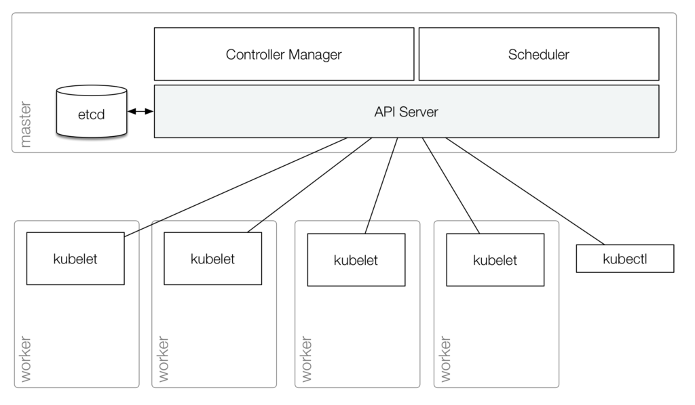

# 2. kube-apiserver

## k8s hardway?

이번 실습은 Kubernetes의 각 핵심 컴포넌트 (kubelet, kube-apiserver, etcd, kube-scheduler, kube-controller-manager)를 하나의 머신 안에서 바이너리 형태로 직접 띄우며 내부 동작 원리를 이해하는 과정입니다.

쿠버네티스 클러스터는 크게 두 가지(컨트롤 플레인, 워커 노드) 영역으로 구성됩니다. 컨트롤 플레인은 클러스터 내의 워커 노드와 파드를 관리하고, 워커 노드들은 컨테이너화된 애플리케이션을 실행합니다.

[^1]

## kube-apiserver

`kube-apiserver`는 쿠버네티스 컨트롤 플레인의 프론트 엔드이며, 다음과 같은 프로세스[^2]로 동작합니다.

### kube-apiserver 동작 프로세스

1. 요청 수신: 사용자가 kubectl create pod과 같은 명령어를 실행하거나 애플리케이션이 REST API를 사용하여 Kubernetes와 상호작용할 때, 해당 요청은 API Server로 전송됩니다.

2. 인증 및 인가 (Authentication & Authorization): API Server는 요청자의 신원을 확인(인증)하고, 요청자가 필요한 권한을 가지고 있는지 체크(인가)합니다.

3. 검증 및 어드미션 제어 (Validation & Admission Control): 요청의 정확성을 검증하며, 어드미션 컨트롤러가 추가적인 정책(예: 리소스 쿼터 제한, 보안 제약 조건 등)을 강제할 수 있습니다.

4. etcd에 데이터 영구 저장: 요청이 유효한 경우, API Server는 모든 Kubernetes 객체를 보유하는 키-값 저장소인 etcd에 데이터를 기록하여 클러스터 상태를 업데이트합니다.

5. 다른 구성 요소에 알림 (Informing Other Components): API Server는 스케줄러(새로운 Pod 생성 시)나 컨트롤러 매니저(복제 및 스케일링 시)와 같은 관련 구성 요소에 알림을 보냅니다.

6. 응답 반환: 마지막으로 API Server는 성공 또는 실패 여부를 나타내는 응답을 다시 보냅니다.

### Kubernetes Component와의 주요 상호작용

쿠버네티스의 모든 Component는 서로 직접 통신하지 않고, API Server를 통해 상호작용합니다.

[^3]

- `etcd`: API Server는 etcd와 직접 통신하는 유일한 구성 요소로, 클러스터 상태 정보를 저장하고 가져옵니다.

- `controller manager`: 컨트롤러들은 API Server의 변경 사항을 감시(Watch)하고 이에 따라 적절한 조치를 취합니다. (예: Deployment가 항상 원하는 수의 Pod를 유지하도록 보장)

- `scheduler`: API Server는 새로운 Pod 생성 요청을 받아 스케줄러에 알리고(Inform), 스케줄러는 Pod를 할당할 적당한 노드를 골라 다시 API Server에게 전달합니다.

- `kubelet`: 워커 노드의 `kubelet`은 API Server와 통신하여 Pod 생성 관련 정보를 받습니다.

- `kubectl` 및 외부 클라이언트: CLI 도구인 `kubectl` 및 기타 외부 클라이언트는 클러스터 리소스를 관리하기 위해 API Server와 통신합니다.

[^1]: https://kubernetes.io/ko/docs/concepts/architecture

[^2]: https://www.linkedin.com/pulse/understanding-kubernetes-api-server-how-works-why-its-sawant-pvdsf/

[^3]: https://www.redhat.com/en/blog/kubernetes-deep-dive-api-server-part-1