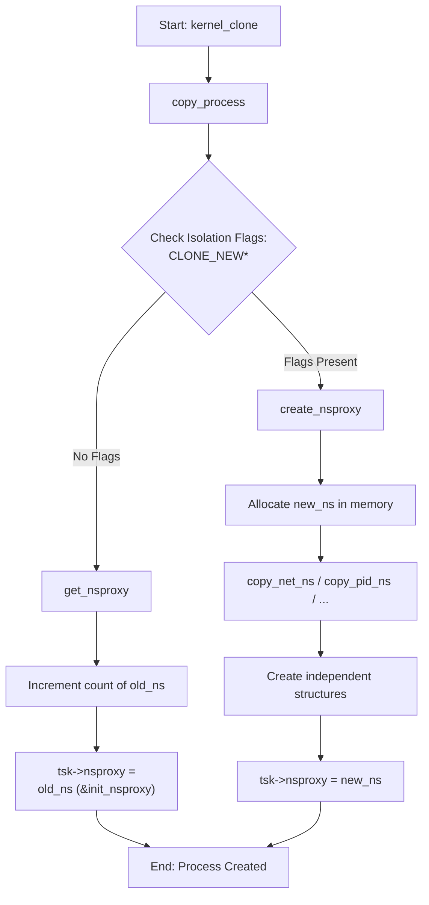
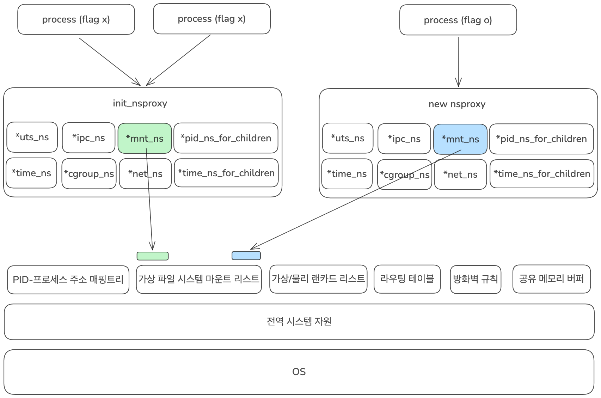

# 1. Namespace

## Intro

**Namespace**란 커널이 프로세스를 위해 제공하는 **칸막이**입니다.

퇴근길 지하철을 생각해봅시다. 열심히 일하고 와서 녹초가 된 몸으로 수많은 사람들 사이에 겨우 꼈습니다. 좀 조용히 쉬고 싶은데, 바로 옆에서 큰 목소리로 시끄럽게 통화하는 사람이 있네요. 이대로 라면 편하게 집에 가기는 글렀습니다. 하지만 우리에겐 헤드셋이 있습니다. 헤드셋을 끼자 시끄러운 소리가 완벽하게 사라졌고, 눈을 감자 수많은 사람도 시야에서 사라집니다. 이제 마치 지하철에 혼자 여유롭게 앉아 가는 것 같은 기분이 듭니다.

프로세스도 우리와 마찬가지입니다. 다른 프로세스들에게 간섭받지 않고, 오롯이 자신만의 독립된 환경에서 실행되고 싶어 합니다. 헤드셋을 끼고 눈을 감아 주변을 차단하듯, Namespace는 프로세스에게는 일종의 칸막이입니다.

그렇다면 왜 '칸막이'라고 했을까요? 시스템 전체를 완전히 쪼갠 것이 아니기 때문입니다. 우리가 헤드셋을 끼고 눈을 감아도 옆 사람은 여전히 통화 중이고 지하철은 미어터집니다. 마찬가지로 **Namespace는 하나의 운영체제 안에서 프로세스의 
'시야'를 논리적으로 제한**할 뿐, 실제 하드웨어나 가상머신(VM)처럼 엄격히 독립된 공간을 만드는 것은 아닙니다.

하지만 프로세스는 이 완벽한 칸막이 덕분에 시스템 자원을 완전히 독점하고 있는 것처럼 안전하게 작동합니다. 우리가 흔히 쓰는 컨테이너(Docker 등) 기술이 바로 이 Namespace를 기반으로 탄생했습니다.

## Definition

[Linux man7](https://man7.org/linux/man-pages/man7/namespaces.7.html)에서는 Namespace를 아래와 같이 설명하고 있습니다.

> Namespace는 *전역 시스템 자원*[^1]을 추상화로 감싸서, 네임스페이스 내의 프로세스들에게는 자신들만의 격리된 전역 자원 인스턴스가 있는 것처럼 보이게 만듭니다. 전역 자원에 대한 변경 사항은 해당 네임스페이스의 구성원인 다른 프로세스들에게는 보이지만, 그 외의 다른 프로세스들에게는 보이지 않습니다. 네임스페이스의 한 가지 용도는 컨테이너를 구현하는 것입니다.

따라서 우리는 Namespace를 이렇게 정의할 수 있습니다.

!!! info "Namespace"
    운영체제의 전역 시스템 자원을 추상화하여, 프로세스들에게 자신들만의 전역 시스템 자원 인스턴스가 있는 것처럼 보이게하는 기술

커널은 어떻게 프로세스의 '시야'를 제한할 수 있을까요? 이 방법에 대해 자세히 알아보겠습니다.

## Nsproxy

커널은 `nsproxy` 구조체를 사용하여 프로세스의 '시야'를 제한합니다.

리눅스 운영체제에서 프로세스는 `task_struct` 구조체로 정의됩니다. [task_struct](https://elixir.bootlin.com/linux/v7.0.10/source/include/linux/sched.h#L1196) 구조체를 확인해보면 프로세스로서 동작하기 위한 기본적인 요소들과 함께 전역 시스템 자원들을 추상화한 Namespace들을 가지고 있습니다. 엄밀히 말하면 프로세스는 `nsproxy`라는 구조체를 가지고 있고, 이 `nsproxy`라는 구조체에 각 Namespace를 가리키고 있는 포인터들을 가지고 있습니다.  정리하면 커널에서 프로세스를 생성할 때 해당 프로세스에는 Namespace가 부여되는 것입니다.

이제 [nsproxy](https://elixir.bootlin.com/linux/v7.0.10/source/include/linux/nsproxy.h) 구조체에 대해서 자세히 알아보겠습니다. 이 구조체는 각 전역 시스템 자원의 포인터들을 모아 놓은 종합 Proxy라고 할 수 있습니다.

```c title="nsproxy 구조체"
struct nsproxy {
	refcount_t count;
	struct uts_namespace *uts_ns;
	struct ipc_namespace *ipc_ns;
	struct mnt_namespace *mnt_ns;
	struct pid_namespace *pid_ns_for_children;
	struct net 	     *net_ns;
	struct time_namespace *time_ns;
	struct time_namespace *time_ns_for_children;
	struct cgroup_namespace *cgroup_ns;
};
extern struct nsproxy init_nsproxy;
```

- `count`: nsproxy를 참조하고 있는 프로세스의 개수입니다. 동일 namespace 구조를 갖는 프로세스들은 동일한 nsproxy 객체를 공유합니다.

- `uts_ns`: 호스트 네임 및 도메인 네임을 격리합니다. (컨테이너마다 다른 호스트 이름을 가질 수 있는 이유)

- `ipc_ns`: Inter-Process Communication(공유 메모리, 메시지 큐 등) 자원을 격리합니다.

- `mnt_ns`: 파일 시스템 마운트 포인트를 격리합니다.(컨테이너가 독립된 루트 / 파일을 보는 이유)

- `pid_ns_for_children`: 자식 프로세스가 생성될 때 속하게 될 PID 격리 공간입니다.

- `net_ns`: IP 주소, 라우팅 테이블, 방화벽, 네트워크 장치(eth0 등)를 격리합니다.

- `time_ns/ time_ns_for_children`: 시스템의 *단조 시간*[^2] 및 부팅 시간을 프로세스 별로 독립적으로 가질 수 있도록 격리합니다.

- `cgroup_ns`: CPU, 메모리 자원 제한을 가하는 컨트롤 그룹(Cgroup)의 *가상 뷰*[^3]를 격리합니다.

- `init_nsproxy`: 리눅스가 부팅될 때 최초로 가지는 호스트 시스템의 본연의 기본(Root) 네임스페이스 프록시

## Process의 Namespace 연결 과정

커널의 [copy_namespaces()](https://elixir.bootlin.com/linux/v7.0.10/source/kernel/nsproxy.c#L167) 코드를 참고해서 Process의 Namespace 연결 과정을 하나씩 살펴보겠습니다.



### 1. 시작 및 진입 단계

- **kernel_clone -> copy_process**: `fork()`나 `clone()` 시스템 콜을 호출하면 커널 내부에서 프로세스 생성이 시작됩니다. `copy_process` 단계에서 새로운 프로세스(`task_struct`)의 뼈대를 메모리에 만들고, 부모의 데이터를 복사하기 시작합니다.

- **Check Isolation Flags: CLONE_NEW**: Namespace를 관리하는 `copy_namespaces()` 함수가 호출되면서 인자로 넘어온 플래그 숫자에 `CLONE_NEWNET`, `CLONE_NEWPID와` 같은 **격리 비트**가 켜져 있는 지 확인합니다.

### 2. 격리 명령이 없는 경우 (NO Flags)

- **tsk -> nsproxy = old_ns(&init_nsproxy)**:  프로세스 생성 시 `dup_task_struct()` 함수를 통해 `nsproxy` 포인터에 부모의 `task_struct` 내용을 메모리에 복사하고 시작합니다.

- **get_nsproxy -> Increment count**: 격리할  필요가 없으므로 부모가 기존에 쓰던 `Namespace(old_ns)`의 주소를 그대로 가져오고, `nsproxy` 참조 카운트만 1 증가시킵니다.

### 3. 격리 명령이 있는 경우 (Flag Present)

- **create_nsproxy -> Allocat new_ns**: 격리 명령이 확인되면 커널은 [create_new_namespaces()](https://elixir.bootlin.com/linux/v7.0.10/source/kernel/nsproxy.c#L87)함수를 호출해 메모리에 새로운 `nsproxy` 공간을 독립적으로 새로 할당합니다.

- **copy_net_ns / copy_pid_ns ... ... -> Create independent structures**: 새 방의 뼈대만 만들면 안이 비어있기 때문에, 요청된 격리 영역별로 실제 독립된 데이터 구조체(텅 빈 네트워크 테이블, 1번부터 시작하는 자식 전용 PID 테이블 등)를 새로 생성해서 새 공간(`new_ns`)에 하나씩 연결해 줍니다.

- **tsk->nsproxy = new_ns**: 최종적으로 새 프로세스의 `nsproxy` 포인터가 방금 만든 독립된 격리 공간의 주소를 가리키게 설정됩니다.

### 4. 완료 단계

- **End: Process Created**: 공용 공간의 주소를 쥐어줬든, 격리된 새 공간의 주소를 쥐어줬든 설정이 끝났으므로 `task_struct` 조립을 완료하고 프로세스를 최종 실행 대기열로 보냅니다.

## Conclusion

프로세스의 시야를 제한하는 칸막이 **Namespace**에 대해 알아봤습니다. 운영체제가 관리하는 전역 시스템 자원은 **Namespace**라는 단위로 추상화됩니다. 



예를 들어 전역 시스템 자원 중 파일 시스템 자원은 `struct mount`라는 구조체로 정의가 됩니다. `struct mnt_namespace`가 마운트 지점들의 '목록'을 관리하는 통이라면, 그 통 안에 담기는 실체이자 리눅스 파일 시스템 프레임워크(VFS, Virtual File System)의 주인공이 바로 `struct mount`입니다. 각 `struct mount` 객체는 자신이 어떤 `mnt_namespace`에 속해 있는지 파악하는 부모 포인터를 가집니다. 따라서 A Namespace에 속한 프로세스가 /mnt/data에 새로운 디스크를 마운트하면, A `Namespace`의 list에만 새로운 `struct mount`가 추가됩니다. B `Namespace`에 속한 프로세스는 이 리스트를 볼 수 없으므로, 격리가 완벽하게 이루어집니다.

일반적으로 프로세스가 처음 생성될 때는 `init_nsproxy`를 통해 전체 프로세스가 공유하는 공용 `Namespace`가 부여됩니다. 따라서 별도의 **격리 Flag** 없이 생성되는 일반적인 프로세스들은 공용 `Namespace`에 포함된 전역 시스템 자원을 볼 수 있습니다. 반대로 **격리 Flag**를 가지고 생성된 프로세스들은 해당 **격리 Flag** 영역에 맞게 별도의 `Namespace`가 생성되고 최종적으로 프로세스의 `nsproxy`가 새로 생성된 `Namespace`를 바라보게 됩니다. 새로 생성된 `Namespace`는 이제 기존에 공용 `Namespace`를 사용중인 프로세스들이 볼 수 없습니다.


[^1]: 전역 시스템 자원: 리눅스 커널이 운영체제 전역에서 단일하게 관리하는 핵심 제어 오브젝트 및 관리 테이블을 의미한다. 대표적으로 프로세스 ID(PID) 트리, 네트워크 프로토콜 스택 및 포트 바인딩 테이블, 파일 시스템 마운트 테이블, 호스트네임(UTS) 등이 이에 해당한다. 전통적인 UNIX 환경에서는 시스템 내의 모든 프로세스가 이 전역 자원을 공동으로 공유하고 참조하지만, 리눅스 네임스페이스(Namespace) 기술을 적용하면 이 전역 자원들이 프로세스 그룹별로 추상화 및 격리되어 마치 독립된 인스턴스처럼 작동하게 된다.

[^2]: 단조 시간(Monotonic clock): 컴퓨터 시스템에서 실제 세계의 시간(시각)에 영향을 받지 않고, 오직 앞으로만 일정하게 흐르는 시계를 말합니다. 시스템이 부팅된 시점을 기준으로 카운트가 시작되며, 인터넷 서버 시간 동기화(NTP)나 서머타임 등으로 인해 시간이 거꾸로 가거나 건너뛰는 일이 절대 발생하지 않습니다. 시간의 흐름이 보장되어야 하는 '두 이벤트 사이의 정확한 경과 시간(Interval) 측정'이나 '네트워크 타임아웃 계산' 등에 사용됩니다.

[^3]: 가상 뷰: 컨테이너 내부 프로세스가 호스트의 복잡한 실제 자원 관리 경로(Full Path)를 보지 못하도록 가로막고, 자신이 배정받은 자원 경력을 마치 '독립된 시스템의 최상위 경로(/)'인 것처럼 속여서 보여주는 격리된 화면을 뜻합니다.
이 덕분에 컨테이너 안에서 구동되는 프로그램(예: Java JVM, 도커 인 도커 등)들이 호스트 환경과 충돌하지 않고, 자신이 독립된 서버에 있다고 착각하며 안전하게 자원 정보를 읽고 쓸 수 있게 됩니다.