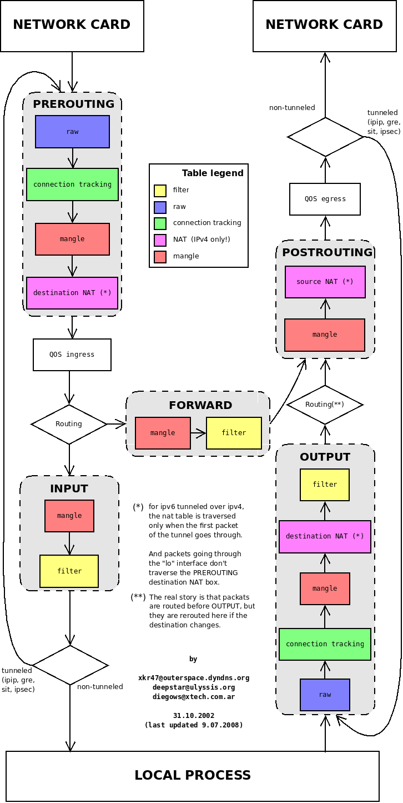

# L3.Netfilter And Iptables

## Intro

CJ대한통운의 옥천HUB를 들어보신 적 있을겁니다. 이 곳에 내 택배가 있으면 굉장히 배송까지 오래 걸린다고 택배계의 '버뮤다 삼각지대'로 불리기도 합니다. 이곳은 국내에서 택배가 가장 많이 몰리는 곳이며 그렇기 때문에 분류나 이동 과정에서 많은 시간이 소요됩니다. 그렇다면 어떻게 그렇게 많은 택배들 중 내 택배가 온전히 우리집으로 도착할 수 있을까요?

어떤 상자는 이 물류센터 자체가 목적지이고, 어떤 상자는 이곳을 잠시 거쳐 갈 뿐이며, 어떤 상자는 물류센터 내부 사무실에서 직접 발송되기도 합니다. 만약 이 모든 상자가 아무런 통제 없이 이동한다면 물류센터는 순식간에 마비될 것입니다. 그래서 물류센터 곳곳에서는 상자를 잠시 멈춰 세우고 검사하거나, 다음 배송지를 수정하거나, 통과 여부를 결정하는 여러 검문소가 존재합니다.

리눅스 커널의 Netfilter가 정확히 이 역할을 수행합니다. 패킷이 네트워크 스택을 통과할 때마다 특정 지점(Hook)에서 잠시 멈춰 세워 검사하고 처리합니다. 그리고 관리자가 "어떤 상자를 통과시키고 막을지", "어떤 주소로 변경할지" 작성한 운영 규칙이 바로 iptables입니다.

## 횡단 경로로 보는 5가지 검문소(Chains)

| 리눅스 네트워크 개념 | 물류 터미널 비유 | 핵심 역할 |
| :--- | :--- | :--- |
| **패킷 (Packet)** | 택배 상자 | 이동하는 데이터의 기본 단위 |
| **IP 주소** | 배송지/발송지 주소 | 최종 목적지 및 출발지 정보 |
| **라우팅 (Routing)** | 행선지 분류 | 어느 경로(지역)로 보낼지 결정하는 과정 |
| **NAT** | 배송 라벨 변경 | 단순히 주소를 바꾸는 것을 넘어, 연결 대상을 중개하는 행위 |

### 1. PREROUTING - 물류센터 입고 분류장
**"행선지 결정을 내리기 전, 막 도착한 상자들을 분류하는 곳"**

택배 상자가 물류센터에 막 도착했습니다. 아직 이 상자를 내부 창고로 들여보낼지, 아니면 다른 지역으로 통과시킬지 결정되기 전 단계입니다.

직원들은 여기서 배송 라벨을 확인하고 필요한 작업을 수행합니다.

- 목적지 라벨 수정: 예를 들어 현재 옥천 HUB로 보내진 택배를, 실제 내가 사는 서울 HUB로 가도록 목적지 라벨을 수정합니다.

- 실제 서버 사례: 포트 포워딩(Port Forwarding)과 DNAT(Destination NAT)가 이곳에서 일어납니다. 외부 공인 IP의 80번 포트로 들어온 웹 요청을 사설망 내부의 실제 서버로 목적지 주소와 포트를 변환하여 토스해 줄 때 사용됩니다.

### 2. INPUT - 물류센터 내부 창고 입구
**"이 물류센터가 최종 목적지인 상자들이 거치는 검문소"**

분류 결과, 해당 사장의 최종 목적지가 이 물류센터인 경우 상자는 내부 창고로 들어가기 전에 마지막 검문을 받습니다. 

- 허용된 화물인지, 위험 물품은 아닌지, 입고가 허가된 거래처인지 확인합니다

- 실제 서버 사례: 로컬 서버 자체를 보호하는 방화벽 역할을 합니다. 외부에서 서버로 시도하는 SSH(22번 포트) 접속을 특정 관리자 IP에서만 허용하고 나머지는 차단(DROP)하거나, Nginx/Apache 웹 서버로 향하는 HTTP(80번)/HTTPS(443번) 트래픽을 허가하는 규칙이 이곳에 등록됩니다.

### 3. FORWARD - 경유 통로
**"현재 물류센터는 거쳐 갈 뿐, 다른 지역으로 가는 상자들의 통로"**

이번에는 상자의 목적지가 현재 물류센터가 아닙니다. 단지 다른 지역 물류센터로 가기 위해 이곳을 잠시 경유할 뿐입니다.

- 상자는 내부 창고로 들어가지 않고, 경유 통로를 지나 반대편 출고장으로 이동합니다

- 이때 물류센터 직원은 "이 화물을 우리 터미널을 거쳐 통과시켜도 되는 안전한 화물인가?"만 판단하고 통과 혹은 폐기를 결정합니다

- 실제 서버 사례: 리눅스 서버가 라우터, 프록시, 또는 게이트웨이 역할을 할 때 작동합니다. 대표적으로 쿠버네티스(Kubernetes) 노드에서 서로 다른 Pod 간의 패킷을 중계할 때, 또는 도커(Docker) 컨테이너가 호스트 OS의 네트워크를 거쳐 외부와 통신할 때 이 FORWARD 체인을 통과하게 됩니다.

### 4. OUTPUT - 물류센터 내부 발송실
**"물류센터 내부 사무실에서 직접 외부로 보내는 상자들"**

외부에서 들어온 상자가 아닙니다. 물류센터 내부 본관 사무실에서 자체적으로 필요에 의해 직접 발송하는 화물입니다.

- 이 상자들은 외부 출고장으로 나가기 전에, 내부 보안 규정에 어긋나는 물품은 없는지 별도의 검사를 받습니다.

- 실제 서버 사례: 서버 내부의 프로세스가 시스템 외부로 요청을 보낼 때 작동합니다. 서버 내부에서 외부 연동을 위해 curl이나 wget으로 외부 API를 호출할 때, 패키지 업데이트를 위해 apt 또는 yum 명령어를 실행할 때, 혹은 외부 DNS 서버로 도메인 질의(DNS Lookup) 패킷을 보낼 때 이곳을 거치게 됩니다.

### 5. POSTROUTING — 최종 출고장
**"모든 분류가 끝나고, 트럭에 실려 떠나기 직전의 최종 라벨링하는 곳"**
이제 상자는 내부 창고에서 나왔든(OUTPUT), 환적 통로를 거쳐왔든(FORWARD) 어느 지역으로 갈지 모두 결정되었습니다. 진짜 트럭에 실려 터미널을 떠나기 직전 단계입니다.

여기서는 최종적으로 외부 세상에 나갈 배송 라벨을 다듬는 작업이 이루어집니다.

- SNAT (발송인 주소 라벨 수정): 어떤 물류 센터에서 건너왔든, 혹은 내부에서 보낸 화물이든 외부로 나갈 때는 '옥천HUB'에서 온 화물로 라벨링하여 다음 도착지에서 (답장을 보낼 주소를) 알 수 있도록 합니다.

- 외부 환경(인터넷)과 내부 환경(사설 네트워크) 사이에서 안전하게 연결 대상을 중개하기 위해 발송지 정보를 변환하는 곳입니다.

- 실제 서버 사례: 마스커레이딩(Masquerading)과 SNAT(Source NAT)가 처리되는 곳입니다. 내부 사설 IP(10.0.0.X)를 쓰는 사내 서버들이 인터넷망에 접속할 수 있도록, 나가는 패킷의 출발지 IP를 단 하나의 공인 IP로 바꾸어주는 공유기(NAT Gateway) 역할을 수행할 때 사용됩니다.

## Netfilter And Iptables

### 1. 역할 분담: 유저 공간 vs 커널 공간

이제 비유를 통해 개념적으로 이해했으니, 본격적으로 Netfilter와 Iptables에 대해 알아보겠습니다.

[netfilter.org](https://www.netfilter.org/)에서는 `Netfilter`와 `iptables`를 아래와 같이 정의하고 있습니다.

!!! info "netfilter"
    netfilter 프로젝트는 패킷 필터링, 네트워크 주소 변환(및 포트) 변환, 패킷 로깅, 사용자 공간 패킷 큐잉 및 기타 패킷 조작을 가능하게 합니다.  netfilter hook은 리눅스 커널 내부의 프레임워크로, 커널 모듈이 리눅스 네트워크 스택의 서로 다른 위치에 콜백 함수를 등록할 수 있도록 합니다. 등록된 콜백 함수는 리눅스 네트워크 스택 내에서 해당 훅을 통과하는 모든 패킷에 대해 다시 호출됩니다.

!!! info "iptables"
    iptables는 규칙 세트를 정의할 수 있는 일반적인 방화벽 소프트웨어입니다. IP table 안의 개별 규칙은 다수의 매칭 조건(matches)과 그에 대응하는 하나의 처리 대상(target)으로 이루어집니다.

따라서 아래와 같이 Netfilter와 Iptables의 관계를 정리할 수 있습니다.

- netfilter (커널 공간 - 엔진): 리눅스 커널 내부의 네트워크 스택 곳곳에 **Hook(갈고리)**를 심어두고, 패킷이 지나갈 때마다 이를 가로채서 제어할 수 있는 Kernel Space 도구입니다.
- iptables (유저 공간 - 도구): 시스템 관리자가 커널의 복잡한 코드를 건드리지 않고, "어떤 패킷을 막고 허용할 것인지" 규칙(Rule)을 정의할 수 있게 해주는 User Space 도구입니다.

> 💡 작동 방식: 관리자가 iptables -A INPUT -p tcp --dport 80 -j ACCEPT라는 규칙을 입력하면, iptables 도구가 이 규칙을 커널 내의 netfilter 모듈로 전달합니다. netfilter는 이 규칙을 기억해 두었다가, 실제로 80번 포트로 들어오는 패킷이 있으면 규칙에 따라 통과(ACCEPT)시킵니다.

### 2. 패킷 제어 규칙의 삼각 편대: 테이블, 체인, 규칙

netfilter가 패킷을 제어하는 방식은 **테이블(Tables) -> 체인(Chains) -> 규칙(Rules)**이라는 계층 구조를 가집니다. iptables는 이 구조에 맞춰 규칙을 생성합니다.

#### 2.1. 테이블 (Tables)
규칙의 '목적'에 따라 분류해 놓은 저장소입니다.

- Raw: netfilter의 '연결 추적(Connection Tracking)' 기능에서 제외할 패킷을 지정합니다.

- Mangle: 패킷 헤더의 특정 필드(TTL, TOS 등)를 수정할 때 사용합니다.

- NAT (Network Address Translation): IP나 포트를 변환(공인 IP -> 사설 IP 등)할 때 사용합니다.

- Filter: 가장 기본이 되는 테이블로, 패킷의 차단/허용(ACCEPT, DROP)을 결정합니다.

- Connection tracking: 패킷이 새로운 연결인지, 기존 연결의 일부인지 추적합니다.

#### 2.2. 5가지 Hooks와 체인 (Chains)

패킷이 리눅스 시스템을 통과하는 경로에는 5가지 주요 길목(Hook)이 있습니다. iptables에서는 이를 **체인(Chain)**이라고 부릅니다.

| Netfilter Hook | iptables 체인 (Chain) | 설명 |
| :--- | :--- | :--- |
| **`NF_IP_PRE_ROUTING`** | `PREROUTING` | 패킷이 네트워크 인터페이스에 도착하자마자 (라우팅 경로 결정 전) |
| **`NF_IP_LOCAL_IN`** | `INPUT` | 호스트(본인 서버)를 목적지로 하는 패킷이 들어올 때 |
| **`NF_IP_FORWARD`** | `FORWARD` | 호스트를 거쳐 다른 목적지로 라우팅되는 패킷 (라우터 역할) |
| **`NF_IP_LOCAL_OUT`** | `OUTPUT` | 호스트 자체에서 외부로 패킷을 내보낼 때 |
| **`NF_IP_POST_ROUTING`** | `POSTROUTING` | 라우팅이 끝나고 패킷이 네트워크 밖으로 나가기 직전 |

#### 2.3. 규칙 (Rules)

규칙은 관리자가 특정 체인에 등록하는 실제 패킷 처리 조건과 행동입니다. 패킷이 특정 체인에 도달하면, 등록된 규칙들을 위에서부터 아래로 순차적으로(Top-down) 대조하며 조건이 맞는지 검사합니다.

하나의 규칙은 크게 **조건(Match)**과 타겟/행동(Target/Action) 두 가지 요소로 구성됩니다.

1. 조건 (Match Criteria)

    "어떤 패킷을 잡아낼 것인가?"를 정의하는 부분입니다. netfilter는 패킷의 헤더 정보를 보고 조건 일치 여부를 판단합니다.

    - 프로토콜 (-p): TCP, UDP, ICMP 

    - 출발지/목적지 주소 (-s, -d): IP 주소 또는 네트워크 대역 (예: 192.168.1.100)

    - 포트 번호 (--sport, --dport): 서비스 포트 (예: SSH 22, HTTP 80)

    - 인터페이스 (-i, -o): 패킷이 들어오거나 나가는 랜카드 (예: eth0, wlan0)

2. 타겟/행동 (Target)

    "조건에 맞는 패킷을 발견하면 어떻게 처리할 것인가?"를 정의하는 부분입니다. (-j 옵션 사용)

    - ACCEPT: 패킷을 허용하고 통과시킵니다. (다음 규칙은 검사하지 않음)

    - DROP: 패킷을 조용히 버립니다. (보낸 대상을 차단하며, 차단되었다는 응답조차 주지 않음)

    - REJECT: 패킷을 버리고, 보낸 대상에게 "거부되었다"는 안내 패킷(ICMP 에러 등)을 되돌려줍니다.

    - LOG: 패킷을 통과시키거나 버리지 않고, 시스템 로그(/var/log/messages 등)에 기록만 남긴 후 다음 규칙으로 넘어갑니다.

## Conclusion

외부에서 들어와 내부 프로세스로 가는 패킷 (INPUT 경로)

    1. NETWORK CARD: 패킷이 물리 랜카드를 통해 들어옵니다.

    2. PREROUTING: 라우팅(경로)을 결정하기 직전 단계입니다. raw ➔ connection tracking ➔ mangle ➔ destination NAT (*) 순으로 거칩니다. 목적지 주소를 바꾸어야 한다면(DNAT) 여기서 바뀝니다.

    3. QoS ingress: 들어오는 패킷의 대역폭이나 우선순위를 제어합니다.

    4. Routing (라우팅 결정): 패킷의 목적지 IP를 확인합니다. "이 패킷은 이 서버 내부 컴퓨터(Local Process)가 받아야 하는구나!"라고 판정되면 아래 INPUT 방향으로 내려갑니다.

    5. INPUT: 내부 프로세스로 들어가기 직전 단계입니다. mangle을 거친 뒤 filter 테이블에서 방화벽 규칙에 따라 허용/차단을 결정합니다.

    6. LOCAL PROCESS: 검증이 끝난 패킷이 웹 서버(Nginx, Apache)나 DB 등 내부 프로그램에 전달됩니다.

외부에서 들어와 다른 곳으로 전달되는 패킷 (FORWARD 경로)

    1. PREROUTING 단계를 똑같이 거친 후, Routing 판정을 받습니다.

    2. 이때 "목적지가 내가 아니네? 다른 곳으로 보내야겠다"라고 판단되면 오른쪽 FORWARD 방향으로 빠집니다.

    3. FORWARD: 다른 네트워크로 통과시키는 단계입니다. mangle을 거쳐 filter 테이블에서 이 패킷을 통과시켜도 안전한지 방화벽 검사를 합니다.

    4. 검사를 통과하면 POSTROUTING 단계로 바로 진입합니다.

내부 프로세스에서 생성되어 외부로 나가는 패킷 (OUTPUT 경로)

    1. LOCAL PROCESS: 내부 프로그램이 패킷을 만들어 보냅니다.

    2. OUTPUT: 나가기 전 첫 번째 제어 단계입니다. raw ➔ connection tracking ➔ mangle ➔ destination NAT (*) ➔ filter 순으로 거칩니다. 내가 나쁜 사이트로 패킷을 보내는 건 아닌지 방화벽(filter)이 체크합니다.

    3. Routing: 목적지가 바뀌었을 경우를 대비해 다시 한번 경로를 재조정합니다.

    4. POSTROUTING: 네트워크 카드로 나가기 직전 최종 단계입니다. mangle을 거쳐 source NAT (*)를 처리합니다. 내부 사설 IP를 공인 IP로 바꾸는 SNAT(공유기 역할)가 여기서 일어납니다.

    5. QoS egress: 나가는 패킷의 속도를 제어합니다.

    6. NETWORK CARD: 최종적으로 랜카드를 통해 외부 네트워크로 전송됩니다.

