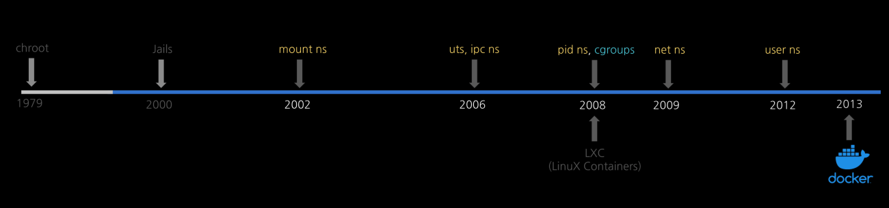

# 0. 개요 및 환경 설정

## 개요

이번 챕터는 if(kakao)2022에서 김상영님이 발표하신 [도커 없이 컨테이너 만들기](https://github.com/sam0kim/container-internal/tree/main)를 따라가며 학습한 내용을 정리한 것입니다.

도커, 쿠버네티스 등 컨테이너 활용 기술을 많이 다루고 있지만 실제 이 기술이 어떤 원리로 동작하는 지 이해하기에 최고의 자료라고 생각합니다.

아무것도 몰랐을 때는 도커가 컨테이너를 만드는 기술이라고 생각했지만, 컨테이너를 만드는 것은 리눅스 커널의 기술이며 도커는 이를 쉽게 활용할 수 있게 만들어진 인터페이스로 이해할 수 있었습니다.



위 그림과 같이 컨테이너 기술이 도커를 통해 상용화되기 전까지 어떤 흐름으로 발전되어 왔는 지 살펴보겠습니다.

## 환경 설정

본격적으로 실습에 앞서 아래와 같은 환경에서 실습을 진행했습니다.

- 호스트 OS: ubuntu 22.04
- 가상화: libvirt
- VM 설정: vagrant

### 가상화 도구 설치

```
# 패키지 목록 업데이트
sudo apt update

# KVM, Libvirt, QEMU 등 필수 도구 설치
sudo apt install -y qemu-kvm libvirt-daemon-system libvirt-clients bridge-utils virtinst virt-manager

sudo adduser $USER libvirt
sudo adduser $USER kvm

newgrp libvirt
newgrp kvm

virsh list --all
```

### 필수 패키지 및 플러그인 설치

```
# 1. 패키지 목록 업데이트 및 필수 빌드 도구 설치
sudo apt update
sudo apt install -y qemu-utils libvirt-dev ruby-libvirt build-essential

# 2. vagrant-libvirt 플러그인 설치
sudo apt install vagrant
vagrant plugin install vagrant-libvirt
```

### 작업 디렉토리 생성 및 Vagrantfile 구성

```
# 1. 가상머신용 디렉토리 생성 및 이동
mkdir -p ~/make-container-demo
cd ~/make-container-demo

# 2. Vagrantfile 파일 생성 및 편집
vim Vagrantfile
```

```
# KVM(Libvirt)을 지원하는 generic 공급자의 ubuntu1804 이미지로 변경
BOX_IMAGE = "generic/ubuntu1804"
HOST_NAME = "ubuntu1804"

$pre_install = <<-SCRIPT
  echo ">>>> pre-install <<<<<<"
  sudo apt-get update &&
  sudo apt-get -y install gcc make pkg-config libseccomp-dev tree jq bridge-utils

  echo ">>>>> install docker <<<<<<"
  sudo apt-get -y install apt-transport-https ca-certificates curl gnupg lsb-release > /dev/null 2>&1 &&
  sudo mkdir -p /etc/apt/keyrings &&
  sudo curl -fsSL https://download.docker.com/linux/ubuntu/gpg | sudo gpg --dearmor -o /etc/apt/keyrings/docker.gpg &&
  echo \
  "deb [arch=$(dpkg --print-architecture) signed-by=/etc/apt/keyrings/docker.gpg] https://download.docker.com/linux/ubuntu \
  $(lsb_release -cs) stable" | sudo tee /etc/apt/sources.list.d/docker.list > /dev/null 2>&1 &&
  sudo apt-get update &&
  sudo apt-get -y install docker-ce docker-ce-cli docker-compose-plugin > /dev/null 2>&1
SCRIPT

Vagrant.configure("2") do |config|
  # 기본 공급자를 libvirt로 지정
  config.vm.provider :libvirt do |libvirt|
    libvirt.driver = "kvm"
  end

  config.vm.define HOST_NAME do |subconfig|
    subconfig.vm.box = BOX_IMAGE
    subconfig.vm.hostname = HOST_NAME
    
    # Libvirt 환경에 맞는 사설 IP 네트워크 설정
    subconfig.vm.network :private_network, ip: "192.168.121.10"
    
    # 가상화 공급자 설정을 libvirt용으로 변경
    subconfig.vm.provider :libvirt do |v|
      v.memory = 1536
      v.cpus = 2
    end
    
    subconfig.vm.provision "shell", inline: $pre_install
  end
end
```

### VM 생성 및 구동

```
vagrant up

vagrant ssh ubuntu1804

vagrant@ubuntu1804:~$ sudo -Es # 실습 계정 : root 계정을 기본으로 합니다.
root@ubuntu1804:~# 

root@ubuntu1804:~# cd /tmp # 실습 경로 : /tmp 를 기본으로 합니다.
root@ubuntu1804:/tmp#
```