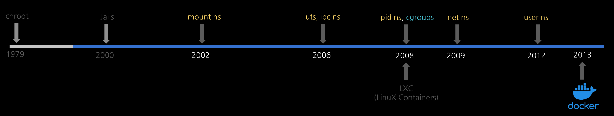

# 1. chroot

## Bill Joy

`chroot`에 대해 알아보기 위해서 한번 빌 조이(Bill Joy, 훗날 BSD 유닉스를 만들고 Sun Microsystems를 창업하는 인물)가 직접 되보는 상상을 해봅시다.

우리는 이제 1980년대 유닉스의 성지였던 벨 연구소와 버클리 대학 연구실의 풍경이 눈에 보이는 곳으로 왔습니다. 그들이 왜 프로세스의 눈을 속여 '루트(`/`)'를 바꿔야만 했을 까요?


**\[오후 8:00 - 야심 찬 출발\]**

우리는 오늘 유닉스 운영체제의 핵심 시스템 기능을 대폭 업그레이드하기로 마음먹었습니다. 새로운 기능이 정상 동작하려면 시스템의 가장 기본이 되는 표준 라이브러리 파일들을 새로 작성해야 합니다.

소스 코드를 열심히 수정하고 컴파일러를 돌릴 준비를 합니다.

**\[오후 10:30 - 뜻밖의 대재앙\]**

새로 만든 라이브러리 파일들을 컴파일하여 시스템 폴더인 `/usr/lib`와 `/bin`에 넣고 테스트를 시작했습니다. 그런데 아차! 소스 코드에 치명적인 오타가 있었습니다.

이 불완전한 시험용 파일이 원본 파일들을 덮어쓰는 순간, 컴퓨터 전체가 굳어버렸습니다. 키보드 입력도 먹히지 않고, 화면은 멈췄습니다.

더 심각한 것은, 컴퓨터의 기본 명령어들마저 이 망가진 라이브러리를 참조하는 바람에 시스템을 정상적으로 부팅하거나 복구하는 것조차 불가능해진 것입니다.

> 겨우 파일 몇개 테스트하려던 것뿐인데, 시스템 전체가 오염되서 완전히 깨져버렸잖아? 다시 OS를 처음부터 설치하려면 밤을 세워야겠네...

**\[오전 01:30 - 또 다른 문제: 버전의 늪\]**

밤새 시스템을 복구한 우리에게 또 다른 난관이 찾아옵니다.

지금 컴퓨터에 깔려있는 OS는 '버전 6'입니다. 하지만 우리는 다음 세대인 '버전 7' OS를 개발해야 합니다.

'버전 7'용 코드를 컴파일하려고 하니, 자꾸만 현재 컴퓨터에 깔려있는 '버전 6'의 구형 헤더 파일들이 자동으로 읽혀 들어와 컴파일 에러가 발생합니다.

그렇다고 개발을 위해 멀쩡히 잘 돌아가는 '버전 6' 시스템의 기본 파일들을 다 지워버릴 수도 없는 노릇이었습니다.

## 나만의 가상 작업실 - chroot

빌 조이는 이 문제를 해결하기 위해 컴퓨터 내부의 '공간'을 속이는 기발한 아이디어를 냅니다.

> 프로세스가 실행될 때, 진짜 시스템의 최상위 디렉토리인 '루트(`/`)'를 보지 못하게 눈을 가려버리자. 그리고 내가 지정한 실험용 폴더를 진짜 '루트(`/`)'인 것처럼 속이는 거야

이렇게 해서 탄생한 시스템 콜이 바로 `chroot` (ChangeRoot)입니다.

자세한 해결 방법을 알아보겠습니다.

1. **실험실 폴더 만들기**: 자신의 홈 디렉토리 아래에 임의로 `/testing_room`이라는 폴더를 만듭니다.

2. **필수 재료만 복사**: 그 폴더 안에 컴파일과 테스트에 필요한 최소한의 깨끗한 `include` 파일과 라이브러리만 복사해 넣습니다.

3. **chroot 실행**: 커널에게 명령합니다. "지금부터 내가 실행할 컴파일러와 프로그램들은 `/testing_room`을 최상위 '루트(`/`)'로 인식하게 해라"

4. **안전한 실험**: 이제 컴파일러는 지정된 폴더 외부의 진짜 시스템 파일들을 건드릴 수 없습니다. 프로그램 안에서 `/usr/lib/libc.a`를 호출하면, 진짜 시스템의 파일이 아닌 `/testing_room/usr/lib/libc.a`가 읽히기 때문입니다.

## chroot 동작 방식 이해하기

`chroot`가 프로세스의 눈을 속여 진짜 '루트(`/`)'대신 가짜 루트 디렉토리를 바라보게 만들 수 있는 기술적인 이유는 **리눅스(유닉스) 커널이 프로세스를 관리하는 '구조체'데이터 안에 루트 디렉토리 정보를 명시해두고, 경로를 해석할 때마다 이 값을 참조**하기 때문입니다.

**\[커널이 프로세스를 기억하는 장부: `task_struct`\]**

리눅스 커널은 실행 중인 모든 프로그램(프로세스)을 관리하기 위해 메모리에 일종의 '장부'를 만듭니다. 이를 실제 코드에서는 `task_struct` 구조체에 저장합니다.

이 장부에는 프로세스의 ID, 메모리 주소, 열린 파일 목록 등 수많은 정보가 담겨 있는데, 그 중에는 "프로세스의 파일 시스템 정보"를 담는 fs라는 하위 구조체 (`fs_struct`)가 있습니다. 이 안에 핵심 비밀이 숨어 있습니다. 자세한 코드는 [여기](https://github.com/torvalds/linux/blob/master/include/linux/fs_struct.h#L15)를 참고하세요.

```c
// 리눅스 커널 내부의 프로세스 장부(개념도)
struct fs_struct {
    struct path root;  // 👈 바로 이 프로세스의 '루트(/)' 디렉토리 위치!
    struct path pwd;   // 👈 이 프로세스의 '현재 작업(.)' 디렉토리 위치
};
```

보통의 프로세스는 컴퓨터가 켜지면 이 `root` 변수에 실제 하드디스크의 최상위 지점의 주소 값이 들어갑니다.

`chroot(path)`를 호출한 프로세스는 커널이 해당 프로세스의 장부를 열어 `root` 변수의 값을 사용자가 인자로 넘긴 `path` (예: `/testing_room`)의 주소값으로 바꿔버립니다.

**\[경로 해석의 비밀\]**

컴퓨터에서 어떤 프로그램이 `/bin/sh`라는 파일을 열어달라고 커널에 요청했다고 해봅시다. 커널은 문자열을 앞에서부터 한 글자씩 해석하기 시작합니다.

1. 가장 먼저 첫 글자인 `/`를 만납니다

2. 커널은 요청한 그 포로세스의 장부(`fs_struct`)에 적힌 `root`변수를 확인합니다.

3. 만약 이프로세스가 `chroot`된 프로세스라면, 커널은 장부에 적힌대로 `/testing_room` 디렉토리로 이동합니다.

4. 그 다음 글자인 `bin`, `sh`를 해석하여 최종적으로 `/testing_room/bin/sh`를 열어줍니다.

프로세스 입장에서는 그저 `/bin/sh`를 열어달라고 했을 뿐인데, 커널이 길잡이(루트 변수)를 바꿔치기 했기 때문에 가짜 환경 속에 갇히는 것입니다.

빌 조이가 chroot 방을 만들 때 필수 라이브러리와 명령어들을 그 안에 복사해 넣어야 했던 이유도 여기에 있습니다.

만약 /testing_room으로 chroot를 했는데 그 내부에 아무것도 없다면, 프로그램이 실행되면서 기본적으로 찾는 표준 C 라이브러리(`/lib/libc.so`)나 기본 쉘(`/bin/sh`)을 찾을 때 커널은 `/testing_room/lib/libc.so`를 찾으려고 시도합니다.

당연히 파일이 없으니 프로그램은 시작하자마자 **"파일을 찾을 수 없습니다(No such file or directory)"**라는 에러를 내며 뻗어버립니다. 그래서 가상 공간 안에도 마치 미니어처 세계를 만들듯 최소한의 파일 구조를 복사해 놔야만 정상 작동할 수 있었던 것입니다.


## chroot - 컨테이너 기술의 시발점이 되다



이 기술 덕분에 개발자들은 **실제 실행중인 시스템을 오염시키지 않으면서, 그 안에서 완전히 독립된 새로운 운영체제를 빌드하고 테스트** 할 수 있게 되었습니다.

실수로 코드에 에러가 발생하더라도 컴퓨터 전체가 망가지는 일 없이, 그 격리된 방(폴더)만 지우고 새로 시작하면 되었으니까요.

이 소박하고 강력한 **"방 가르기"** 아이디어가 40년 동안 흐르고 흘러 컨테이너 기술의 거대한 시발점이 되었습니다.

## 참고 문헌

[Slashdot](https://it.slashdot.org/story/07/09/27/2256235/when-not-to-use-chroot)

[man7 - choot](https://man7.org/linux/man-pages/man2/chroot.2.html)