# 2. 컨테이너 파일시스템

이전 글에서는 [chroot](./1.chroot.md)에 대해 알아보았습니다. 이번에는 `chroot`를 기반으로 어떻게 컨테이너 파일시스템이 구성되는 지 알아보겠습니다.

## 프로세스를 가두자

먼저 `chroot`를 사용하여 프로세스를 가두어 보겠습니다. 여기서 "가둔다"라는 의미는 Bill Joy가 그랬듯이 프로세스가 동작함에 있어 다른 파일 시스템들과 분리되어서 동작하게 한다는 의미입니다. 즉 프로세스의 `root`를 별도로 만들어주는 것이지요.

[환경 설정](0. 개요 및 환경 설정.md)에서 구성한 환경을 통해 실습을 진행해봅시다.

```bash
cd make-container-demo/
vagrant ssh ubuntu1804
sudo -Es
cd /tmp/
```

```bash
root@ubuntu1804:/tmp# mkdir myroot
root@ubuntu1804:/tmp# chroot myroot /bin/sh
chroot: failed to run command ‘/bin/sh’: No such file or directory
```

`myroot`라는 새로운 `root`를 만들어주고 `chroot`를 적용하면 현재 실행 중인 `bash` 프로세스는 `myroot`를 `root`로서 바라보게됩니다.

그러다 보니 `/bin/sh` 경로에 아무것도 존재하지 않아 `sh`이 실행되지 않습니다.

이를 위해 기존 `root`로 이동해서 `sh`를 실행하기 위해 어떤 파일들이 필요한 지 확인해보겠습니다.

```bash
root@ubuntu1804:/tmp# which sh
/bin/sh
root@ubuntu1804:/tmp# ldd /bin/sh
	linux-vdso.so.1 (0x00007ffe00de0000)
	libc.so.6 => /lib/x86_64-linux-gnu/libc.so.6 (0x00007efd3ecec000)
	/lib64/ld-linux-x86-64.so.2 (0x00007efd3f2fd000)
```

필요한 파일들을 이제 새로운 `myroot`로 복사해줍니다.

```bash
root@ubuntu1804:/tmp# mkdir -p myroot/bin
root@ubuntu1804:/tmp# cp /bin/sh myroot/bin/
root@ubuntu1804:/tmp# mkdir -p myroot/{lib64,lib/x86_64-linux-gnu};
root@ubuntu1804:/tmp# cp /lib/x86_64-linux-gnu/libc.so.6 myroot/lib/x86_64-linux-gnu/;
root@ubuntu1804:/tmp# cp /lib64/ld-linux-x86-64.so.2 myroot/lib64;
root@ubuntu1804:/tmp# chroot myroot /bin/sh
# ls
/bin/sh: 1: ls: not found
```

마찬가지로 `ls` 명령어도 실행할 수 있게 복사해줍니다.

```bash
root@ubuntu1804:/tmp# which ls
/bin/ls


root@ubuntu1804:/tmp# ldd /bin/ls
	linux-vdso.so.1 (0x00007ffc213ae000)
	libselinux.so.1 => /lib/x86_64-linux-gnu/libselinux.so.1 (0x00007f4426ead000)
	libc.so.6 => /lib/x86_64-linux-gnu/libc.so.6 (0x00007f4426abc000)
	libpcre.so.3 => /lib/x86_64-linux-gnu/libpcre.so.3 (0x00007f442684b000)
	libdl.so.2 => /lib/x86_64-linux-gnu/libdl.so.2 (0x00007f4426647000)
	/lib64/ld-linux-x86-64.so.2 (0x00007f44272f7000)
	libpthread.so.0 => /lib/x86_64-linux-gnu/libpthread.so.0 (0x00007f4426428000)


root@ubuntu1804:/tmp# cp /bin/ls myroot/bin/


root@ubuntu1804:/tmp# cp /lib/x86_64-linux-gnu/\
{libselinux.so.1,libc.so.6,libpcre.so.3,libdl.so.2,\
libpthread.so.0} \
myroot/lib/x86_64-linux-gnu/;


root@ubuntu1804:/tmp# cp /lib64/ld-linux-x86-64.so.2 myroot/lib64/;
```

이제 독립된 `myroot`아래 `sh`와 `ls`가 실행될 수 있게 모든 파일을 복사해두었습니다.

```bash
root@ubuntu1804:/tmp# tree
.
├── myroot
│   ├── bin
│   │   ├── ls
│   │   └── sh
│   ├── lib
│   │   └── x86_64-linux-gnu
│   │       ├── libc.so.6
│   │       ├── libdl.so.2
│   │       ├── libpcre.so.3
│   │       ├── libpthread.so.0
│   │       └── libselinux.so.1
│   └── lib64
│       └── ld-linux-x86-64.so.2
```

이제 `chroot`를 실행하면 마치 `sh`와 `ls`만 존재하는 새로운 OS에 접속한 것처럼 느껴집니다.

```bash
root@ubuntu1804:/tmp# chroot myroot/ /bin/sh
# ls
bin  lib  lib64
```

마지막으로 `ps`까지 추가해보도록 하겠습니다. `ps`는 김상영님이 준비해주신 스크립트로 적용해보겠습니다.

```bash
wget https://raw.githubusercontent.com/sam0kim/container-internal/refs/heads/main/scripts/chroot_ps.sh

bash chroot_ps.sh;
```

```
root@ubuntu1804:/tmp# chroot myroot /bin/sh
# ps
Error, do this: mount -t proc proc /proc
# mount -t proc proc /proc
# ps
  PID TTY          TIME CMD
11649 ?        00:00:00 sudo
11650 ?        00:00:00 bash
11870 ?        00:00:00 sh
11873 ?        00:00:00 ps
```

지금까지 `sh`, `ls`, `ps`까지 모두 설치해보았습니다. `chroot` 시스템 콜을 통해 현재 동작 중인 `bash` 프로세스의 `root`를 `myroot`로 변경해보았고, `myroot`에 필요한 파일들을 복사해서 마치 독립된 환경에 프로세스를 가두는 것처럼 해보았습니다.

다음 실습을 위해 아래와 같이 자원을 정리해줍시다.

```bash
# exit
root@ubuntu1804:/tmp# umount /tmp/myroot/proc
```

## 남이 만든 이미지로 해보자

위에 우리가 [프로세스를 가두자](#_1)를 통해 한 행위는 도커로 이미지를 내려받아 컨테이너를 실행하는 것과 본질적으로 동일합니다.

- 컨테이너 이미지란 본질적으로 "애플리케이션이 실행되는 데 필요한 모든 파일(바이너리, 라이브러리, 설정 파일 등)을 모아 놓은 디렉토리 구조"일 뿐이며, 컨테이너 기술에서는 이를 루트 파일 시스템(`rootfs`)라고 합니다.

- 즉, 컨테이너는 이러한 디렉토리를 `root`로 삼아 실행된 격리된 프로세스입니다.

한번 다른 사람들이 만들어놓은 이미지로 프로세스를 구동해보겠습니다.

```bash
root@ubuntu1804:/tmp# mkdir nginx-root;
root@ubuntu1804:/tmp# docker export $(docker create nginx) \ | tar -C nginx-root -xvf -;
root@ubuntu1804:/tmp# chroot nginx-root /bin/sh;
```

```bash
# ls /
bin   docker-entrypoint.d   home   media  proc	sbin  tmp
boot  docker-entrypoint.sh  lib    mnt	  root	srv   usr
dev   etc		    lib64  opt	  run	sys   var

# nginx -g "daemon off;"
```

```
root@ubuntu1804:/tmp# curl localhost:80
<!DOCTYPE html>
<html>
<head>
<title>Welcome to nginx!</title>
...
</html>
```

## 탈옥을 해보자

사실 우리가 지금까지 프로세스를 가둔 방법은 `chroot`를 통해서였습니다. 이전 글 [chroot](./1.chroot.md)에서 설명한 것처럼 `chroot`는 보안적으로 안전하게 프로세스를 가두려고 만들었다기 보단, 기존 파일 시스템으로 인해 빌드가 영향 받는 것을 방지 하기 위해 새로 만든 별도의 파일 시스템 용도로 만든 것입니다.

따라서 이를 그대로 컨테이너 기술에 도입하기엔 단점이 있었는데요, 그건 바로 "탈옥"이 가능하다는 점이었습니다. 한번 우리가 만든 `myroot` 환경을 탈옥하는 실습을 진행해보겠습니다.

```bash
root@ubuntu1804:/tmp# chroot myroot /bin/sh
# ls /
bin  lib  lib64  proc  usr
```

```bash
# /tmp/escape_chroot.c

#include <sys/stat.h>
#include <unistd.h>

int main(void)
{
	mkdir(".out", 0755);
	chroot(".out");
	chdir("../../../../../");
	chroot(".");
	return execl("/bin/sh", "-i", NULL);
}
```

```bash
gcc -o myroot/escape_chroot \
escape_chroot.c
```

```bash
root@ubuntu1804:/tmp# chroot myroot /bin/sh
# ls
bin  escape_chroot  lib  lib64	proc  usr
# ./escape_chroot
# ls /
bin   home	      lib64	  opt	sbin  tmp      vmlinuz.old
boot  initrd.img      lost+found  proc	snap  usr
dev   initrd.img.old  media	  root	srv   var
etc   lib	      mnt	  run	sys   vmlinuz
```

위와 같이 아주 간단한 C언어 코드로 기존 `root`로 도달할 수 있음을 볼 수 있습니다.
탈옥이 되는 이유는 간단합니다. 어떤 신규 `myroot`라도 결국 기존 `root` 폴더의 아래 자식으로 존재할 수 밖에 없고,`chdir("../../../../../")`로 부모 폴더로 타고 넘어가다보면 언젠간 `root`가 나오게 됩니다.

## 탈옥을 막아보자

탈옥을 어떻게 하면 막을 수 있을까요? 위에서 탈옥이 가능한 원인이 기존 `root` 폴더의 아래 자식으로 존재할 수 밖에 없기 때문이라고 했으니 `root` 폴더를 새로운 `myroot` 아래 옮겨버리면 될까요?

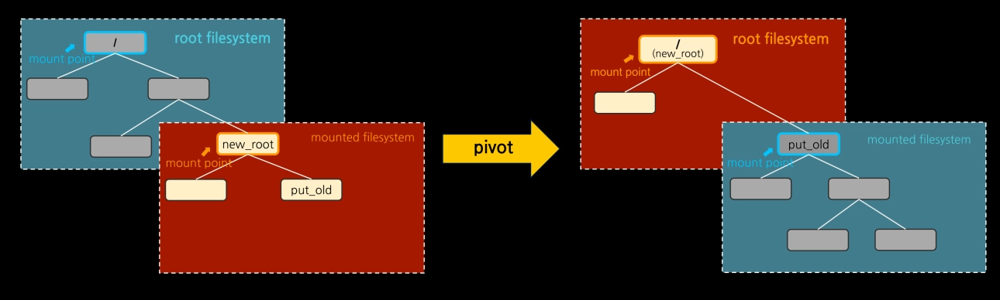[^1]

이렇게 되면 배보다 배꼽이 더 큰 상황이 벌어집니다. 바로 호스트 루트 파일 시스템에 직접적인 영향을 주기 때문입니다.

이를 해결하기 위해 2002년 "네임스페이스"가 개발되었고, 호스트에 영향을 주지 않고도 루트 파일 시스템을 피봇할 수 있게 마운트 환경만 별도로 격리할 수 있게 되었습니다.

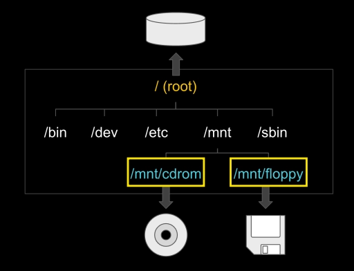[^2]

마운트란 신규 파일 시스템을 루트 파일 시스템의 하위 디렉토리로 부착하는 시스템 콜입니다.

- 마운트 포인트: 부착 지점
- 예) USB, CDROM 마운트

네임스페이스가 개발됨에 따라, 마운트 환경만 별도로 격리할 수 있는 마운트 네임스페이스가 생겼습니다.

이제 탈옥을 안전하게 막을 수 있게 되었습니다.

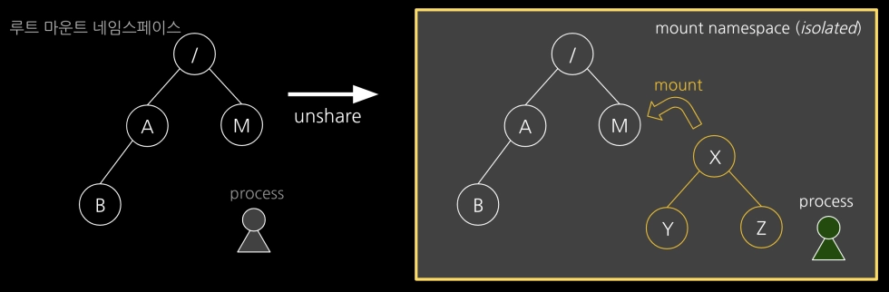

- `unshare` 시스템 콜을 통해 기존 호스트의 루트 마운트 네임스페이스와 독립된 신규 마운트 네임스페이스를 만들어 줍니다.

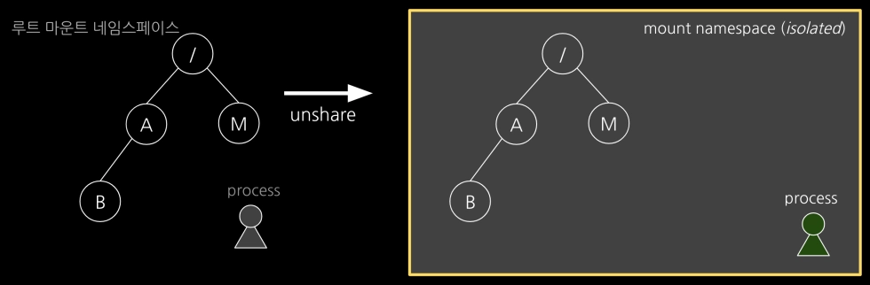

- `mount` 시스템 콜을 통해 프로세스의 신규 파일 시스템을 연결해줍니다.

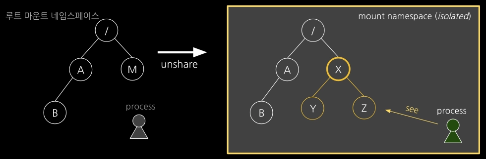
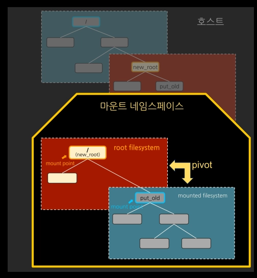[^3]

- `chroot`가 아닌 `pivot_root`를 통해 기존 루트(`/`)를 새로운 루트(`new_root`)로 교체하면서, 기존 루트는 새로운 루트 아래의 임시 디렉토리(`old_root`)로 보냅니다.

- 마지막으로 `umount -l /old_root`를 `old_root`에 마운트되어 있는 호스트 루트 파일시스템을 언마운트하여 연결 고리를 완전히 끊어버립니다.

위 과정을 한번 실습으로 간단히 확인해보겠습니다.

```bash
root@ubuntu1804:/tmp# unshare --mount /bin/sh
# df -h
Filesystem      Size  Used Avail Use% Mounted on
/dev/vda3       124G  3.7G  114G   4% /
udev            712M     0  712M   0% /dev
tmpfs           745M     0  745M   0% /dev/shm
tmpfs           149M  5.9M  144M   4% /run
tmpfs           5.0M     0  5.0M   0% /run/lock
tmpfs           149M     0  149M   0% /run/user/1000
tmpfs           745M     0  745M   0% /sys/fs/cgroup
/dev/vda1       462M  272M  162M  63% /boot
overlay         124G  3.7G  114G   4% /var/lib/docker/overlay2/0a14c9347b6db2094bef965af3983b65fda99cdeda59f2e4457917951dc4d9b8/merged
# mkdir new_root
# mount -t tmpfs none new_root
# df -h | grep new_root
none            745M     0  745M   0% /tmp/new_root
```

```bash
# cp -r myroot/* new_root
# tree new_root
new_root
├── bin
│   ├── ls
│   ├── mkdir
│   ├── mount
│   ├── ps
│   └── sh
├── escape_chroot
├── lib
│   └── x86_64-linux-gnu
│       ├── libblkid.so.1
│       ├── libc.so.6
│       ├── libdl.so.2
│       ├── libgcrypt.so.20
│       ├── libgpg-error.so.0
│       ├── liblz4.so.1
│       ├── liblzma.so.5
│       ├── libmount.so.1
│       ├── libpcre.so.3
│       ├── libprocps.so.6
│       ├── libpthread.so.0
│       ├── librt.so.1
│       ├── libselinux.so.1
│       ├── libsystemd.so.0
│       └── libuuid.so.1
├── lib64
│   └── ld-linux-x86-64.so.2
├── proc
└── usr
    └── lib
        └── x86_64-linux-gnu
            └── liblz4.so.1

8 directories, 23 files
```

```bash
# mkdir new_root/put_old
# cd new_root
# pwd
/tmp/new_root
# pivot_root . put_old;
# cd /;
# ls /
bin  escape_chroot  lib  lib64	proc  put_old  usr
# ls put_old
bin   home	      lib64	  opt	sbin  tmp      vmlinuz.old
boot  initrd.img      lost+found  proc	snap  usr
dev   initrd.img.old  media	  root	srv   var
etc   lib	      mnt	  run	sys   vmlinuz
```

```bash
# ./escape_chroot
# ls -l
total 16
drwxr-xr-x  2 0 0  140 Jun 14 12:32 bin
-rwxr-xr-x  1 0 0 8440 Jun 14 12:32 escape_chroot
drwxr-xr-x  3 0 0   60 Jun 14 12:32 lib
drwxr-xr-x  2 0 0   60 Jun 14 12:32 lib64
drwxr-xr-x  2 0 0   40 Jun 14 12:32 proc
drwxr-xr-x 23 0 0 4096 Jan  6  2024 put_old
drwxr-xr-x  3 0 0   60 Jun 14 12:32 usr
```

위와 같이 기존에 탈옥 코드를 동작 시켜도, 본래 호스트 파일 시스템의 루트로 접근할 수 없음을 확인할 수 있습니다.

## 중복을 해결하자

이제 이미지를 잘 만들고, 탈옥도 못하게 막았습니다. 컨테이너 파일 시스템 만들기 성공입니다. 이제 이걸 가지고 다양한 환경들을 구성했습니다.

모든 환경에서는 당연히 필요한 필수 명령어들이 있었습니다. `sh`, `ls`, `ps` 이런 것들이죠.

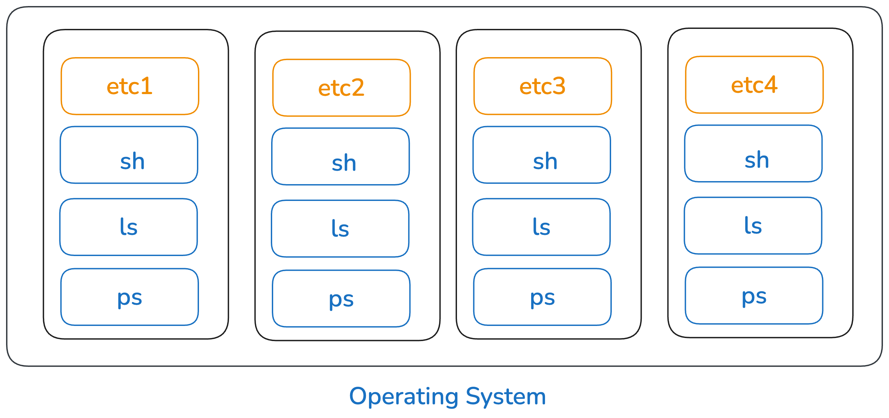

총 4개의 환경을 만들 때 필수 명령어들이 각 환경에 다 설치된다면, OS 입장에선 동일한 파일들이 총 4세트가 생겨나는 셈입니다. 불필요한 중복이 발생하는 것이지요.

그런데 만약 각 환경에서 사용하는 동일한 파일들은 공유해서 사용할 수 있다면 어떨까요?

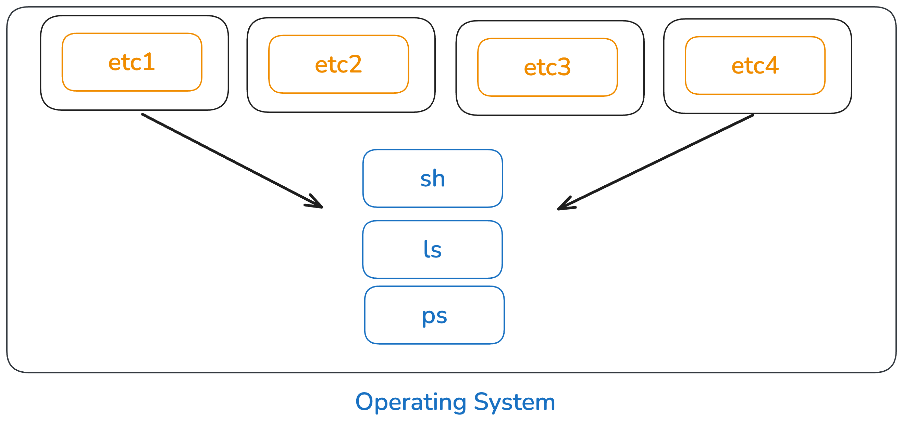

기존에 중복으로 설치되었던 파일들이 사라지게 되므로 OS 입장에서는 저장소를 더 효율적으로 사용할 수 있습니다.

이러한 아이디어로 시작된 것이 바로 "오버레이 파일시스템(overlayFS)"입니다. 오버레이 파일시스템에 대해 더 깊게 알고 싶다면, 다음 글 [overlayFS](./3.overlayFS.md)을 참고해주세요

우선은 실습을 통해 overlayFS을 통해 이미지 중복 문제를 어떻게 해결하는 지 알아보겠습니다.

아래 그림과 같이 overlayFS을 통해 파일시스템을 구성해보겠습니다.

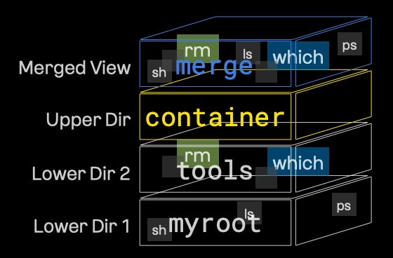

읽기 전용 Lower Dir1인 `myroot`는 위에서 실습하면서 만들 것을 그대로 사용합니다.

```bash
root@ubuntu1804:/tmp# mkdir tools
root@ubuntu1804:/tmp# which which
/usr/bin/which
root@ubuntu1804:/tmp# ldd /usr/bin/which
	not a dynamic executable
root@ubuntu1804:/tmp# mkdir -p tools/usr/bin;
root@ubuntu1804:/tmp# cp /usr/bin/which tools/usr/bin/;
```

읽기 전용 Lower Dir2인 `tools`를 새로 만들어 주겠습니다.

```bash
root@ubuntu1804:/tmp# which rm;
/bin/rm
root@ubuntu1804:/tmp# ldd /bin/rm;
	linux-vdso.so.1 (0x00007ffc1bd93000)
	libc.so.6 => /lib/x86_64-linux-gnu/libc.so.6 (0x00007f98500d7000)
	/lib64/ld-linux-x86-64.so.2 (0x00007f98506d8000)
	
root@ubuntu1804:/tmp# mkdir -p tools/{bin,lib64,lib/x86_64-linux-gnu};

root@ubuntu1804:/tmp# cp /lib/x86_64-linux-gnu/libc
libc-2.27.so             libcidn-2.27.so          libcryptsetup.so.12
libcap-ng.so.0           libcidn.so.1             libcryptsetup.so.12.2.0
libcap-ng.so.0.0.0       libcom_err.so.2          libcrypt.so.1
libcap.so.2              libcom_err.so.2.1        libc.so.6
libcap.so.2.25           libcrypt-2.27.so
root@ubuntu1804:/tmp# cp /lib/x86_64-linux-gnu/libc.so.6 tools/lib/x86_64-linux-gnu/
root@ubuntu1804:/tmp# cp /lib64/ld-linux-x86-64.so.2 tools/lib64
```

이제 변경 가능한 Upper Dir를 만들어주겠습니다.

```bash
root@ubuntu1804:/tmp# mkdir -p rootfs/{container,work,merge}
root@ubuntu1804:/tmp# tree rootfs
rootfs
├── container
├── merge
└── work
```

마지막으로 `mount` 명령어를 통해 `overlay` 타입의 파일 시스템을 사용하여 여러 디렉터리를 하나로 병합하였습니다.

```bash
root@ubuntu1804:/tmp# mount -t overlay overlay -o \
> lowerdir=tools:myroot,\
> upperdir=rootfs/container,\
> workdir=rootfs/work rootfs/merge
```

- lowerdir=tools:myroot (하위 레이어 / 읽기 전용)
    -  기반이 되는 디렉터리들입니다. 콜론(:)을 기준으로 오른쪽(myroot)이 가장 아래, 왼쪽(tools)이 그 위에 쌓입니다.
    - 이 디렉터리들의 파일은 **읽기 전용(Read-Only)**으로만 접근되며 원본은 절대 수정되지 않습니다.

- upperdir=rootfs/container (상위 레이어 / 쓰기 가능)
    - 컨테이너 안에서 파일 추가, 수정, 삭제 등의 모든 변경 사항이 실제로 기록되는 디렉터리입니다.
- workdir=rootfs/work (작업 디렉터리)
    - OverlayFS가 내부적으로 파일 생성이나 원자적(atomic)인 시스템 작업을 처리할 때 사용하는 빈 임시 공간입니다. 
    - 상위 레이어와 같은 파일 시스템 안에 있어야 합니다.
- rootfs/merge (최종 마운트 포인트 / 병합 뷰)
    - 사용자가 최종적으로 바라보게 되는 디렉터리입니다.
    - lowerdir와 upperdir의 내용이 합쳐져서 보이며, 여기서 파일을 수정하면 실제로는 upperdir에만 반영됩니다.

우리가 위에서 하고자 했던 그림대로 구성된 것을 확인해봅시다.


기존 원래 이미지인 `myroot`와 `rootfs/merge`를 비교해보면, 실제로 `tools`에서 추가하난 `rm`과 `which`가 추가되었으믈 병합 뷰에서 확인할 수 있습니다.

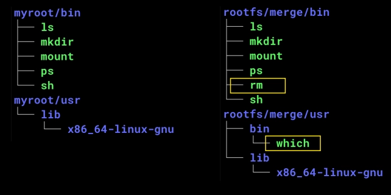

```bash
root@ubuntu1804:/tmp# tree -L 2 myroot/{bin,usr}
myroot/bin
├── ls
├── mkdir
├── mount
├── ps
└── sh
myroot/usr
└── lib
    └── x86_64-linux-gnu

2 directories, 5 files
```

```bash
root@ubuntu1804:/tmp# tree -L 2 rootfs/merge/{bin,usr};
rootfs/merge/bin
├── ls
├── mkdir
├── mount
├── ps
├── rm
└── sh
rootfs/merge/usr
├── bin
│   └── which
└── lib
    └── x86_64-linux-gnu

3 directories, 7 files
```

마지막으로 화이트아웃(Whiteout) 동작을 확인해보겠습니다.

[overlayFS](./3.overlayFS.md)에서 알아본 것처럼 OverlayFS에서는 읽기 전용인 Lowerdir에만 존재하는 파일을 삭제하려고 하면 쓰기 가능한 Upperdir에 `escape_chroot`라는 이름의 '화이트아웃(특수 마커)' 파일을 만듭니다.

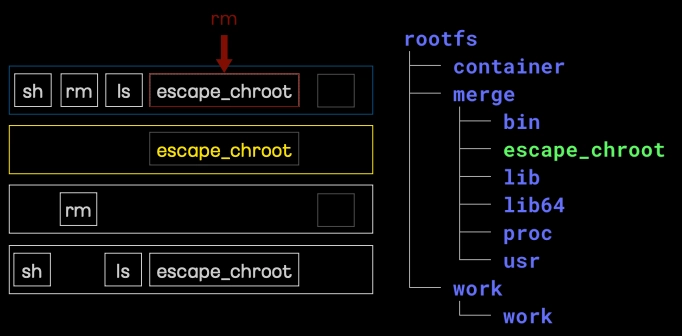

위 그림 처럼 한번 원래 Lowerdir1에 있었던 `myroot` 이미지의 `escape_chroot`를 삭제해보겠습니다.

삭제 전에는 병합 뷰(`rootfs/merge`)를 확인해보면 아래와 같이 `escpae_chroot`가 보이는 걸 확인 할 수 있습니다.

```bash
root@ubuntu1804:/tmp# tree -L 2 rootfs/merge
rootfs/merge
├── bin
│   ├── ls
│   ├── mkdir
│   ├── mount
│   ├── ps
│   ├── rm
│   └── sh
├── escape_chroot
├── lib
│   └── x86_64-linux-gnu
├── lib64
│   └── ld-linux-x86-64.so.2
├── proc
└── usr
    ├── bin
    └── lib

8 directories, 8 files
```

이제 파일을 삭제 후, 파일 시스템 전체를 조회해보겠습니다.

```bash
root@ubuntu1804:/tmp# rm rootfs/merge/escape_chroot
root@ubuntu1804:/tmp# tree -L 2 rootfs
rootfs
├── container
│   └── escape_chroot
├── merge
│   ├── bin
│   ├── lib
│   ├── lib64
│   ├── proc
│   └── usr
└── work
    └── work

9 directories, 1 file
```

삭제 후에 원래 비어있었던 Upperdir인 `container`폴더에 `escape_chroot`가 생겨난 것을 알 수 있습니다. 그리고 병합뷰 (`rootfs/merge`) 하위에 있었던 `escape_chroot`는 삭제된 것을 알 수 있습니다.

이처럼 overlayFS에서는 상위 레이어의 이 마커를 읽고, "아, 이 파일은 아래에 존재하더라도 사용자에게는 보여주지 말아야겠구나" 하고 Merged 뷰에서 지워버립니다.

[^1]: 이미지 출처: [김상영 - 도커 없이 컨테이너 만들기](https://github.com/sam0kim/container-internal)

[^2]: 이미지 출처: [김상영 - 도커 없이 컨테이너 만들기](https://github.com/sam0kim/container-internal)

[^3]: 이미지 출처: [김상영 - 도커 없이 컨테이너 만들기](https://github.com/sam0kim/container-internal)