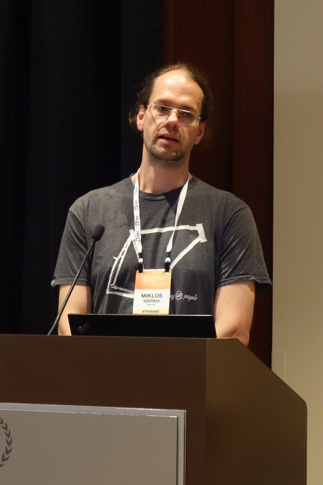
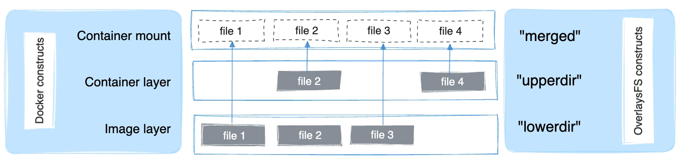

# 3. OverlayFS

## 유니온 파일시스템(UnionFS)의 탄생

오버레이 파일시스템(OverlayFS)이 나오기 전에 유니온 파일시스템(UnionFS)이라는 것이 먼저 세상에 나왔습니다.

유니온 파일시스템의 기본 개념이 처음 세상에 나타난 것은 2000년대 초반이었습니다. 지금은 USB 하나에 수십 GB의 데이터를 마음대로 쓰고 지우며 모든 것을 클라우드에 쉽게 올리는 시대이지만, 당시의 컴퓨팅 환경은 전혀 달랐습니다.

당시 개발자들에게는 파일시스템을 설계함에 있어 **두 가지 커다란 고민거리이자 모순**이 있었습니다.

### 고민 1. 읽기 전용(Read-Only) 매체의 한계
플래시 메모리(인터넷 공유기 등)나 CD-ROM(Live CD 등)처럼 **"쓰기가 불가능한 읽기 전용"** 미디어가 널리 사용되던 시절이었습니다.
설치 없이 CD만 넣고 즉시 부팅해 쓸 수 있는 리눅스(Live CD)를 만들고 싶었지만, 사용자가 설정을 바꾸거나 임시 파일을 생성해야 하는데 CD-ROM은 읽기 전용이라 데이터를 쓸 수가 없었습니다. 램 디스크(RAM Disk)에 전체 OS를 복사해 쓰기에는 당시 RAM 용량(몇십 MB 수준)이 너무 부족했습니다.

### 고민 2. 저장 공간의 비효율과 중복 낭비
동일한 운영체제나 기본 템플릿 환경을 여러 개 만들어 배포해야 할 때가 있습니다. 만약 10개의 가상 환경을 만든다면, 공통된 기본 시스템 디렉터리를 매번 `cp -r`로 통째로 복사해야 했습니다. 이는 디스크 저장 공간을 10배로 낭비하게 만들고 복사하는 데도 엄청난 시간이 걸렸습니다. 공통되는 부분은 하나만 저장해 두고 공유해서 쓸 수 있는 방법이 절실했습니다.

### 해결책: 에레즈 자도크 교수팀의 UnionFS
이 두 가지 문제를 우아하게 해결하기 위해 2003~2004년경 뉴욕 스토니브룩 대학교(Stony Brook University)의 **에레즈 자도크(Erez Zadok) 교수팀**은 가상 파일시스템 템플릿(FiST) 연구를 기반으로 **UnionFS**를 발표하게 됩니다[^1]. 이들이 고안해낸 아이디어는 컴퓨터 공학계의 혁신이었습니다.

**"지우개로 지울 수 없는 원본 문서(Lower) 위에, 투명한 필름(Upper)을 겹쳐놓고 사용자가 필름 위에만 글을 쓰게 하면 어떨까?"**

물리적인 읽기 전용 디렉터리를 전혀 훼손하지 않으면서도, 그 위에 쓰기 전용 가상 레이어를 병합(Unification)하여 마치 하나의 일반 디렉터리처럼 보여주는 **유니온 마운트(Union Mount)** 기술은 이렇게 탄생했습니다.

---

## AUFS의 유행과 커널 진영의 차가운 시선

이후 2000년대 후반에 접어들며 UnionFS의 성능과 버그를 대폭 개선한 **AUFS(Another UnionFS)**가 등장했고, 이는 순식간에 리눅스 배포판의 Live CD 부팅 기술을 독점하는 사실상의 업계 표준이 되었습니다.

하지만 커다란 골칫거리가 하나 남아있었습니다. 바로 **"리눅스 순정 커널(Mainline Kernel)에 정식 채택되지 못했다"**는 점이었습니다. 

리눅스 커널 총괄자 리누스 토발즈와 가상 파일시스템(VFS) 메인테이너들은 AUFS의 코드를 커널 공식 소스에 포함하는 것을 완강히 거부했습니다. 이유는 명확했습니다.

* **코드가 지나치게 복잡하고 스파게티처럼 꼬여 있어 유지보수가 불가능하다.**
* **기존 VFS의 디렉터리 캐싱(dcache)이나 파일 락킹(locking) 규칙을 무리하게 우회하기 때문에, 커널 전체의 안정성을 깨트릴 위험이 크다.**

이 때문에 각 리눅스 배포판 개발자들은 커널 버전을 올릴 때마다 공식 커널 소스에 AUFS 패치를 따로 수동 병합(Out-of-tree merge)해야 하는 혹독한 유지보수 노동을 매번 감당해야만 했습니다.

---

## 구원 투수 등판 - 미클로시 스제레디

{ width="300" style="display: block; margin: 0 auto" }

이 교착 상태를 깨트리기 위해 등장한 인물이 바로 OverlayFS의 창시자인 한 헝가리 출신 개발자, **미클로시 스제레디(Miklós Szeredi)**였습니다. 

그는 커널 메인테이너들의 높은 눈높이를 만족시키기 위해 기존 AUFS의 복잡다단한 부가 기능들을 과감하게 쳐냈습니다. 그리고 리눅스 커널 내부의 정석적인 파일 조작 인터페이스를 완벽히 준수하는 **"극도로 단순하고 안전한" 새로운 오버레이 파일시스템(OverlayFS)**을 설계하여 제안했습니다.

이 정교하면서도 간결한 코드는 수년간의 치열한 커널 메인라인 논쟁을 거쳐, 마침내 까다롭기로 소문난 리누스 토발즈의 마음을 움직였습니다. 2013년 3월 12일, 리누스는 승인의 메시지를 보냅니다.

> "Yes, I think we should just do it. It's in use, it's pretty small, and the other alternatives are worse." [^2]

결국 OverlayFS는 **2014년 리눅스 3.18 커널에 정식 승인되어 병합**되었습니다. 그리고 이 합류는 마침 급성장하기 시작한 **Docker(도커)** 엔진이 가장 완벽하고 가벼운 가상화 파일시스템 레이어 표준을 갖게 만드는 기폭제가 되었습니다.

---

## OverlayFS의 3대 핵심 구성 요소

미클로시 스제레디가 구현한 `OverlayFS` 역시 이 유니온 마운트의 철학을 고스란히 계승했습니다. 디렉터리를 다음과 같이 3가지 역할(실제로는 4가지)로 나누어 정의하여 사용합니다.

[^3]

1. **Lower Directory (아래층 / 읽기 전용)**
	* 지우개로 지울 수 없는 **원본 문서**입니다. 
	* 컨테이너 세계에서는 **도커 베이스 이미지(Ubuntu, Nginx 등)**에 해당합니다. 절대 수정되지 않고 안전하게 보호됩니다.

2. **Upper Directory (위층 / 쓰기 전용)**
	* 원본 위에 올린 **투명 필름**입니다.
	* 컨테이너 세계에서는 **컨테이너 레이어(Container Layer)**에 해당합니다. 사용자가 추가한 파일, 수정사항, 삭제 기록이 오직 이곳에만 기록됩니다.

3. **Merged Directory (결합층 / 통합 뷰)**
	* Lower와 Upper를 겹쳐서 위에서 바라본 **최종 결과물**입니다.
	* 컨테이너 내부의 사용자가 바라보고 실제로 작업하게 되는 디렉터리 경로입니다.

4. **Work Directory (Workdir)**
	* 위 과정에서 파일 이동 및 생성 작업을 안전하게 처리하기 위한 임시 작업 공간입니다.

---

## OverlayFS 3가지 동작 시나리오 (읽기, 쓰기, 삭제)

이 겹쳐진 필름 상태에서 사용자가 파일을 다룰 때, 시스템 내부적으로는 다음과 같이 매우 단순하고 영리하게 작동합니다.

### 1. 파일 읽기 (Read)
* **상황 A**: 사용자가 `fileA`를 읽으려고 합니다. `fileA`가 투명 필름(Upper)에 적혀 있다면, 필름에 적힌 최신 버전을 보여줍니다.
* **상황 B**: 만약 투명 필름에 없다면, 그 아래 비치는 원본 문서(Lower)에서 `fileA`를 찾아 읽어 들입니다.

### 2. 파일 수정 및 쓰기 (Write - Copy-on-Write)
* **상황 A**: 사용자가 아예 새로운 `fileB`를 생성합니다. 원본에는 없으므로 그냥 투명 필름(Upper)에 `fileB`를 작성합니다.
* **상황 B**: 원본(Lower)에 있는 `fileA`를 수정하려고 합니다. 원본은 읽기 전용이라 직접 수정할 수 없으므로, 시스템이 원본 `fileA`를 투명 필름(Upper)으로 **복사(Copy)**해온 뒤, 필름 위에서 수정을 진행합니다. 이를 **Copy-on-Write (COW)**라고 부릅니다.

### 3. 파일 삭제 (Delete - Whiteout)
* **상황**: 원본(Lower)에 있는 `fileA`를 삭제하고 싶습니다. 하지만 원본은 건드릴 수 없습니다.
* **해결책**: 투명 필름(Upper)에 **"이 밑에 있는 `fileA`는 가려서 안 보이게 해라"**라는 특수한 표식(화이트아웃, Whiteout) 스티커를 붙여둡니다. 최종 뷰(Merged)에서 사용자는 `fileA`가 삭제된 것처럼 보이지만, 원본(Lower)의 `fileA`는 여전히 훼손되지 않은 채 그대로 존재합니다.

[^1]: UnionFS (Unification File System)는 2003~2004년경 뉴욕 스토니브룩 대학교의 Erez Zadok 교수팀이 가상 파일시스템 템플릿(FiST) 연구의 일환으로 최초 개발했습니다. [Wikipedia](https://en.wikipedia.org/wiki/UnionFS)

[^2]: 리누스 토발즈의 실제 메일 (2013년 3월 12일): [LKML Archive](https://lkml.indiana.edu/hypermail/linux/kernel/1303.1/02476.html)

[^3]: 그림 출처 [Docker Docs](https://docs.docker.com/engine/storage/drivers/overlayfs-driver/)