# 4. 컨테이너 격리

## 네임스페이스의 탄생

지금까지 컨테이너 파일 시스템에 대해서 알아보았습니다. `pivot_root`를 통해 프로세스를 위한 독립적인 파일 시스템을 만들어주고, 기존의 루트 파일 시스템은 안전하게 분리해내었습니다. 이 과정에서 마운트 네임스페이스 이야기가 나왔습니다. 

프로세스의 루트 탈옥을 방지하기 위해 기존 루트 파일 시스템을 현재 설정한 프로세스의 신규 파일 시스템 하위로 이동시킨 후 마운트 해제해야 했는데, 마운트 네임스페이스 없이 이러한 행위를 하면 호스트의 루트 파일 시스템이 사라지는 치명적인 영향을 주게 됩니다.

그래서 별도의 마운트 네임스페이스를 만들고 그 안에서 파일 시스템을 변경하면 기존의 호스트의 마운트 네임스페이스는 건들이지 않으므로, 호스트 영향 없이 컨테이너 파일 시스템 구성이 가능하게 됩니다.

이처럼 네임스페이스는 호스트에 영향을 주지 않으면서 프로세스를 컨테이너 안으로 격리하는 핵심 요소라고 할 수 있습니다.
네임스페이스에 대한 자세한 설명은 [Namespace](../container primitives/1.Namespace.md) 글을 참고해주세요.

## 네임스페이스의 발전과 도커의 시작

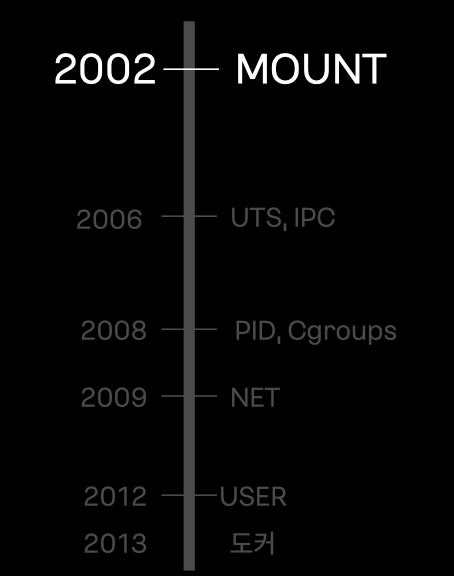

- 2002년 리눅스 커널 2.4.19 버전에 파일 시스템 경로를 격리하는 마운트 네임스페이스가 최초로 추가되었습니다.

- 2012년 마지막 퍼즐이었던 유저 네임스페이스가 완성되었습니다. 이로써 컨테이너 안에서는 루트 권한을 갖더라도, 실제 호스트에는 아무런 영향을 끼칠 수 없는 격리 환경이 완성되었습니다.

- 2013년 리눅스 커널 3.8 버전 부터 이제 컨테이너를 안전하고 완벽하게 구동하는 데 필요한 모든 네임스페이스 기술이 다 갖춰졌고, 도커의 탄생을 통해 컨테이너 기술이 확산됩니다.

## 네임스페이스 특징

모든 프로세스는 각 종류별 네임스페이스를 가지고 있습니다. 이때 자식 프로세스는 부모의 네임스페이스를 상속하게 됩니다.

보통은 각 커널에서 코드에 구성된 시스템콜을 호출해서 네임스페이스를 생성하겠지만, 저희는 실습을 위해 네임스페이스를 생성하는 `unshare` 명령어를 사용해보겠습니다.

```bash
unshare [옵션] [프로그램 [args .. ]]
-m, —mount
-u, —uts
-i, —ipc
-p, —pid
-n, —net
-U, —user
```

네임스페이스를 생성하기 전에 `lsns` 명령어를 통해 현재 호스트에는 어떤 네임스페이스들이 존재하는 지 확인해봅시다.

```bash
lsns, list namespace
-t: 네임스페이스 타입 예)pid, mnt, uts, ..
-p: 조회할 process id
```

```bash
# namespace 확인하기 1

root@ubuntu1804:/tmp# lsns -p 1
        NS TYPE   NPROCS PID USER COMMAND
4026531835 cgroup     96   1 root /sbin/init
4026531836 pid        96   1 root /sbin/init
4026531837 user       96   1 root /sbin/init
4026531838 uts        96   1 root /sbin/init
4026531839 ipc        96   1 root /sbin/init
4026531840 mnt        90   1 root /sbin/init
4026531993 net        95   1 root /sbin/init
root@ubuntu1804:/tmp# lsns -t mnt -p 1
        NS TYPE NPROCS PID USER COMMAND
4026531840 mnt      90   1 root /sbin/init
```

### 마운트 네임스페이스

이제 한번 실제로 프로세스의 네임스페이스를 확인해보겠습니다.

```bash
# namespace 확인하기 2

root@ubuntu1804:/tmp# ls -al /proc/$$/ns
total 0
dr-x--x--x 2 root root 0 Jun 15 12:04 .
dr-xr-xr-x 9 root root 0 Jun 15 11:58 ..
lrwxrwxrwx 1 root root 0 Jun 15 12:04 cgroup -> 'cgroup:[4026531835]'
lrwxrwxrwx 1 root root 0 Jun 15 12:04 ipc -> 'ipc:[4026531839]'
lrwxrwxrwx 1 root root 0 Jun 15 12:04 mnt -> 'mnt:[4026531840]'
lrwxrwxrwx 1 root root 0 Jun 15 12:04 net -> 'net:[4026531993]'
lrwxrwxrwx 1 root root 0 Jun 15 12:04 pid -> 'pid:[4026531836]'
lrwxrwxrwx 1 root root 0 Jun 15 12:04 pid_for_children -> 'pid:[4026531836]'
lrwxrwxrwx 1 root root 0 Jun 15 12:04 user -> 'user:[4026531837]'
lrwxrwxrwx 1 root root 0 Jun 15 12:04 uts -> 'uts:[4026531838]'
root@ubuntu1804:/tmp# readlink /proc/$$/ns/mnt
mnt:[4026531840]
```

이제 한번 `unshare` 명령어를 통해 현재 `bash`프로세스의 마운트 네임스페이스만 격리해보겠습니다.

```bash
root@ubuntu1804:/tmp# unshare -m
root@ubuntu1804:/tmp# lsns -p $$
        NS TYPE   NPROCS   PID USER COMMAND
4026531835 cgroup     98     1 root /sbin/init
4026531836 pid        98     1 root /sbin/init
4026531837 user       98     1 root /sbin/init
4026531838 uts        98     1 root /sbin/init
4026531839 ipc        98     1 root /sbin/init
4026531993 net        97     1 root /sbin/init
4026532296 mnt         2 12725 root -bash
```

다른 네임스페이스는 별도로 격리해주지 않았으므로 위에서 확인한 호스트의 네임스페이스와 동일한 것을 확인할 수 있습니다. 특히 마운트 네임스페이스는 위에서 확인한 `mnt:[4026531840]`과 달리 새로운 마운트 네임스페이스 `mnt:[4026532296]`가 생성된 것을 볼 수 있습니다. 

```bash
root@ubuntu1804:/tmp# exit
logout
root@ubuntu1804:/tmp# lsns -p $$
        NS TYPE   NPROCS PID USER COMMAND
4026531835 cgroup     96   1 root /sbin/init
4026531836 pid        96   1 root /sbin/init
4026531837 user       96   1 root /sbin/init
4026531838 uts        96   1 root /sbin/init
4026531839 ipc        96   1 root /sbin/init
4026531840 mnt        90   1 root /sbin/init
4026531993 net        95   1 root /sbin/init
```

`exit`을 통해 격리된 네임스페이스를 나가면 기존에 호스트 네임스페이스로 돌아온 것을 확인할 수 있습니다.

### UTS 네임스페이스

UTS(Unix Time Sharing) 네임스페이스는 호스트명을 격리하는 네임스페이스입니다.

호스트의 이름이 `ubuntu1804`인 서버를 `Sam`으로 변경해보겠습니다.

```bash
root@ubuntu1804:/tmp# unshare -u
root@ubuntu1804:/tmp# lsns -p $$
        NS TYPE   NPROCS   PID USER COMMAND
4026531835 cgroup     97     1 root /sbin/init
4026531836 pid        97     1 root /sbin/init
4026531837 user       97     1 root /sbin/init
4026531839 ipc        97     1 root /sbin/init
4026531840 mnt        91     1 root /sbin/init
4026531993 net        96     1 root /sbin/init
4026532296 uts         2 12741 root -bash
root@ubuntu1804:/tmp# hostname
ubuntu1804
root@ubuntu1804:/tmp# hostname Sam
root@ubuntu1804:/tmp# hostname
Sam
```

호스트 명이 제대로 변경되었으며 새로 생성된 UTS 네임스페이스를 나가면 기존 호스트 UTS 네임스페이스는 영향받지 않아 hostname이 그대로 `ubuntu1804`인 것을 확인할 수 있습니다.

```bash
root@ubuntu1804:/tmp# exit
logout
root@ubuntu1804:/tmp# lsns -p $$
        NS TYPE   NPROCS PID USER COMMAND
4026531835 cgroup     96   1 root /sbin/init
4026531836 pid        96   1 root /sbin/init
4026531837 user       96   1 root /sbin/init
4026531838 uts        96   1 root /sbin/init
4026531839 ipc        96   1 root /sbin/init
4026531840 mnt        90   1 root /sbin/init
4026531993 net        95   1 root /sbin/init
root@ubuntu1804:/tmp# hostname
ubuntu1804
```

### IPC 네임스페이스

IPC(Inter-Process Communication) 네임스페이스는 프로세스 간 통신을 위한 Shared Memory, Pipe, Message Queue 등을 격리합니다.

```bash
root@ubuntu1804:/tmp# unshare -i
root@ubuntu1804:/tmp# lsns -p $$
        NS TYPE   NPROCS   PID USER COMMAND
4026531835 cgroup     98     1 root /sbin/init
4026531836 pid        98     1 root /sbin/init
4026531837 user       98     1 root /sbin/init
4026531838 uts        98     1 root /sbin/init
4026531840 mnt        92     1 root /sbin/init
4026531993 net        97     1 root /sbin/init
4026532296 ipc         2 12764 root -bash
```

### PID 네임스페이스

PID 네임스페이스는 프로세스들이 가지는 고유 번호 PID(Process ID)를 격리합니다.

원래 리눅스 시스템에서 PID 1번은 컴퓨터가 켜질 때 가장 먼저 실행되는 운영체제의 핵심 프로세스(`init` 또는 `systemd`)만 가질 수 있습니다. 하지만 PID 네임스페이스를 격리하면, 컨테이너 안에서 실행된 첫 번째 프로세스에게도 PID 1번이라는 특권을 줄 수 있습니다.

#### 호스트의 PID 1

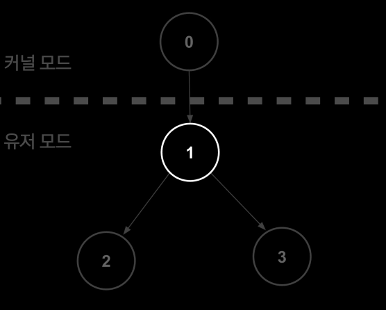

리눅스 커널(PID 0)이 부팅을 완료하면서 유저 모드로 전환될 때 가장 처음으로 만드는 프로세스가 바로 PID 1번(`init` 또는 `systemd`)입니다. 이 프로세스는 운영체제 모든 프로세스의 "최상위 부모"이며 다음과 같은 막중한 책임을 집니다.

- 시그널 처리: 시스템이 정상적으로 종료되거나 프로세스끼리 통신할 때 보는 신호를 총괄 관리합니다.

- 좀비, 고아 프로세스 처리: 부모 프로세스가 먼저 죽어버린 고아 프로세스가 생기면, PID 1번이 이들을 자신의 자식으로 입양합니다. 그리고 그 자식들이 종료될 때 메모리에서 깔끔하게 정리하여 좀비 프로세스가 되는 것을 막아줍니다.

- 죽으면 시스템 패닉: 호스트의 PID1번이 죽으면 리눅스 커널은 더 이상 운영체제를 유지할 수 없다고 판단하고 시스템 패닉(커널 패닉)을 일으키며 컴퓨터를 강제로 재부팅합니다.

#### 컨테이너에서의 PID 1

- `unshare`할 때 `fork`하여 자식 PID 네임스페이스의 PID1로 실행
: 현재 실행 중인 쉘에서 unhare -p(PID)격리를 호출하면 새 네임스페이스 공간을 만들고, 현재 프로세스를 `fork`하여 새로 태어난 자식 프로세스를 그 공간의 대장 (PID 1)으로 임명합니다.

- 시그널 처리 / 좀비, 고아 프로세스 처리: 호스트의 `init` 프로세스와 똑같은 의무를 수행합니다.

- 죽으면 컨테이너 종료: 컨테이너의 PID 1번이 죽는다면 해당 컨테이너(네임스페이스 전체)가 즉시 종료 됩니다.

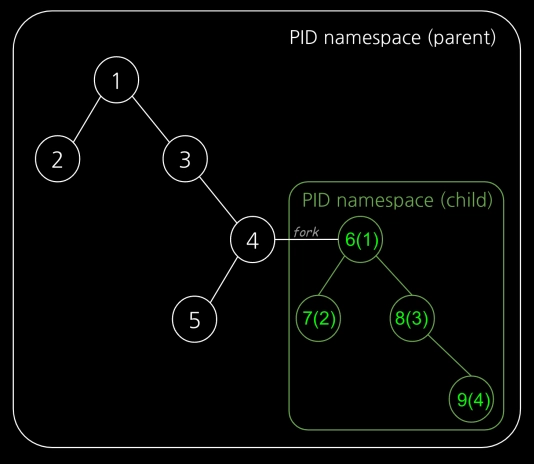

PID 네임스페이스의 가장 큰 특징은 부모-자식 네임스페이스가 중첩된 구조라는 것입니다.
마치 트리 형태처럼 호스트가 가지는 가장 뿌리가 되는 네임스페이스가 '부모'가 되고, 그 안에서 생성된 프로세스의 네임스페이스가 '자식'이 됩니다.

부모 환경에서는 자식의 모든 것을 볼 수 있지만, 반대로 자식 환경에서는 부모를 절대 볼 수 없는 단방향 시야 구조를 가지고 있습니다.

예를 들어 호스트에서 도커 컨테이너 하나를 띄우고, 그 안에서 웹 서버(Nginx)를 실행했다고 가정해 봅시다.

컨테이너(자식)에서 보면 이 웹서버는 PID 1로 보입니다 또한 호스트에서 동작중인 프로세스를 볼 수 없습니다. 하지만 호스트(부모)에서는 해당 프로세스는 PID 4523으로 보이고, 컨테이너 안에서 돌아가는 모든 프로세스가 다 보입니다. 만약 호스트에서 kill 4523을 치면 컨테이너 안의 웹 서버가 강제 종료됩니다.

이 구조 덕분에 컨테이너는 완벽한 독립감을 느끼며 안전하게 실행되고, 호스트 컴퓨터는 모든 컨테이너를 완벽하게 통제하고 관리할 수 있게 됩니다.

#### PID 네임스페이스 만들기

```bash
root@ubuntu1804:/tmp# unshare -fp --mount-proc /bin/sh

- unshare: 부모 프로세스와 네임스페이스(Namespace)를 공유하지 않고 분리하겠다는 명령어입니다.
- -f (--fork): 네임스페이스를 생성한 후, 지정한 명령어(/bin/sh)를 실행하기 전에 프로세스를 포크(fork)하여 새로운 자식 프로세스로 실행합니다. PID 네임스페이스를 분리할 때 반드시 필요합니다.
- -p (--pid): 독립된 PID(프로세스 ID) 네임스페이스를 생성합니다. 이 안에서 실행되는 첫 번째 프로세스는 PID 1번(컨테이너의 init 프로세스 같은 역할)을 가지게 되며, 바깥 호스트의 프로세스들을 볼 수 없게 됩니다.
- --mount-proc: 새로운 PID 네임스페이스에 맞춰 /proc 파일 시스템을 자동으로 다시 마운트해 줍니다. 리눅스에서 ps 명령어 등은 /proc을 읽어서 프로세스를 보여주는데, 이 옵션 덕분에 새 네임스페이스 안에서 ps를 치면 호스트 프로세스는 안 보이고 격리된 프로세스만 보이게 됩니다.
- /bin/sh: 격리된 환경 내에서 실행할 대상 프로그램(셸)입니다.


# ps -ef
UID        PID  PPID  C STIME TTY          TIME CMD
root         1     0  0 12:20 pts/0    00:00:00 /bin/sh
root         2     1  0 12:21 pts/0    00:00:00 ps -ef
#
```

위 과정을 통해 프로세스가 새로운 PID 네임스페이스에 자식 프로세스를 만들었고, 이 프로세스가 PID1로 생성된 것을 확인할 수 있습니다.

```bash
root@ubuntu1804:/tmp# ps -ef | grep "/bin/sh"
root     12783 12696  0 12:20 pts/0    00:00:00 unshare -fp --mount-proc /bin/sh
root     12784 12783  0 12:20 pts/0    00:00:00 /bin/sh
root     12884 12864  0 12:23 pts/1    00:00:00 grep --color=auto /bin/sh

root@ubuntu1804:/tmp# lsns -t pid -p 12784
        NS TYPE NPROCS   PID USER COMMAND
4026532297 pid       1 12784 root /bin/sh
```

```bash
# lsns -t pid -p 1
        NS TYPE NPROCS PID USER COMMAND
4026532297 pid       2   1 root /bin/sh
```

호스트 네임스페이스에서 프로세스를 확인해보면 처음에 수행한 프로세스가 `12783` PID로 보이고 이를 부모로 하는 자식 프로세스 `12784`가 확인됨을 알 수 있습니다.


```bash
root@ubuntu1804:/tmp# kill -SIGKILL 12784
```

컨테이너 안에서 PID가 1이었던 프로세스를 호스트에서 kill 하게 되면 컨테이너 환경이 종료되는 것을 확인할 수 있습니다.

### 네트워크 네임스페이스

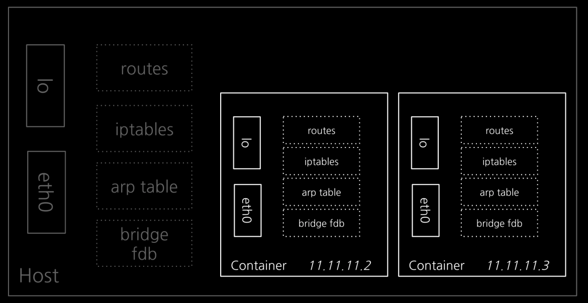

네트워크 네임스페이스에는 별도의 IP 주소, 라우팅 테이블, 소켓, 방화벽 등 모든게 구성됩니다.

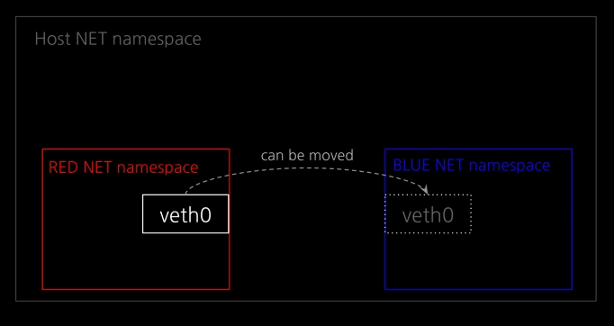

네트워크 네임스페이스 안에 존재하는 요소들은 여러 네트워크 네임스페이스에 걸쳐 있을 수는 없지만, 하나의 네트워크 네임스페이스에서 다른 네트워크 네임스페이스로 이동할 수 있습니다.

네트워크 네임스페이스를 삭제하면, 생성되었던 가상 인터페이스도 같이 삭제되며 연결되어 있던 물리 인터페이스는 기존 네임스페이스로 복원됩니다.

#### 1:1 통신 실습

네트워크 네임스페이스를 격리하여 RED/BLUE 통신 실습을 진행하겠습니다.

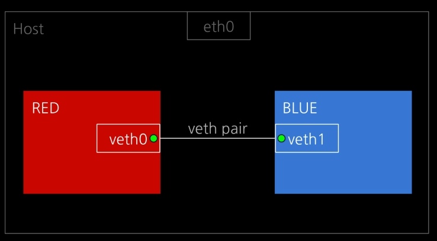

먼저 veth pair를 설정해주겠습니다. 여기서 veth pair란 가상 인터페이스 veth를 연결해주는 가상 랜선이라고 할 수 있습니다.

```bash
ip link add veth0 type veth peer name veth1

root@ubuntu1804:/tmp# ip a
...
5: veth1@veth0: <BROADCAST,MULTICAST,M-DOWN> mtu 1500 qdisc noop state DOWN group default qlen 1000
    link/ether ca:38:be:41:a9:56 brd ff:ff:ff:ff:ff:ff
6: veth0@veth1: <BROADCAST,MULTICAST,M-DOWN> mtu 1500 qdisc noop state DOWN group default qlen 1000
    link/ether 36:54:66:63:d1:38 brd ff:ff:ff:ff:ff:ff
```

이제 RED, BLUE 네트워크 네임스페이스를 생성하고 각 가상 인터페이스 veth0, veth1를 해당 네임스페이스에 넣어주겠습니다.

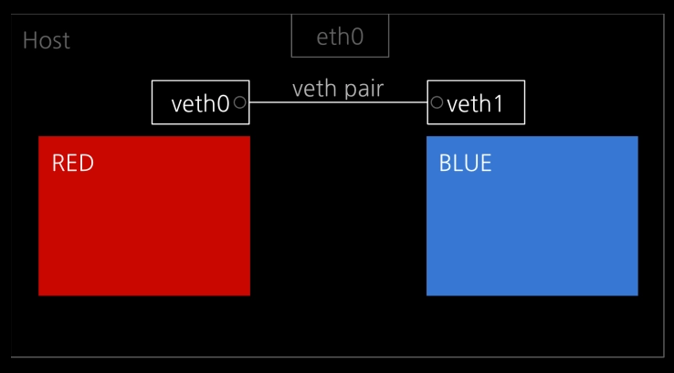

```bash
ip netns add RED
ip netns add BLUE
```

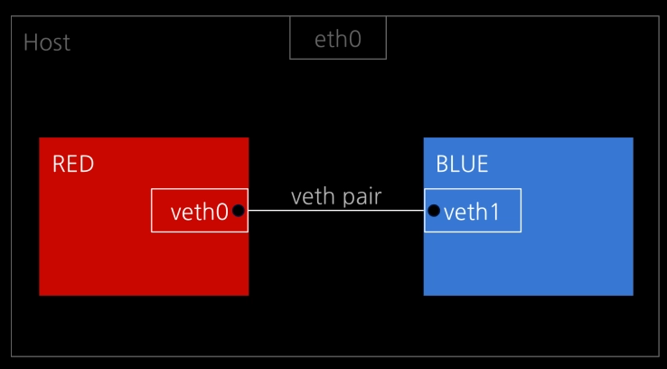

```bash
# veth0 → RED
ip link set veth0 netns RED
# veth1 → BLUE
ip link set veth1 netns BLUE
```

이제 준비가 되었으니, 가상 인터페이스 veth0와 veth1를 활성화해준 뒤 IP를 할당해주겠습니다.

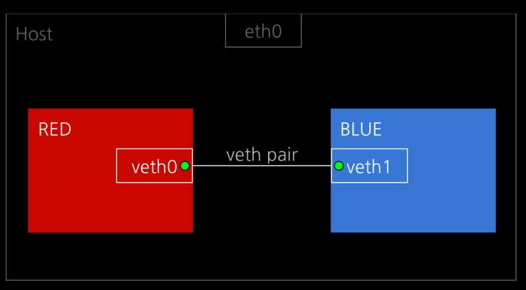
```bash
# veth0 UP
ip netns exec RED ip link set veth0 up
# veth1 UP
ip netns exec BLUE ip link set veth1 up
```


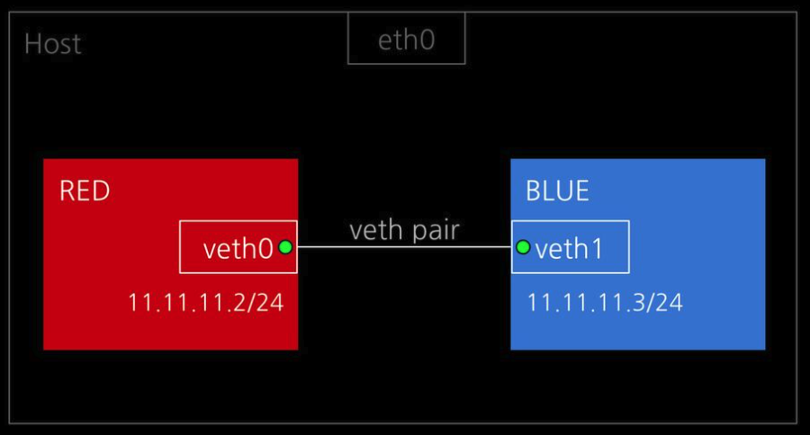

```bash
# veth0 IP 설정
ip netns exec RED ip addr add 11.11.11.2/24 dev veth0
# veth1 IP 설정
ip netns exec BLUE ip addr add 11.11.11.3/24 dev veth1
```

이제 모든 준비가 되었으니 각 네트워크 네임스페이스에 들어가서 설정을 확인해보겠습니다.

```bash
root@ubuntu1804:/tmp# nsenter --net=/var/run/netns/RED
root@ubuntu1804:/tmp# ip a
1: lo: <LOOPBACK> mtu 65536 qdisc noop state DOWN group default qlen 1000
    link/loopback 00:00:00:00:00:00 brd 00:00:00:00:00:00
6: veth0@if5: <BROADCAST,MULTICAST,UP,LOWER_UP> mtu 1500 qdisc noqueue state UP group default qlen 1000
    link/ether 36:54:66:63:d1:38 brd ff:ff:ff:ff:ff:ff link-netnsid 1
    inet 11.11.11.2/24 scope global veth0
       valid_lft forever preferred_lft forever
    inet6 fe80::3454:66ff:fe63:d138/64 scope link
       valid_lft forever preferred_lft forever
root@ubuntu1804:/tmp# ip route
11.11.11.0/24 dev veth0 proto kernel scope link src 11.11.11.2
```

```bash
root@ubuntu1804:/tmp# nsenter --net=/var/run/netns/BLUE
root@ubuntu1804:/tmp# ip a
1: lo: <LOOPBACK> mtu 65536 qdisc noop state DOWN group default qlen 1000
    link/loopback 00:00:00:00:00:00 brd 00:00:00:00:00:00
5: veth1@if6: <BROADCAST,MULTICAST,UP,LOWER_UP> mtu 1500 qdisc noqueue state UP group default qlen 1000
    link/ether ca:38:be:41:a9:56 brd ff:ff:ff:ff:ff:ff link-netnsid 0
    inet 11.11.11.3/24 scope global veth1
       valid_lft forever preferred_lft forever
    inet6 fe80::c838:beff:fe41:a956/64 scope link
       valid_lft forever preferred_lft forever
root@ubuntu1804:/tmp# ip route
11.11.11.0/24 dev veth1 proto kernel scope link src 11.11.11.3
```

모든 설정이 제대로 되어있음을 확인했습니다. 이제 `ping`을 통해 RED쪽 veth0에서 BLUE 쪽 veth1로 ICMP 통신을 해보겠습니다.

```bash
# RED
root@ubuntu1804:/tmp# ping 11.11.11.3
PING 11.11.11.3 (11.11.11.3) 56(84) bytes of data.
64 bytes from 11.11.11.3: icmp_seq=1 ttl=64 time=0.260 ms
64 bytes from 11.11.11.3: icmp_seq=2 ttl=64 time=0.044 ms
64 bytes from 11.11.11.3: icmp_seq=3 ttl=64 time=0.044 ms
64 bytes from 11.11.11.3: icmp_seq=4 ttl=64 time=0.043 ms
64 bytes from 11.11.11.3: icmp_seq=5 ttl=64 time=0.043 ms
64 bytes from 11.11.11.3: icmp_seq=6 ttl=64 time=0.033 ms
64 bytes from 11.11.11.3: icmp_seq=7 ttl=64 time=0.043 ms
64 bytes from 11.11.11.3: icmp_seq=8 ttl=64 time=0.043 ms
```

```bash
# BLUE
root@ubuntu1804:/tmp# tcpdump -li veth1
tcpdump: verbose output suppressed, use -v or -vv for full protocol decode
listening on veth1, link-type EN10MB (Ethernet), capture size 262144 bytes
12:49:45.260760 IP 11.11.11.2 > 11.11.11.3: ICMP echo request, id 12995, seq 9, length 64
12:49:45.260770 IP 11.11.11.3 > 11.11.11.2: ICMP echo reply, id 12995, seq 9, length 64
12:49:46.284846 IP 11.11.11.2 > 11.11.11.3: ICMP echo request, id 12995, seq 10, length 64
12:49:46.284873 IP 11.11.11.3 > 11.11.11.2: ICMP echo reply, id 12995, seq 10, length 64
12:49:47.309077 IP 11.11.11.2 > 11.11.11.3: ICMP echo request, id 12995, seq 11, length 64
12:49:47.309106 IP 11.11.11.3 > 11.11.11.2: ICMP echo reply, id 12995, seq 11, length 64
12:49:48.332824 IP 11.11.11.2 > 11.11.11.3: ICMP echo request, id 12995, seq 12, length 64
12:49:48.332860 IP 11.11.11.3 > 11.11.11.2: ICMP echo reply, id 12995, seq 12, length 64
^C
8 packets captured
8 packets received by filter
0 packets dropped by kernel
```

위 결과를 통해 네트워크 네임스페이스에 가상 인터페이스를 구성하고, 가상 랜선으로 연결하여 네임스페이스 간 통신을 확인해볼 수 있었습니다.

### 유저 네임스페이스

유저 네임스페이스는 프로세스의 사용자 ID(UID)와 그룹 ID(GID) 공간을 격리하는 기술입니다. 이러한 기능을 통해 호스트 시스템의 일반 사용자가 특정 네임스페이스 안에서는 `root` 권한을 가질 수 있게 됩니다.

컨테이너로 환경을 격리해서 프로세스를 동작시켜보니 하나의 문제가 있었던 것입니다. 바로 프로세스가 `root` 권한이 필요했을 때 였습니다. 모든 컨테이너에 호스트의 `root` 권한을 주자니 보안적으로 너무 위험하고, 그렇다고 일반 사용자 권한으로 프로세스를 돌리자니 부족했던 것입니다.

그래서 이 문제를 해결하기 위해 네임스페이스 안에서는 별도의 권한 체계를 갖도록 유저 네임스페이스라는 것을 만들었습니다.

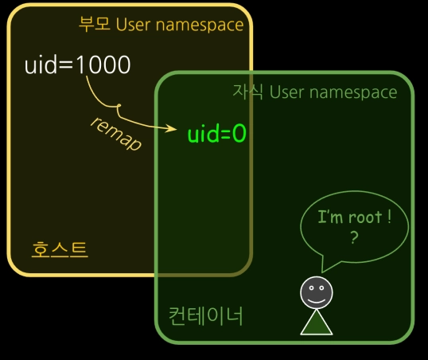

구체적으로는 프로세스의 사용자 ID(UID)와 그룹 ID(GID) 공간을 격리하여 호스트와 컨테이너가 각각 독립 UID, GID를 가질 수 있게 했습니다. 별도의 체계를 가지고 있기 때문에 서로 번호가 충돌하지 않습니다.

PID 네임스페이스와 동일하게 부모-자식 네임스페이스의 중첩 구조를 가지고 있습니다.

호스트(부모)라는 큰 틀 체계 아래에 컨테이너(자식)라는 독립된 하위 체계가 겹쳐져서(중첩되어) 동작하는 방식입니다.

#### 도커의 호스트 유저 네임스페이스 공유

```bash
# 일반 계정에서 도커 사용하기
chjung99@main-host:~$ docker run -it ubuntu /bin/sh
Unable to find image 'ubuntu:latest' locally
latest: Pulling from library/ubuntu
1c24335ddd46: Pull complete
6f5c5aa4e145: Pull complete
9bcf140d7f0f: Download complete
Digest: sha256:f3d28607ddd78734bb7f71f117f3c6706c666b8b76cbff7c9ff6e5718d46ff64
Status: Downloaded newer image for ubuntu:latest
# 
# id
uid=0(root) gid=0(root) groups=0(root)
```

```bash
chjung99@main-host:~$ id
uid=1000(chjung99) gid=1000(chjung99) groups=1000(chjung99),4(adm),24(cdrom),27(sudo),30(dip),46(plugdev),108(kvm),110(lxd),122(libvirt),999(docker)

chjung99@main-host:~$ ps -ef | grep "/bin/sh"
chjung99   81038   80981  0 12:55 pts/3    00:00:00 docker run -it ubuntu /bin/sh
root       81102   81079  0 12:55 pts/0    00:00:00 /bin/sh
...
```

```bash
# readlink /proc/$$/ns/user
user:[4026531837]
```

```bash
chjung99@main-host:~$ readlink /proc/$$/ns/user
user:[4026531837]
```

위 내용을 통해 도커에서 기본적으로 프로세스를 실행하면 호스트와 동일한 유저 네임스페이스를 공유해서, 진짜 호스트의 `root`로 실행됨을 확인할 수 있습니다.

이러한 도커의 `root`권한 사용은 패키지 설치이 쉽고, 시스템 리소스 이용에 제약이 없어지는 등 편의성은 올라가지만, 보안에 취약하다는 큰 단점이 있습니다.

#### 유저 네임스페이스 격리하기

이제 유저 네임스페이스를 한번 격리해보겠습니다.

```bash
chjung99@main-host:~$ unshare -U --map-root-user /bin/sh
```
- unshare -U: 현재 프로세스(부모)와 공유하던 유저 네임스페이스를 끊고, 새로운 자식 유저 네임스페이스를 생성하라는 명령어입니다.

- --map-root-user: 이게 핵심입니다. 현재 로그인한 일반 사용자(chjung99, UID 1000)를 새로 만든 격리 공간 안에서는 **root(UID 0)로 매핑(변환)**하라는 의미입니다.

```bash
# id
uid=0(root) gid=0(root) groups=0(root),65534(nogroup)

# readlink /proc/$$/ns/user
user:[4026532735]
```

격리 공간 안에서 권한을 확인해보면 `root` 권한이 부여된 것을 확인할 수 있습니다.
그리고 유저 네임스페이스의 번호가 호스트 네임스페이스와 다른 `user:[4026532735]`임을 알 수 있습니다.

호스트에서 다시 한번 확인해보면

```bash
chjung99@main-host:~$ id
uid=1000(chjung99) gid=1000(chjung99) groups=1000(chjung99),4(adm),24(cdrom),27(sudo),30(dip),46(plugdev),108(kvm),110(lxd),122(libvirt),999(docker)

chjung99@main-host:~$ ps -ef | grep "/bin/sh"
chjung99   81237   80981  0 12:58 pts/3    00:00:00 /bin/sh
...

chjung99@main-host:~$ readlink /proc/$$/ns/user
user:[4026531837]
```

`/bin/sh` 프로세스가 `root`가 아닌 일반 사용자로 실행되고 있음을 확인할 수 있습니다.

이렇듯 유저 네임스페이스를 통해 컨테이너 안에서 `root` 권한을 갖고, 밖에서는 안전하게 일반 사용자 권한을 가질 수 있게 설정할 수 있습니다.

도커 버전 1.10 이후부터는 이러한 유저 네임스페이스 설정을 지원하고 있는데, 기본 설정은 유저 네임스페이스를 사용하지 않는 것으로 되어 있습니다.

## 정리

| 네임스페이스 구분 | 설명 |
| :--- | :--- |
| **마운트 네임스페이스** | 마운트 포인트 격리 (2002) |
| **UTS 네임스페이스** | hostname, domain name 격리 (2006) |
| **IPC 네임스페이스** | IPC 격리 (2006) |
| **PID 네임스페이스** | pid 넘버스페이스 격리 (2008) |
| **네트워크 네임스페이스** | 네트워크 스택 가상화 및 격리 (2009) |
| **USER 네임스페이스** | UID/GID 넘버스페이스 격리 (2012) |