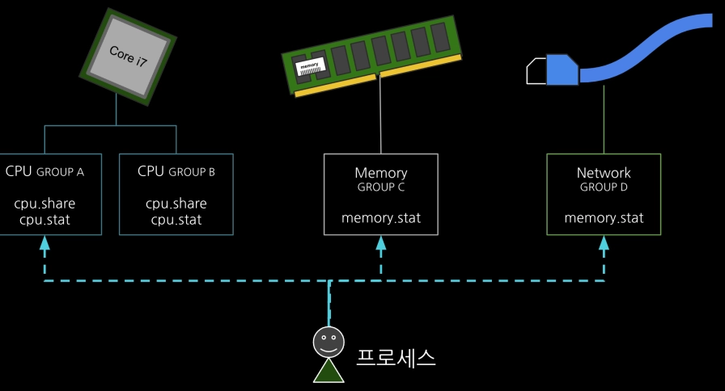
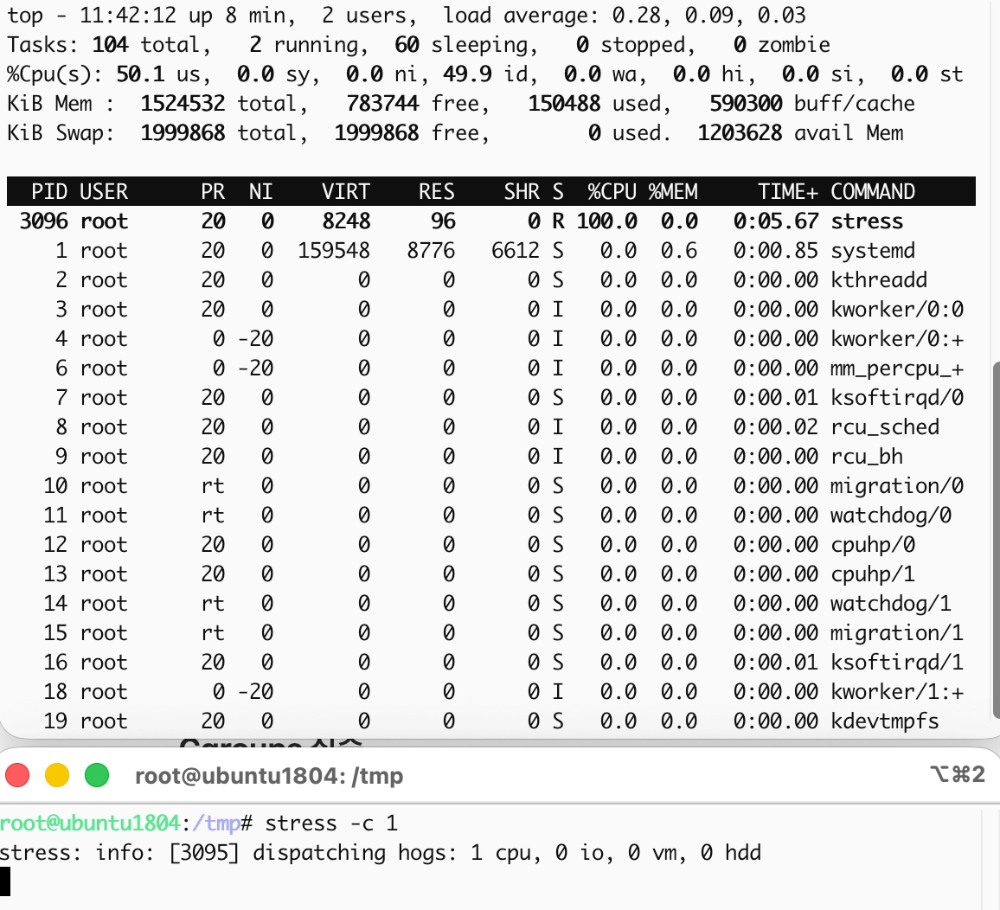
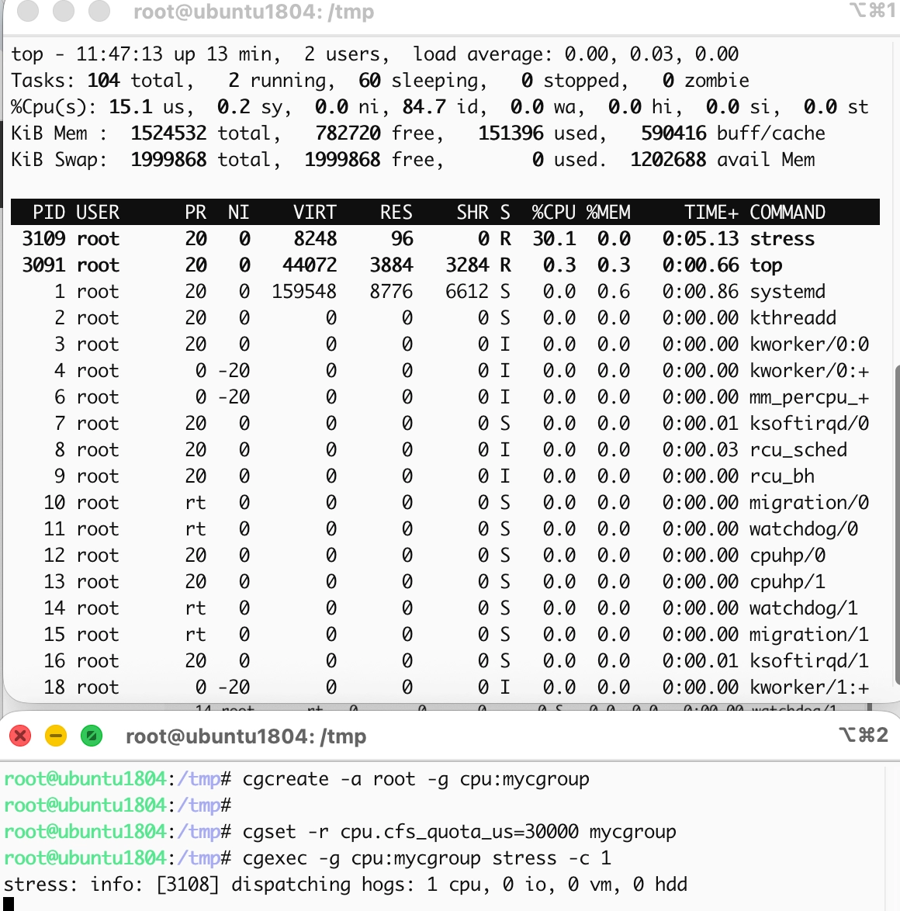

# 5. 컨테이너 자원

## Cgroup의 탄생 - process containers

2006년 구글의 엔지니어 Paul Menage와 Rohit Seth는 그들이 직면한 문제를 해결하기 위해 "process containers"[^1]라는 프로젝트를 시작합니다.

당시 구글은 거대한 데이터 센터를 효율적으로 운영하기 위해, 하나의 대형 서버 안에서 검색 엔진, 광고 시스템, 내부 분석 툴 등 수많은 프로세스를 동시에 돌려야 했습니다.

당시엔 프로세스 간 자원을 구별없이 공유하고 있었기 때문에, 실시간 검색과 같은 중요한 서비스가 배치 분석 작업과 같이 덜 중요한 서비스 때문에 느려지고 있었습니다.

따라서 이들은 프로세스 별로 자원을 사용할 수 있는 "Limit"을 제어할 수 있는 장치를 만들기로 했습니다. 이를 통해 서비스의 중요도에 따라 프로세스 그룹을 만들고 그룹 단위로 사용량을 묶어서 제한하고 감시하고자 했습니다.

바로 이 "process containers"란 프로젝트가 2007년 "cgroup(Control Groups)"[^2]라는 이름으로 변경되었고 2008년 리눅스 커널에 공식적으로 포함되었습니다.

정리하면 cgroup은 하나의 리눅스 시스템 안에서 특정 프로세스 무리가 전체 시스템을 마비시키지 못하도록 자원의 벽을 치고 관리하자는 목표 하에 탄생한 것입니다.

## Cgroup이 자원을 제어하는 방법



cgroup은 시스템의 자원(CPU, 메모리 등)을 독립된 울타리로 나누어 관리합니다. 특히 이러한 관리는 리눅스 파일 시스템(`/sys/fs/cgroup`)을 통해 이루어집니다. 개발자가 복잡한 시스템 콜 코딩을 하지 않아도, 시스템 관리자가 터미널에서 폴더를 만들고(`mkdir`), 파일에 글을 쓰는(`echo`)것만으로도 자원이 제어됩니다.

cgroup을 통해 자원이 제어하는 핵심은 바로 커널 호출 흐름에 심어놓은 검문소(Hook)입니다.

위에서 말한대로 `/sys/fs/cgroup`에 프로세스 자원 제한을 설정해두면, 커널은 프로세스가 자원을 요청할 때마다 잠시 멈춰 세우고 "너 어느 그룹 소속이야? 그 그룹 지금 한도 남았어?"라고 확인하는 과정을 매번 수행하는 것입니다. 이를 크게 "관찰"과 "제어"라는 두 가지 메커니즘으로 나누어 설명할 수 있습니다.

### 관찰: 프로세스에 꼬리표 달기

커널은 프로세스를 관리할 때 `task_struct`라는 구조체를 사용합니다. cgroup은 이 `task_struct`에 "나는 이 그룹 소속이야"라는 포인터(꼬리표)를 하나 박아두는 것에서 시작합니다.

- 커널 내부에는 css_set(Cgroup Subsystem Set)이라는 구조체가 있습니다. 모든 프로세스는 실행되는 동안 자신의 `task_struct`안에 `css_set`을 가리키는 포인터를 가집니다.

- 프로세스가 메모리를 새로 하당 요청하거나, CPU를 쓰려고 스케줄러에 들어올 때, 커널은 이 포인터를 조회합니다. 이를 통해 어떤 그룹에 속한 프로세스인지 커널이 확인할 수 있습니다.

### 제어: 커널의 검문소(Hook)

자원을 제어한다는 것은 결국 자원 요청을 "거절"하거나, 속도를 "늦추거나", "뺐는" 행위입니다. 커널은 코드 곳곳에 이 로직을 심어두었습니다.

#### CPU 제어: 스케줄러의 타임 슬라이스 가로채기

CPU 제어는 CFS(Completely Fair Scheduler)라는 커널 스케줄러와 연동됩니다.

- 커널은 각 그룹마다 quota라는 예산을 줍니다.

- 프로세스가 CPU를 쓰려고 할 때, 스케줄러는 "이 프로세스 그룹의 잔여 예산이 있는가?"를 먼저 확인합니다.

- 만약 예산이 0이라면, 스케줄러는 그 프로세스를 실행 대기열에서 강제로 제외하고, 예산이 다시 충전된느 주기까지 잠재워 버립니다.

#### 메모리 제어: Page Fault의 검문

메모리 제어는 훨씬 빡빡합니다. 메모리는 CPU처럼 '잠시 대기'로 해결되지 않기 때문입니다.

- 일반적으로 프로세스가 메모리를 더 요청하면, 커널은 물리 메모리 페이지를 할당하는 `alloc_pages` 함수를 호출합니다.

- cgroup이 활성화되어 있다면, 이 함수가 실행되기 직전에 "이 그룹의 현재 메모리 사용량이 한도를 넘었는가?"를 확인하는 로직이 들어 있습니다.

- 한도를 넘었다면, 커널은 일단 1차로 그 프로세스가 사용 중인 불필요한 페이지 캐시를 강제로 뺏어옵니다. 그래도 안되면 2차로 해당 그룹의 프로세스 중 하나를 골라 강제 종료(OOM Kill)시킵니다.

## Cgroup v1에서 v2까지

## Cgroup 실습

```bash
apt install -y cgroup-tools
apt install -y stress

stress -c 1
```

어떤 제한도 없이 호스트에서 `stress` 명령어로 CPU를 사용하면 전체 호스트의 100%까지 점유하는 것을 확인할 수 있습니다.



`cgcreate`, `cgset` 명령어를 통해 `/sys/fs/cgroup` 위치에 cgroup 설정을 아래와 같이 진행해줍니다. 기본적으로 리눅스 CPU 스케줄러는 cpu.cfs_period_us(기본값 100,000 마이크로초)라는 주기 동안 프로세스가 얼마나 CPU를 쓸지 결정합니다.

`cpu.cfs_quota_us=30000`으로 설정해주면 CPU 사용이 30%로 제한됩니다.

```bash
cgcreate -a root -g cpu:mycgroup
cgset -r cpu.cfs_quota_us=30000 mycgroup
cgexec -g cpu:mycgroup stress -c 1
```




[^1]: https://lwn.net/Articles/199643/
[^2]: https://lwn.net/Articles/250280/