# 6. 컨테이너 만들기

## 도커 없이 컨테이너 만들기

이제 지금까지 알아본 [컨테이너 파일 시스템](./2.컨테이너%20파일시스템.md), 네임 스페이스를 활용한 [컨테이너 격리](./4.컨테이너%20격리.md), Cgroup을 활용한 [컨테이너 자원](./5.컨테이너%20자원.md)을 종합해서 도커 없이 컨테이너를 만들어보겠습니다.

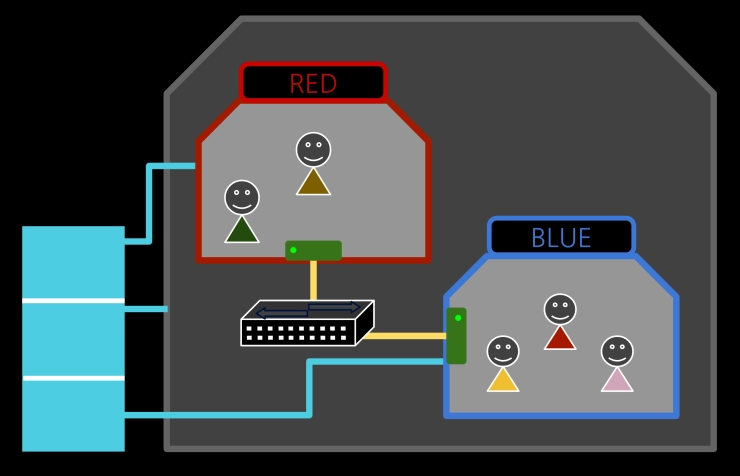

## 이미지 준비

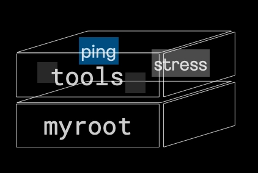

```bash
root@ubuntu1804:/tmp/myroot# tree -L 2
.
├── bin
│   ├── ls
|   ├── rm
│   ├── mkdir
│   ├── mount
│   ├── ps
│   └── sh
├── lib
│   └── x86_64-linux-gnu
├── lib64
│   └── ld-linux-x86-64.so.2
├── proc
│   ├── 1
│   ├── 10
│   ├── 105
```

[컨테이너 파일 시스템](./2.컨테이너%20파일시스템.md)에서 준비한 `myroot`를 그대로 사용하고, 그 위에 tools 이미지를 아래와 같이 만들어주겠습니다.

- ping: 컨테이너 통신 테스트
- stress: 컨테이너 부하 테스트
- hostname: 호스트네임 변경
- umount: put_old 제거

```bash
wget https://raw.githubusercontent.com/sam0kim/container-internal/refs/heads/main/scripts/copy_tools.sh;

bash copy_tools.sh;

root@ubuntu1804:/tmp# tree -L 1
.
├── chroot_ps.sh
├── myroot
└── tools
```

이제 바로 컨테이너 파일 시스템을 만들고 싶지만, 호스트에 영향이 없이 컨테이너만의 파일 시스템을 구성하려면 별도의 마운트 네임스페이스가 필요합니다.

마운트 네임스페이스 뿐만 아니라 네트워크, Cgroup 등 설정을 함께 해준 뒤 파일 시스템을 구성해보겠습니다.

## 컨테이너 네트워크 구성하기

```bash
ip netns add RED;
ip netns add BLUE;
```

네트워크 네임스페이스 `RED`, `BLUE`를 생성해줍니다.

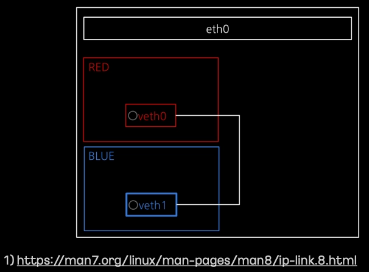

```bash
ip link add veth0 netns RED type veth peer name veth1 netns BLUE
```

`RED`/`BLUE` 네트워크 네임스페이스에 각각 가상 인터페이스(`veth0`/`veth1`)를 추가하고, 이를 veth pair로 연결해줍니다.

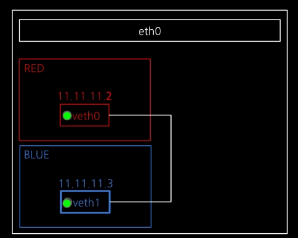

```bash
ip netns exec RED ip addr add dev veth0 11.11.11.2/24

ip netns exec RED ip link set veth0 up;

ip netns exec BLUE ip addr add dev veth1 11.11.11.3/24;

ip netns exec BLUE ip link set veth1 up;
```

각 인터페이스에 IP를 할당하고, 인터페이스를 활성화해줍니다.

## 컨테이너 Cgroup 및 네임스페이스 설정하기

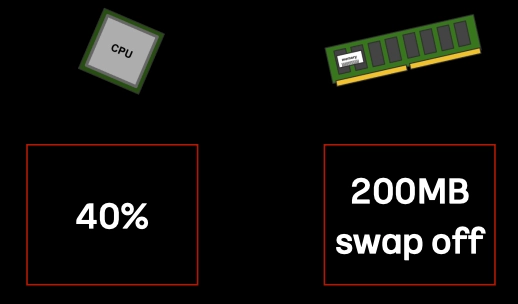

```bash
mkdir /sys/fs/cgroup/cpu/red;
mkdir /sys/fs/cgroup/memory/red;

echo 4000 > /sys/fs/cgroup/cpu/red/cpu.cfs_quota_us;
echo 209715200 > /sys/fs/cgroup/memory/red/memory.limit_in_bytes;
echo 0 > /sys/fs/cgroup/memory/red/memory.swappiness;

mkdir /sys/fs/cgroup/cpu/blue;
mkdir /sys/fs/cgroup/memory/blue;

echo 40000 > /sys/fs/cgroup/cpu/blue/cpu.cfs_quota_us;
echo 209715200 > /sys/fs/cgroup/memory/blue/memory.limit_in_bytes;
echo 0 > /sys/fs/cgroup/memory/blue/memory.swappiness;
```

red, blue라는 이름으로 cgroup을 각각 만들어준 뒤 
RED는 CPU 4%, 메모리 200MB(swap off)로 설정하고, 
BLUE는 CPU 40%, 메모리는 200MB(swap off)로 설정해줍니다.

```bash
unshare -m -u -i -fp nsenter --net=/var/run/netns/RED /bin/sh;

echo "1" > /sys/fs/cgroup/cpu/red/cgroup.procs;
echo "1" > /sys/fs/cgroup/memory/red/cgroup.procs;
```

```bash

unshare -m -u -i -fp nsenter --net=/var/run/netns/BLUE /bin/sh;

echo "1" > /sys/fs/cgroup/cpu/blue/cgroup.procs;
echo "1" > /sys/fs/cgroup/memory/blue/cgroup.procs;
```

이제 새로운 마운트, UTS, IPC, PID, NET 네임스페이스를 만들어 `/bin/sh` 프로세스를 실행해줍니다. 이로써 컨테이너를 위한 기본적인 틀이 완성되었습니다.

마지막으로 cgroup 적용을 위해 PID 1번 프로세스를 각각의 생성했던 red, blue 그룹에 넣어주면 이제 컨테이너 안에 모든 프로세스는 해당 그룹에 속하게 됩니다.

## 파일 시스템 구성하기

### RED 컨테이너 파일 시스템

이제 RED 컨테이너 안에서 작업을 진행해보겠습니다.

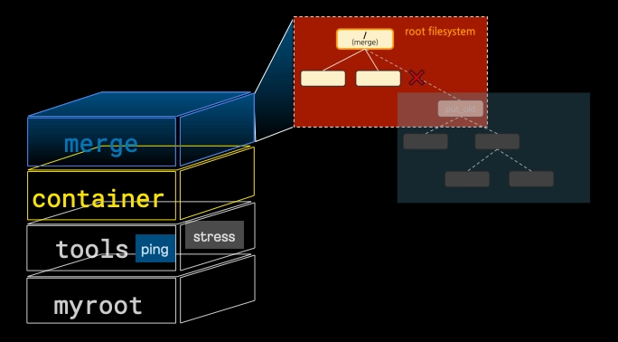

RED 컨테이너 용 오버레이 파일 시스템 구성하고 마운트하기 위해 아래와 같이 폴더를 구성해보겠습니다.

```bash
mkdir /redfs;
mkdir /redfs/container;
mkdir /redfs/work;
mkdir /redfs/merge;
```

위에서 준비한 이미지(`myroot`, `tools`)를 변경 불가능한 `lowerdir`로 설정하고, 변경 가능한 `upperdir`로 방금 만들어준 `/redfs/container`를 설정하고 최종 병합 뷰를 `/redfs/merge`로 설정해주겠습니다.

```bash
mount -t overlay overlay -o lowerdir=/tmp/tools:/tmp/myroot,upperdir=/redfs/container,workdir=/redfs/work /redfs/merge
```

최종 마운트 된 RED 컨테이너 파일 시스템은 아래와 같습니다.

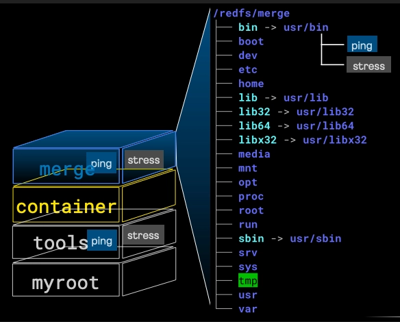

이제 `pivot_root`를 통해 기존 `root`는 `신규 root` 아래로 옮기고 `umount` 해주겠습니다. 새로 마운트 네임스페이스가 만들어졌기 때문에 호스트에 영향이 가지 않습니다.

```bash
mkdir -p /redfs/merge/put_old

cd /redfs/merge;
pivot_root . put_old;
cd /;

mount -t proc proc /proc;
umount -l put_old;
rm -rf put_old;
```

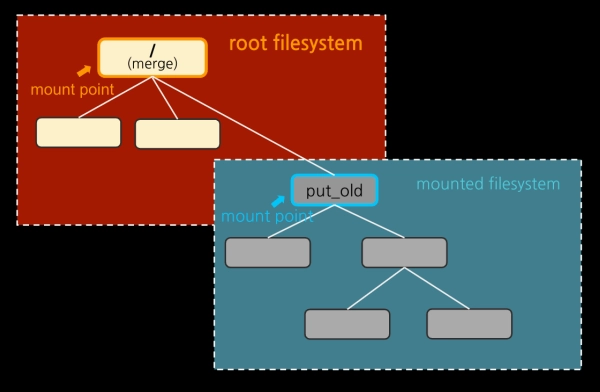
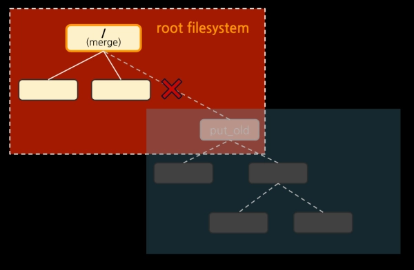

이제 RED의 호스트 네임을 설정해주고

```bash
# hostname RED
# hostname
RED
```

프로세스까지 확인해보면 PID 네임스페이스도 독립적으로 잘 생성되었음을 확인할 수 있습니다.

```bash
# ps -ef
UID        PID  PPID  C STIME TTY          TIME CMD
0            1     0  0 12:51 ?        00:00:00 /bin/sh
0           13     1  0 12:52 ?        00:00:00 ps -ef
```

### BLUE 컨테이너 파일 시스템

이제 BLUE 컨테이너 안에서 동일한 작업을 진행해보겠습니다.

방법은 동일하기 때문에 설명은 생략합니다.

```bash
mkdir /bluefs;
mkdir /bluefs/container;
mkdir /bluefs/work;
mkdir /bluefs/merge;
```

```bash
mount -t overlay overlay -o lowerdir=/tmp/tools:/tmp/myroot,upperdir=/bluefs/container,workdir=/bluefs/work /bluefs/merge
```

```bash
mkdir -p /bluefs/merge/put_old

cd /bluefs/merge;
pivot_root . put_old
cd /

mount -t proc proc /proc;
umount -l put_old;
rm -rf put_old;
```

```bash
# hostname BLUE
# hostname
BLUE
```

```bash
# ps -ef
UID        PID  PPID  C STIME TTY          TIME CMD
0            1     0  0 13:01 ?        00:00:00 /bin/sh
0           12     1  0 13:03 ?        00:00:00 ps -ef
```

## 컨테이너 테스트

이제 RED/BLUE 컨테이너가 모두 준비되었습니다.

통신 테스트부터 진행해보겠습니다.

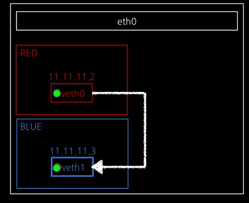

```bash
# ping 11.11.11.3
PING 11.11.11.3 (11.11.11.3) 56(84) bytes of data.
64 bytes from 11.11.11.3: icmp_seq=1 ttl=64 time=0.432 ms
64 bytes from 11.11.11.3: icmp_seq=2 ttl=64 time=0.042 ms
64 bytes from 11.11.11.3: icmp_seq=3 ttl=64 time=0.043 ms
64 bytes from 11.11.11.3: icmp_seq=4 ttl=64 time=0.042 ms
64 bytes from 11.11.11.3: icmp_seq=5 ttl=64 time=0.043 ms
^C
--- 11.11.11.3 ping statistics ---
5 packets transmitted, 5 received, 0% packet loss, time 4101ms
rtt min/avg/max/mdev = 0.042/0.120/0.432/0.156 ms
```

패킷 손실없이 정상적으로 패킷이 전달됨을 확인할 수 있습니다.

이제 stress 테스트를 진행해보겠습니다.

```bash
stress --vm 1 --vm-bytes 197M
```

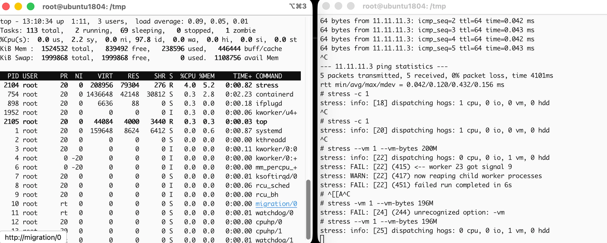

RED의 경우 CPU를 최대 사용해도 전체 4%만 사용하는 것을 알 수 있고,
메모리는 --vm-bytes 200M으로 설정하면 프로세스 실행 중 실패하고, 근접한 197M 정도로 하면 전체 메모리의 5.2% 정도 사용하는 것을 확인할 수 있습니다.

## 마치며

지금까지 도커 없이 컨테이너를 만드는 과정에 대해 알아보았습니다. 이를 통해 도커와 같은 기술이 실제로는 리눅스 커널의 어떤 요소를 활용하는 지 자세히 알아볼 수 있었습니다.

도커는 단지 인터페이스일 뿐이며, 실제 우리가 사용하는 컨테이너는 리눅스 커널의 네임스페이스, 오버레이 파일 시스템, Cgroup을 통해 구성됩니다.

앞으로 더 봐야할 것들은 아래와 같습니다.

- 컨테이너 네트워크 (가상 네트워크 통신)
- 컨테이너 표준화 (인터페이스)
- 컨테이너 오케스트레이션 (쿠버네티스)
